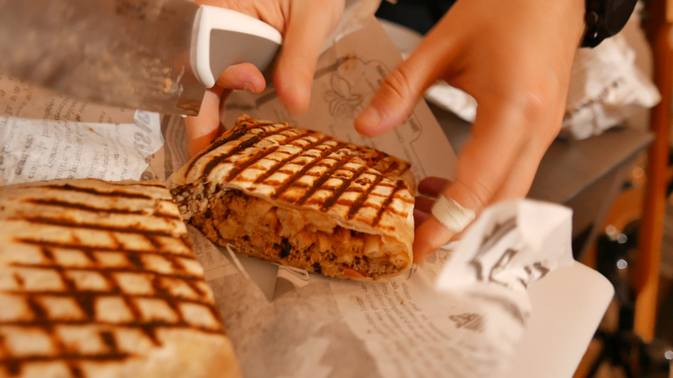
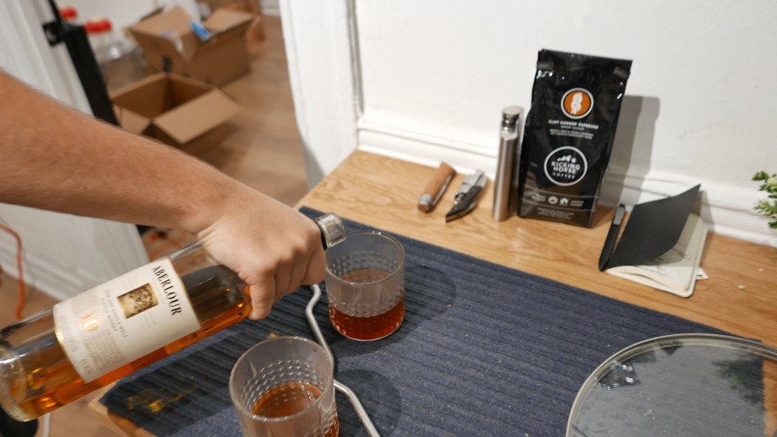
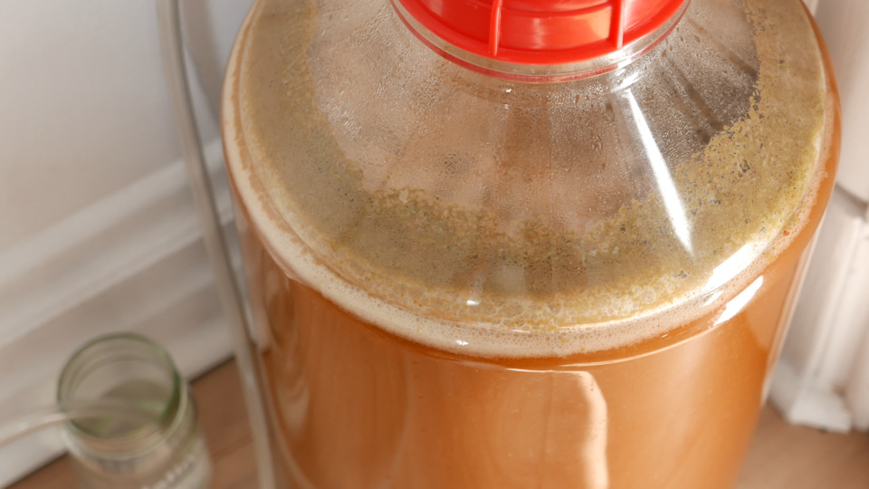
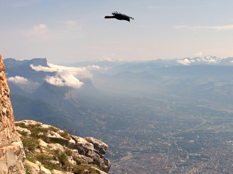
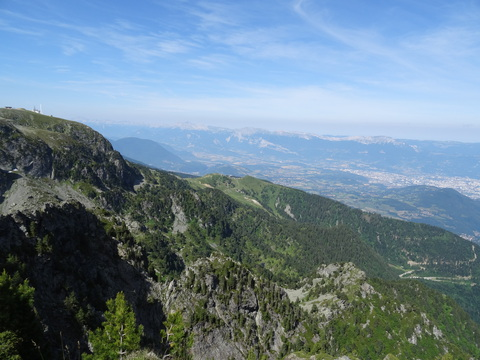
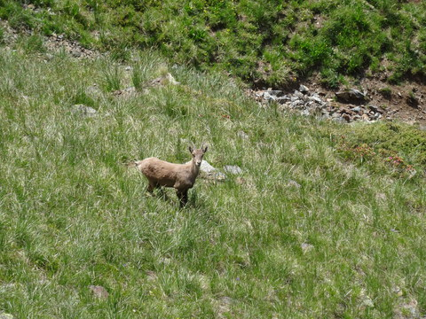

# The title goes here!
Month 42, 1337

Let's showcase some of the styling features of this website.

## Basic stuff

We're going to start this journey with a random quote, from myself.

> TIL rsync can hardlink to previous backups with `--link-dest` and you
> can essentially [recreate macOS Time Machine](https://github.com/cytopia/linux-timemachine/blob/45a03e6aef24d895209c3a588575cac247334918/timemachine#L346)
> with that. This is just beautiful.
>
> --- [@valeriangalliat](https://twitter.com/valeriangalliat), [May 13, 2021](https://twitter.com/valeriangalliat/status/1392846380348153860)

We can do *italic* and **bold** text as well as ~~strikethrough~~.

* We can also do lists.
* Like this.

1. Some of them can even be ordered.
1. Like this.

We can [link to things](/) and even include
[links with a title](/ "The home page of this website"). It's otherwise
common for `abbr` elements to have a title like if I start telling you
about the <abbr title="Loudness units relative to full scale">LUFS</abbr>
unit for example.

I can chose to put a big horizontal line like this.

---

This text is below the big horizontal line.

## Code and alike

I can write `some('code')` like this, wow!

```js
const iv = crypto.randomBytes(16)
const cipher = crypto.createCipher('aes256', key, iv)
```

Incredible, even blocks of code. But don't you also want to try keyboard
shortcuts, like <kbd>Alt</kbd> + <kbd>F4</kbd>?

## Tables

| Type | Model                                          | Price  |
|------|------------------------------------------------|--------|
| RAM  | Corsair Value Select 2 GiB DDR3 1333 MHz CL9   | €21.15 |
| HDD  | Western Digital Green Desktop 1 TiB SATA 6Gb/s | €54.75 |
| PSU  | LDLC QS-360 Quality Select 80PLUS Gold         | €44,95 |
| Case | Cooler Master Elite 342                        | €29.89 |

## Footnotes

I forgot that I added support for footnotes at some point[^1], so now I
have to make sure I keep supporting that.

[^1]: This is a footnote, and it can even reference another[^2] footnote!
[^2]: Oh yeah.

## Hero and subtitle

I'll need [another page](playground-hero.md) to show you that.

## Floats

<figure class="left">
  
</figure>

Sometimes I float an image on the left and write some garbage on the
right. So here I'm doing just that to make sure I don't accidentally
break it while playing with CSS.

<div style="clear: both"></div>

I guess a lot of content should go there to wrap
around that image but I'll just use a `<div style="clear: both">`
instead.

<figure class="left">
  <object data="https://media2.giphy.com/media/13FrpeVH09Zrb2/giphy.gif" type="image/gif"></object>
</figure>

Actually, sometimes I do the same thing with a GIF that I hotlink from
somewhere else because I'm an asshole, so let's try that too.

<div style="clear: both"></div>

## Images and videos

I'm just gonna paste here some of the media of other posts that make
somewhat "complex" use of images.

### Single wide picture

<figure class="center">
  <a href="../../img/2021/06/brewzilla/hop.jpg">
    
  </a>
</figure>

### With a caption

<figure class="center">
  
  <figcaption>Un gros tacos bien sale</figcaption>
</figure>

### Basic grid

<figure class="grid grid-2">
  <a href="../../img/2021/06/brewzilla/spigot.jpg">
    
  </a>
  <a href="../../img/2021/06/brewzilla/scotchie.jpg">
    
  </a>
</figure>

### Fat grid

Did you know it's also responsive? And it's got a caption as well in
case you didn't notice.

<div class="oversized">
  <figure class="grid grid-3 grid-grow">
    <a href="../../img/2021/06/brewzilla/rack-1.jpg">
      
    </a>
    <a href="../../img/2021/06/brewzilla/rack-2.jpg">
      
    </a>
    <a href="../../img/2021/06/brewzilla/rack-3.jpg">
      
    </a>
    <figcaption>Here we didn't use the pump because we didn't know better, but really, use the pump.</figcaption>
  </figure>
</div>

### Uneven grid

If I resize that grid, the third picture is alone on the last line.

<figure class="grid grid-2">
  <a href="../../img/2021/06/brewzilla/rack-1.jpg">
    
  </a>
  <a href="../../img/2021/06/brewzilla/rack-2.jpg">
    
  </a>
  <a href="../../img/2021/06/brewzilla/rack-3.jpg">
    
  </a>
  <figcaption>I would probably not add a caption there as I don't like the look of it.</figcaption>
</figure>

### Uneven grid grow

You can do the same but make sure the last element takes the whole
space. It even works with a video!

<figure class="grid grid-2 grid-grow">
  <a href="../../img/2021/06/brewzilla/ferment-1.jpg">
    
  </a>
  <a href="../../img/2021/06/brewzilla/ferment-2.jpg">
    
  </a>
  <video src="../../img/2021/06/brewzilla/fermenting.mp4" loop controls></video>
  <figcaption>The beer during fermentation!</figcaption>
</figure>

### Very fat grid

Some grids can even span on multiple lines, automagically.

<div class="oversized">
  <figure class="grid grid-3">
    <a href="../../img/2016/03/mountain/01.jpg">
      
    </a>
    <a href="../../img/2016/03/mountain/02.jpg">
      
    </a>
    <a href="../../img/2016/03/mountain/03.jpg">
      
    </a>
    <a href="../../img/2016/03/mountain/04.jpg">
      
    </a>
    <a href="../../img/2016/03/mountain/05.jpg">
      
    </a>
    <a href="../../img/2016/03/mountain/06.jpg">
      
    </a>
    <a href="../../img/2016/03/mountain/07.jpg">
      
    </a>
    <a href="../../img/2016/03/mountain/08.jpg">
      
    </a>
    <a href="../../img/2016/03/mountain/09.jpg">
      
    </a>
    <a href="../../img/2016/03/mountain/10.jpg">
      
    </a>
    <a href="../../img/2016/03/mountain/11.jpg">
      
    </a>
    <a href="../../img/2016/03/mountain/12.jpg">
      
    </a>
    <figcaption>Here's a taste of the sublime landscapes we have in the Alps.</figcaption>
  </figure>
</div>

### Video

<figure class="video">
  <iframe src="https://www.youtube.com/embed/arQ4Yutbitk" allowfullscreen></iframe>
</figure>

### Video with a caption

Embedded videos can have a caption, too, but it's a tiny bit more
tricky.

<figure class="full">
  <div class="video">
    <iframe src="https://www.youtube.com/embed/8ejJZoURasY" allowfullscreen></iframe>
  </div>
  <figcaption>This video have a caption.</figcaption>
</figure>

### Smaller images

Oh and if an image isn't wide enough, it can be centered.

<figure class="center">
  
</figure>

Or not.

<figure>
  
</figure>

But either way, it can definitely have a caption that'll fit it nicely.

<figure class="center">
  
  <figcaption>This is the Statue of Liberty, in case you didn't notice.</figcaption>
</figure>
