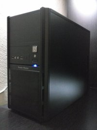

# Low consumption home server
October 26, 2014

[CodeJam](../../2015/03/naming-things.md) is my little homemade piece
of Internet -- a €200 server optimized for low consumption, while being
a decent x86-64 machine, where I run all the "cloud" services I need.

To be more clear, I planned to decently host a web server (mostly, but
not limited to, static websites), a mail server, an IRC server, an XMPP
node, Git repositories [with a neat web interface][gogs], possibly a
Minecraft server, and wanted to be comfortable enough to add other
things if needed.

[gogs]: http://gogs.io/

I was ready to spend at most €300 on this server, while keeping the
electricity bill fairly low.

This blog post will explain how I choose it, and why I'm pretty
satisfied with it.

**Note:** I'm relying on
[cpubenchmark.net](http://www.cpubenchmark.net/) to compare the CPUs
performance. By relating to my "gaming" PC CPU score, *and with a lot of
intuition*, I was expecting a score higher than 800 to fit my needs.

## Barebone PCs

Naturally, I wanted to buy retail components and build the server
myself. But I got advised to look at barebone PCs. So that's what I did.
Here are the machines that seemed to match my expectations:

Model                     | CPU               | Score | Consumption | Price
--------------------------|-------------------|-------|-------------|------
MSI Wind Box DC110-006XEU | Intel Celeron 847 | 994   | 17 W        | €243
Shuttle XS35-703 V2       | Intel Atom D525   | 690   | 13 W        | €269

These PCs seemed pretty decent, given the performance and price, and the
consumption is pretty stunning!

However we'll see below it was not my best option. Let's see what we
need to build everything from scratch.

## General components

I was expecting between 10 and 15 watts for the RAM, HDD and PSU
combined, plus cooling. Not much to optimize here... maybe take a
"green" HDD (like I did), but I suspect the gain to be just about a few
watts. Here's my cart:

Type | Model                                          | Price
-----|------------------------------------------------|-------
RAM  | Corsair Value Select 2 GiB DDR3 1333 MHz CL9   | €21.15
HDD  | Western Digital Green Desktop 1 TiB SATA 6Gb/s | €54.75
PSU  | LDLC QS-360 Quality Select 80PLUS Gold         | €44,95
Case | Cooler Master Elite 342                        | €29.89

## Choosing the CPU

After searching hardware websites for CPUs matching my criteria, I ended
up with the following ones:

Model               | Score | TDP  | Price
--------------------|-------|------|------
Intel Core i3-4130  | 4908  | 54 W | €104
Intel Pentium G3220 | 3244  | 53 W | €52
Intel Celeron G1820 | 3024  | 53 W | €38
AMD Sempron 145     | 796   | 45 W | €30

It's interesting to see the i3 performance compared to the Pentium and
Celeron while they have the same consumption. However it's more than
twice the price! On the other hand, the Sempron is really cheap, and
its consumption is slightly lower, but the performance is really poor.

*The AMD Athlon 5350 was not out at this time, but today, with a
score of 2610, a 25 W TDP and for €52, it would be a nice alternative to
Intel CPUs.*

So these are the CPUs with the lowest TDP I could find at popular French
hardware retailers. But where can I find the same CPUs as in barebone
PCs? They had a much lower consumption.

Well, the only thing I found (I felt like it was kinda rare) is a
motherboard with an *integrated CPU*: the Gigabyte GA-C1037UN-EU, with
an Intel Celeron 1037U. This CPU have a score of 1738, for 17 W TDP, and
this for €79! This was **exactly** what I needed.

## Putting it all together

<figure class="left">
  
</figure>

I bought the Gigabyte GA-C1037UN-EU, and all the
[components](#general-components) for roughly €230 (and €30 shipping). I
expected between 30 and 35 W for the whole server.

After receiving and building the server, I installed FreeBSD, and all
the services I needed. A few months later, I got an [electronic
wattmeter] to measure the actual consumption: it was between 25 and 30 W
most of the time, and after a week monitoring, I could see a peak to 35
W, but no higher than that. Pretty satisfying!

[electronic wattmeter]: http://en.wikipedia.org/wiki/Wattmeter#Electronic_wattmeter
