# Looking back at 2015
March 12, 2016

**Sidenote:** you can say your procrastination level is very high where
you write an article like this in March.

I got inspired by my friend [Kitty][kitty]'s article [Looking back at
2015][kitty-2015] and decided to write my own (about two
months later but shhh, it's never too late).

[kitty]: http://kittygiraudel.com/
[kitty-2015]: http://kittygiraudel.com/2016/01/05/looking-back-at-2015/

This article is more a writing exercise for me than something you should
read, unless you have nothing better to do than reading about my 2015
year. And I have the feeling that it will be quite long. Nevertheless, I
make this page public.

## Programming, open source

I began the year spending the vast majority of my free time programming
and contributing to open source, with the motivation and productivity
momentum being part of the [SassDoc][sassdoc] team gave me since mid 2014.

I'm especially super thankful to [Kitty][tw-kitty], [Pascal][tw-pascal]
and [Fabrice][tw-fabrice], we made an awesome team that I'm really proud
being part of. I learnt so much by building SassDoc together, as much in
programming as in open source project handling and team building.

[sassdoc]: http://sassdoc.com/
[tw-kitty]: https://twitter.com/KittyGiraudel
[tw-pascal]: https://twitter.com/pascalduez
[tw-fabrice]: https://twitter.com/FWeinb

### January 16

I Celebrated the 1 year anniversary of my [home server][home-server] I
gave birth to in 2014. This also means 1 year day to day FreeBSD usage
as a server OS. The only thing I have to say is I still happily run it!

During this year of administration of my little server, I experimented
with FreeBSD jails, setting up, hosting and maintaining a web, mail,
IRC, XMPP server, among others.

While I did not experience with real word charge and scaling, it tought
me one or two things about system administration.

[home-server]: ../../2014/10/low-consumption-home-server.md

### February 5

Release of [SassDoc][sassdoc] 2.0.0, after a lot of work with the
SassDoc team on the previous months to completely rewrite the core, add
more features, and make a pretty website.

### February 7

I made my first pull request, and (not so) sadly last, since I don't do
PHP anymore, on the [Symfony][symfony] project to add support for images
extraction with the crawler component, involving a slight refactoring of
the module.

[symfony]: http://symfony.com/

Symfony is a large project, and to my eyes an example for open source
guidelines and contribution process. Everything is documented with
well-defined and enforced rules. The code review is really solid, I had
input on my code by multiple people, got really good comments and
suggestions, my mistakes were directly pointed out. It made me feel
really confident while contributing, and it was a really insightful
experience contributing to a project of this size.

While such a strict process requires more time and implication (at least
for non-trivial change like this), both for the external contributor and
the maintainers, it results in a really consistent and totally
documented project, from the actual file tree to the commit and pull
request history.

The only negative point for me is that the pull request got actually
merged nearly one year later (close to 3 days). Also my name didn't
appear as the final commit author, and while I don't really care, it
surprised me a little bit. But I see it as a pledge that one of the
reviewers actually takes the full ownership of this code and its
maintenance which is a good thing.

### February 8

First real contribution to the [NixOS][nixos] project, by adding a Vim
plugin and the late io.js support, following a quick fix for npm
packages the day before.

[nixos]: http://nixos.org/

### February 19

I published my blog, [CodeJam](../..), that you are currently reading,
after experimenting for a while on a blog engine using a makefile as its
core.

### March 4

I released [gogs-migrate][gogs-migrate], a tool to automatically migrate
(and optionally mirror) GitHub repositories to a [Gogs][gogs] instance.
This is my most successful personal project by number of stars (16 as of
today, great success)!

[gogs-migrate]: https://github.com/valeriangalliat/gogs-migrate
[gogs]: https://gogs.io/

### March 18

First release of [markdown-it-anchor], another of my (relatively) most
successful projects, this time by number of contributions (5 pull
requests, and 10 issues, OMG).

It's a flexible plugin for the [markdown-it] Markdown parser allowing to
add an ID and an anchor to headings (I'm using it on this very blog). I
released it on the day following [markdown-it-title][markdown-it-title],
[markdown-it-highlighted][markdown-it-highlighted], and
[markdown-it-highlightjs][markdown-it-highlightjs]. These are all
plugins I needed to improve my <abbr title="Keep it simple, stupid">KISS</abbr>
blog engine.

[markdown-it]: https://github.com/markdown-it/markdown-it
[markdown-it-anchor]: https://github.com/valeriangalliat/markdown-it-anchor
[markdown-it-title]: https://github.com/valeriangalliat/markdown-it-title
[markdown-it-highlighted]: https://github.com/valeriangalliat/markdown-it-highlighted
[markdown-it-highlightjs]: https://github.com/valeriangalliat/markdown-it-highlightjs

### September 10

I made a [couple][webtorrent-pr-425] [pull][webtorrent-pr-426]
[requests][webtorrent-pr-427] on [WebTorrent][webtorrent] as I was
working with it for the final project of my studies.

[webtorrent-pr-425]: https://github.com/feross/webtorrent/pull/425
[webtorrent-pr-426]: https://github.com/feross/webtorrent/pull/426
[webtorrent-pr-427]: https://github.com/feross/webtorrent/pull/427
[webtorrent]: https://github.com/feross/webtorrent

### November 6

I helped my friend [Kitty][kitty] to build [node-legofy][node-legofy],
a tool to convert an image to a mosaic of LEGO. We had a lot of fun
writing this.

[node-legofy]: https://github.com/KittyGiraudel/node-legofy

### December 7

I bought a [Kimsufi][kimsufi]. I had to monitor its status in real time
minutes for a week, so I could get a notification when the server I
wanted was available. I could log it as available maybe 3 or 4 times in
the week, and each time they were gone in less than 5 minutes.
The first time I was sleeping, the second time I lost too much time
creating my account and the server was not available anymore when I was
ready to pay, but I got it the third time!

I [installed NixOS on it][nixos-kimsufi] and began migrating parts of my
[FreeBSD home server][home-server] to it. It's a way for me to learn
more about [NixOS][nixos] by using it daily.

[kimsufi]: https://www.kimsufi.com/
[nixos-kimsufi]: ../../2015/12/installing-nixos-on-a-kimsufi.md
[home-server]: ../../2014/10/low-consumption-home-server.md

### Other projects

I started a lot of libraries and tools as side projects, that don't
really worth mentioning, but I still do.

* [cgip][cgip] CGI IP echo service. <!-- February 7 -->
* [es6-denodeify][es6-denodeify] Convert callbacks to promises. <!-- February 11 -->
* [through2-sync][through2-sync] Synchronous [through2][through2] transforms. <!-- February 22 -->
* [stream64][stream64] Base64 encode/decode stream. <!-- February 22 -->
* [make-overridable][make-overridable] [Override design pattern][override] for JavaScript. <!-- February 28 -->
* [bind-late][bind-late] Late binding of [overridable][make-overridable] object properties. <!-- February 28 -->
* [gogs-migrate][gogs-migrate] Migrate existing repositories on a [Gogs][gogs] instance. <!-- March 4 -->
* [help2md][help2md] Convert command help string to Markdown. <!-- March 7 -->
* [antisocial-auth][antisocial-auth] Social authentication for websites that don't provide any. <!-- March 11 -->
* [express-then][express-then] [Express][express] handlers with promise support. <!-- March 11 -->
* [crypto-promise][crypto-promise] Promise version of Node.js crypto module. <!-- March 11 -->
* [jvc][jvc] Node.js [jeuxvideo.com][jeuxvideo.com] [API][jvc-api] client. <!-- March 11 -->
* [jvc-cli][jvc-cli] CLI [jeuxvideo.com][jeuxvideo.com] client. <!-- March 14 -->
* [jvc-auth][jvc-auth] Authenticate [jeuxvideo.com][jeuxvideo.com] users. <!-- March 15 -->
* [stream-concat-promise][stream-concat-promise] Promise version of [concat-stream][concat-stream]. <!-- March 17 -->
* [promise-done][promise-done] Propagate errors out of promise context.  <!-- March 17 -->
* [markdown-it-title][markdown-it-title] Extract title during [markdown-it][markdown-it] parsing. <!-- March 17 -->
* [markdown-it-highlighted][markdown-it-highlighted] Whether code was highlighted during [markdown-it][markdown-it] rendering. <!-- March 17 -->
* [markdown-it-highlightjs][markdown-it-highlightjs] Preset to use [highlight.js][highlight.js] with [markdown-it][markdown-it]. <!-- March 17 -->
* [markdown-it-anchor][markdown-it-anchor] Header anchors for [markdown-it][markdown-it]. <!-- March 18 -->
* [fetch-cookie][fetch-cookie] Decorator for a `fetch` function to support automatic cookies. <!-- May 4 -->
* [fr-gas-price][fr-gas-price] Retrieve French gas price data from [government website][gas]. <!-- May 4 -->
* [promise-retryable][promise-retryable] Retryable promises. <!-- November 1 -->
* [babel-plugin-transform-array-from][babel-plugin-transform-array-from] Replace `Array.from` by `require('array-from')`. <!-- November 9 -->

[cgip]: https://github.com/valeriangalliat/cgip
[es6-denodeify]: https://github.com/valeriangalliat/es6-denodeify
[through2-sync]: https://github.com/valeriangalliat/through2-sync
[stream64]: https://github.com/valeriangalliat/stream64
[make-overridable]: https://github.com/valeriangalliat/make-overridable
[bind-late]: https://github.com/valeriangalliat/bind-late
[help2md]: https://github.com/valeriangalliat/help2md
[antisocial-auth]: https://github.com/valeriangalliat/antisocial-auth
[express-then]: https://github.com/valeriangalliat/express-then
[crypto-promise]: https://github.com/valeriangalliat/crypto-promise
[jvc]: https://github.com/valeriangalliat/jvc
[jvc-cli]: https://github.com/valeriangalliat/jvc-cli
[jvc-auth]: https://github.com/valeriangalliat/jvc-auth
[stream-concat-promise]: https://github.com/valeriangalliat/stream-concat-promise
[promise-done]: https://github.com/valeriangalliat/promise-done
[fetch-cookie]: https://github.com/valeriangalliat/fetch-cookie
[fr-gas-price]: https://github.com/valeriangalliat/fr-gas-price
[promise-retryable]: https://github.com/valeriangalliat/promise-retryable
[babel-plugin-transform-array-from]: https://github.com/valeriangalliat/babel-plugin-transform-array-from

[through2]: https://github.com/rvagg/through2
[override]: http://lethalman.blogspot.fr/2014/09/nix-pill-14-override-design-pattern.html
[express]: http://expressjs.com/
[jeuxvideo.com]: https://www.jeuxvideo.com/
[jvc-api]: https://wiki.jvflux.com/Documentation_de_l'API_Jeuxvideo.com
[concat-stream]: https://github.com/maxogden/concat-stream
[highlight.js]: https://highlightjs.org/
[gas]: http://www.prix-carburants.gouv.fr/

## <abbr title="Away from keyboard">AFK</abbr>

### Summer

Since I procrastinated my days off for 3 years (yes, I procrastinate
*even* my days off) while working at [Dredd][dredd], I had the
equivalent of 3 months of vacations to take before the end of June
(provided that I was still studying 2 days per week at [Aries][aries]).

[dredd]: http://www.dredd.fr/
[aries]: http://www.ecolearies.fr/

I wrote code all day long for a month, but then I realized than as the
time was passing, I was getting incredibly way less productive than when
I was working, even though I had all the time I wanted to dedicate to my
side projects, open source, and generally improving my technical skills.

At the point where I was doing nothing meaningful of my days, I started
biking, and hiking a little later. I was not in a good shape since I
spent the past years basically daylong behind a computer without any
physical activity, it was terribly demanding, and I could barely bike
for 4 kilometers, being super exhausted and thirsty at the end. But
by training nearly everyday, I quickly got better and could bike more
and more kilometers while being less and tired and needing less water.

Soon enough I could bike for 20, 40, even 80 kilometers straight! This
was a rewarding experience and was really worth the initial pain.

<figure class="center">
  <a href="../../img/2016/03/bike/01.jpg">
    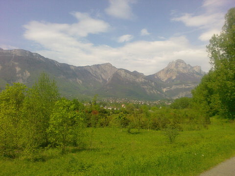
  </a>
  <a href="../../img/2016/03/bike/02.jpg">
    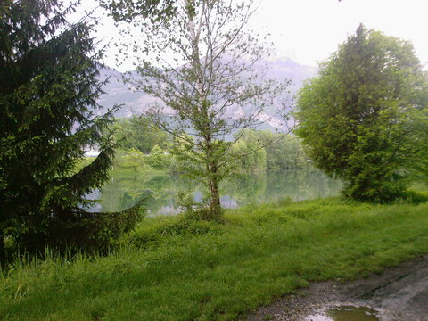
  </a>
  <a href="../../img/2016/03/bike/03.jpg">
    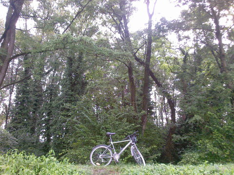
  </a>
  <a href="../../img/2016/03/bike/04.jpg">
    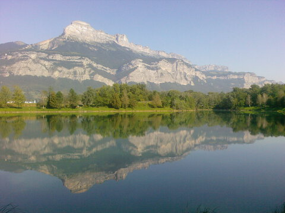
  </a>
  <figcaption>It allowed me to discover nice places around my city, Grenoble.</figcaption>
</figure>

Being in the heart of the Alps, and since I had a car, I had the chance
to be able to go hiking in wonderful places in just 30 or 45 minutes of
driving. Like for the bike, I started with small but exhausting hikes,
until I got trained enough to do larger ones, with more ease.

At the end of the summer, I walked roughly 20,000 vertical meters among
30 tracks.

  <figure class="center">
    <a href="../../img/2016/03/mountain/01.jpg">
      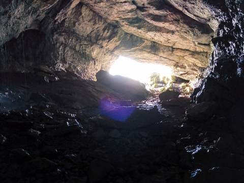
    </a>
    <a href="../../img/2016/03/mountain/02.jpg">
      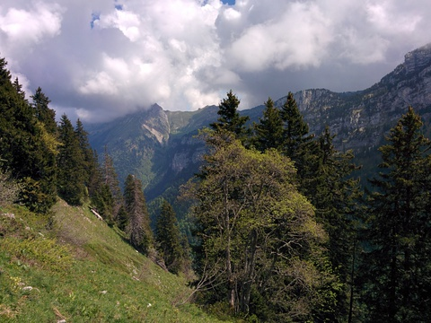
    </a>
    <a href="../../img/2016/03/mountain/03.jpg">
      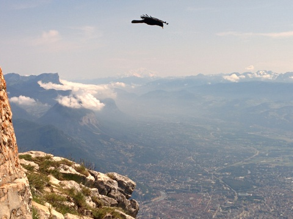
    </a>
    <a href="../../img/2016/03/mountain/04.jpg">
      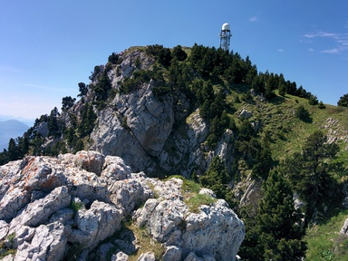
    </a>
    
    <a href="../../img/2016/03/mountain/06.jpg">
      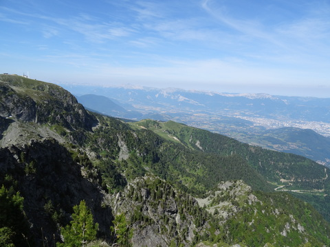
    </a>
    
    <a href="../../img/2016/03/mountain/08.jpg">
      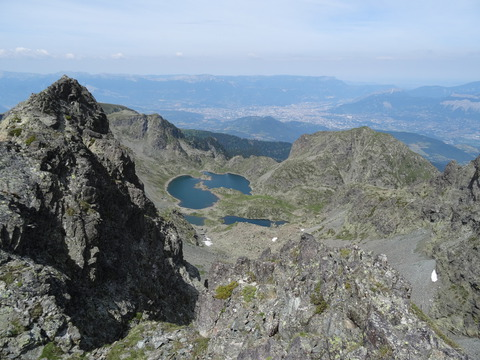
    </a>
    
    <a href="../../img/2016/03/mountain/10.jpg">
      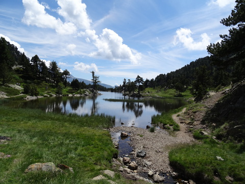
    </a>
    <a href="../../img/2016/03/mountain/11.jpg">
      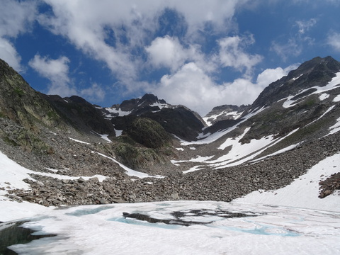
    </a>
    <a href="../../img/2016/03/mountain/12.jpg">
      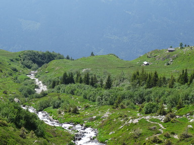
    </a>
    <figcaption>Here's a taste of the sublime landscapes we have in the Alps.</figcaption>
  </figure>

### September 17

I graduated from [Aries][aries]. This marks the end of my studies, with
a software developer diploma, 3 years after integrating this school in
the webmaster class.

Those 3 years at Aries were really enjoyable. We had such great vibes
and complicity within the class that the 2 days of school per week felt
like a week-end before the week-end. These memories will remain etched
in my mind.

### September 22

I moved from Grenoble (France) to Montreal (Quebec) with a 2 years
<abbr title="Working holiday visa">WHV</abbr>.

I had quite a fright because the carpooling I took to go to the airport
in Paris the day before had an engine problem in the middle of the trip
and we were stuck in a garage for half a day. Fortunately they could fix
the engine and I got to my destination on time.

<figure class="center">
  
  <a href="../../img/2016/03/airport/02.jpg">
    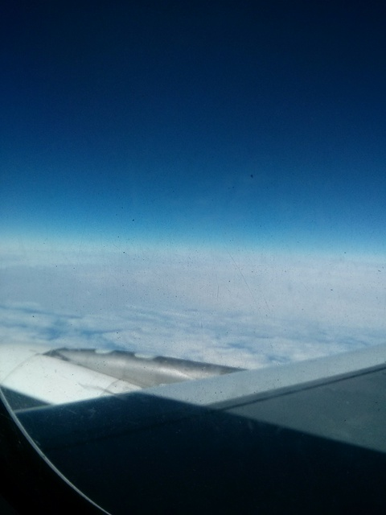
  </a>
  <figcaption>Direction Montreal!</figcaption>
</figure>

### September 21

I Joined [Busbud][busbud] as a backend developer. I'm so excited to work
here, it's really motivating and productive to be part of such an
awesome team of enthusiast programmers.

We also have a blazingly awesome ping pong setup, that is, admittedly,
quite addictive. I'm working on making it work on different setups than
our *exact* configuration and hardware in order to make it open source.
Stay tuned!

[busbud]: https://www.busbud.com/

  <figure class="center">
    <a href="../../img/2016/03/busbud.jpg">
      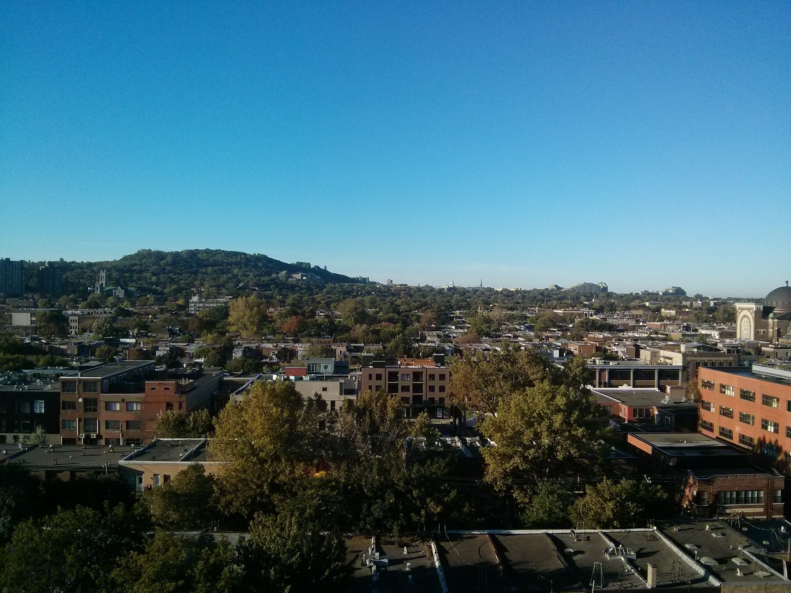
    </a>
    <figcaption>Busbud, a startup with a view!</figcaption>
  </figure>

### October 1

I signed the lease for a flatsharing that I visited the day before. It
was the last day of my Airbnb and I can say I was really lucky because
it was for me the best match, both for the place and the roommates, that
I had between the dozens of flatsharings I visited during my first
week.

I spent most of my day in IKEA, and the whole evening building all
the furniture. This is *definitely* not my area of expertise nor an
enjoyable hobby for me.

I now live with 4 awesome roommates in a beautiful apartment, with 5
rooms, two bathrooms, a BBQ, and even the luxury of a dishwasher!

### October 31

Right when I got my first paycheck, I bought a new guitar, since I left
mines in France. It's a Fender Stratocaster, the guitar of my dreams
since ever. Let's [play that funky music][funk]!

[funk]: https://youtu.be/_pHT9yYFdZg

  <figure class="center">
    <a href="../../img/2016/03/guitar/01.jpg">
      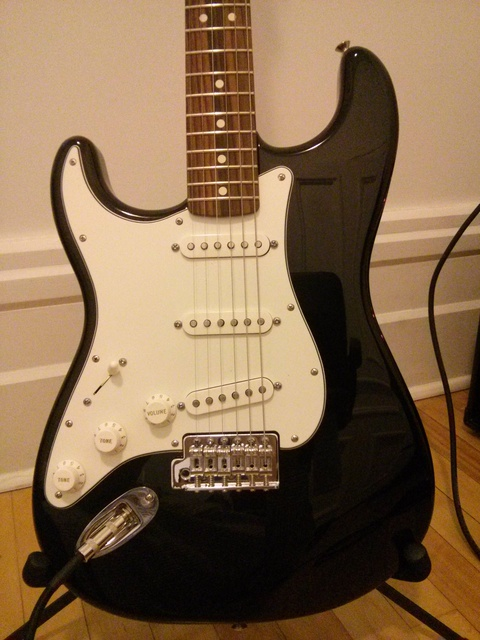
    </a>
    
    
    <figcaption>Shameless guitar porn.</figcaption>
  </figure>

### November 19

I got a bit annoyed to walk 20 minutes to work everyday while I felt
like it would take 5 minutes in bike. Same for getting kinda anywhere in
Montreal, while there are buses and metros, everything seems so close in
bike and you don't have to wait nor pay anything!

So I decided to get a bike, even if the winter was coming. After all, I
heard some people here kept biking in the winter, even with snow storms
and a decent amount of snow on the road.

Turned out the snow took a while to fall, so I could profit of my bike
in ideal conditions for another month. And even once the roads were
covered by a couple centimeters of snow, biking on it was surprisingly
good, and even really enjoyable when the snow is fresh!

<figure class="center">
  <a href="../../img/2016/03/bike-2/01.jpg">
    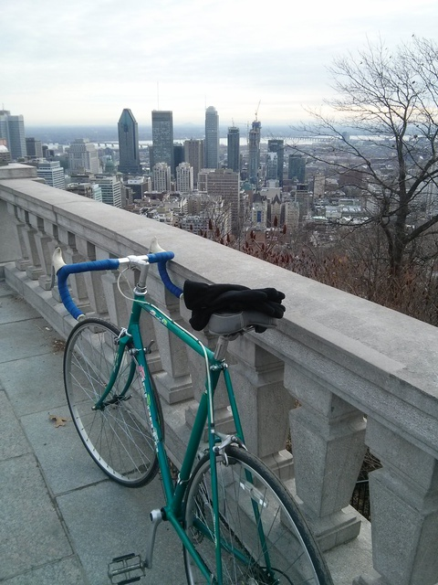
  </a>
  <a href="../../img/2016/03/bike-2/02.jpg">
    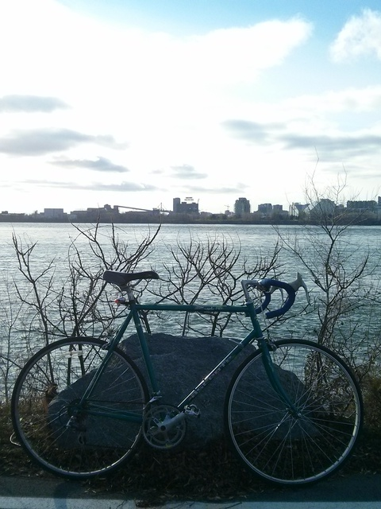
  </a>
  <figcaption>This is my bike. It's a beautiful bike.</figcaption>
</figure>

### December 24

I and a few friends casually made a BBQ for Christmas Eve. That's a
pretty badass thing to do for a first Canadian winter. :D

### December 30

5 AM, I took my bag, put my [balaclava][cagoule] and walked to the bus
station downtown under the falling snow. Direction New York for the New
Year's Eve!

After a 8 hours bus trip we arrived in Manhattan. During 2 days we
walked around the whole island and could visit a decent part of it.

[cagoule]: https://youtu.be/Ud_-AuBmp6Q

  <figure class="center">
    <a href="../../img/2016/03/ny/01.jpg">
      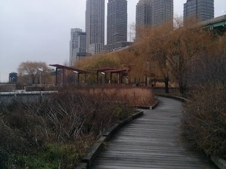
    </a>
    
    
    
    
    
    <figcaption>New York.</figcaption>
  </figure>

The New Year's Eve in Times Square was also an unique experience. It's
incredibly hard to get in Times Square at 3 PM, and even if you're lucky
enough to get inside (which we were), you then have to wait another 9
hours standing in the crowd without really any kind of animation. All of
this to have the countdown the last minute before midnight, and a tiny
firework. I have quite mixed feelings about this experience, to say the
least.

### What next?

That was a pretty intense year for me; finishing my studies, leaving my
job, family and friends to start from scratch in a new country, where I
had my first full time job and also my first flatsharing experience!

It will be hard to make 2016 even more awesome, but I'm happy I quickly
found a stable situation that gives me peace of mind, and I think like
enjoying this for a while, focusing more on programming and playing
music.
