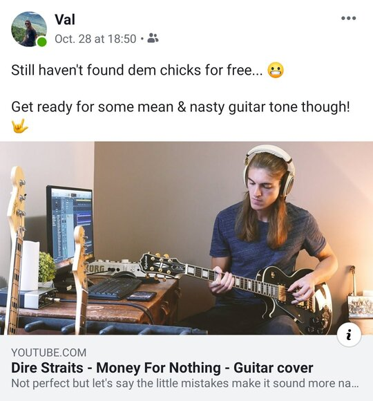
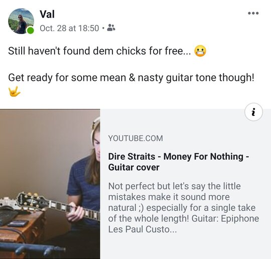

# Fix Facebook YouTube attachment layout on mobile
November 7, 2019

When sharing YouTube videos on Facebook, depending if you use the
desktop or mobile app to create the post, and probably some other random
factors, Facebook might use a different post layout.

One looks good, where you have the video cover taking the whole width,
and title and description below.

<figure class="center">
  
  <figcaption>That's the one you want.</figcaption>
</figure>

One is just awful where the video cover is badly cropped and shrunk on
the left and they try to fit the title and description on the right.

<figure class="center">
  
  <figcaption>Why, just why.</figcaption>
</figure>

If you end up with the bad one, there's a way to force the good layout!

On the mobile app, edit your post, remove the attachment picture, paste the
YouTube link again to force the attachment picture to be fetched again, remove
the link if you don't want it to be in the post, and save.

This worked for me many times so far!
