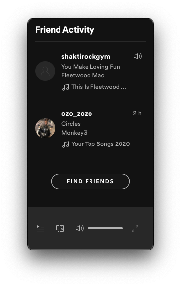

# What's currently playing at Shakti Rock Gym?
September 24, 2020

Shakti is a rock climbing gym in Montreal, Canada, and it's my favorite
gym. The first thing that struck me 4 years ago when I started climbing
there is the music.

## TLDR

I made a Shakti radio, and you can find it on [Spotify][spotify] and
[YouTube][youtube]. Those are regular playlists, but they're updated in real time with
the songs that are playing in the gym.

[spotify]: https://open.spotify.com/playlist/5qgFzOvllbtIehVfd66SZG
[youtube]: https://www.youtube.com/playlist?list=PL3gQ6-WYh7kX1CARbXnNuP4kgnG0E5Guu

If you tune to the last song (or the one before to be safe), you should
be able to listen *live* to the music at Shakti. Enjoy!

## What about the music at Shakti?

It's just *so good*.

I was constantly shaking my head bouncing to the music, it hypes me a
lot and this kind of atmosphere really drives my energy and motivation.

It's that good that most of the time, either I know the song and it's a
song I love, or I don't know the song and I'm going straight away to
Shazam it because I love it.

And the best thing is, I don't think they even *try*. It seems that
whoever is running the gym at a given time is putting whatever music
they feel like (so you can usually notice patterns depending on who's
there), which means a *lot* of different stuff is playing, whether it's
funk, reggae, country, rap, even old school French rap, disco, Latino
music, classical, electro, and more!

As my friend Alex puts it brilliantly:

> It's not necessarily music that I would have put myself, but it's
> always great.

So why am I writing about that today?

## The problem with Shakti music

When I'm at the gym, a lot of times I'm too lazy to go grab my phone and
Shazam a song, and I always wished I could just look up later "what song
was playing at Shakti at 17:28" and find it again (something that you
can otherwise do on popular radio channels).

Other times, I was at home and I didn't really have any inspiration on
what to listen to, and I wished I could just tune to whatever was
playing at Shakti because I knew it would be good.

Basically, I wanted a Shakti radio. And since it didn't exist, I built
it.

## Hacking the Shakti vibe to enjoy it *all the time*

Regardless of who's putting the music at the gym, they always do it
through the same Spotify account ([shaktirockgym](https://open.spotify.com/user/shaktirockgym)).
You can publicly follow that account and it pops up in your "friend
activity" feed.

<figure class="center">
  
</figure>

As you can see we can... see what's currently playing at Shakti. As
well as what's Alex listening to. Those are my two only friends, really.
I didn't click "find friends".

Most apps use HTTP to fetch their data, Spotify is no exception to that.
Doing the same calls as the app, you can programmatically know what your
friends are listening to.

In case you wonder, the call is:

```
https://guc-spclient.spotify.com/presence-view/v1/buddylist
```

By fetching periodically the "friend activity" feed, it's then trivial
to append new songs to a playlist. Easy!

You can find the playlist on Spotify, it's called [Shakti Rock Gym Live][spotify].

But I actually don't use Spotify, I'm more of a YouTube person. So for
convenience, I made a [YouTube mirror][youtube]. It uses YouTube Music
in the background, and while there's no bulletproof way of getting the
YouTube version of a given Spotify song, I've found [my method][spotify-to-youtube]
pretty reliable so far.

You can find the code to [fetch your friend activity][spotify-buddylist]
on GitHub, as well as the code for the actual [Shakti
Radio][shakti-radio] that feeds the playlists in real time.

[spotify-to-youtube]: https://github.com/valeriangalliat/spotify-to-youtube
[spotify-buddylist]: https://github.com/valeriangalliat/spotify-buddylist
[shakti-radio]: https://github.com/valeriangalliat/shakti-radio
