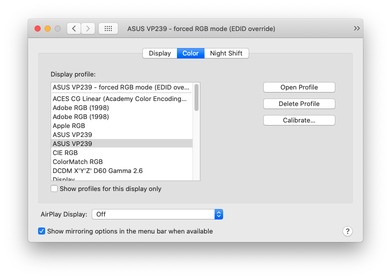

Too much contrast on external screen with macOS Catalina
========================================================
October 2, 2020

I recently [upgraded][upgrade] my [Hackintosh][hackintosh] from High
Sierra to Catalina (after switching from NVIDIA to AMD).

[upgrade]: upgrade-hackintosh-high-sierra-catalina.md
[hackintosh]: ../../2019/03/macos-high-sierra-msi-h110m-pro-d-skylake-nvidia-pascal.md

After the upgrade, the contrast was way too high on my ASUS monitor
(VP239H-P). I can't add pictures here really because it's how the
display rendered colors that was affected, and a screenshot wouldn't
represent that. I confirmed that the colors were off by comparing with
my Windows dual boot.

I wasn't in high contrast mode, and this problem was there with any kind
of display profile in the system preferences (each profile looked
different, but each profiled looked equally overly contrasty).

While I couldn't find anything online about that exact issue, I found
a similar post with an [external monitor color problem][color-problem].

[color-problem]: https://spin.atomicobject.com/2018/08/24/macbook-pro-external-monitor-display-problem/

There's a great explanation there about color formats, the differences
between YCbCr, YPbPr and RGB, and the way EDIDs affect which color
format will be used.

For me, it seems that High Sierra used RGB by default, while Catalina
switched to YCbCr, as my ASUS VP239H-P claims to support it, but in
practice it gives way too contrasty results.

The only way to fix that as explained in the above article, is to
configure macOS to override the EDID of that specific display to force
RGB mode.

## Patch the EDID to force RGB mode

Here's [another article][force-rgb-mode] that explains in great details
how to do that, but I'll sum up things here.

[force-rgb-mode]: https://www.mathewinkson.com/2013/03/force-rgb-mode-in-mac-os-x-to-fix-the-picture-quality-of-an-external-monitor

Download the [following script][script] and run `ruby patch-edid.rb`.
That will generate a directory starting with `DisplayVendorID-`, in my
case, `DisplayVendorID-469`, that contains a file for your specific
display, in my case, `DisplayProductID-23c5`.

[script]: https://gist.github.com/adaugherity/7435890

You need to put this file in `/System/Library/Displays/Contents/Resources/Overrides`, so in my case
the full path would be `/System/Library/Displays/Contents/Resources/Overrides/DisplayVendorID-469/DisplayProductID-23c5`.

You can't write in this folder by default at least in recent macOS
versions like Catalina, and I've seen people suggesting to reboot in
recovery mode to be able to do it from there, but as far as I'm
concerned, a simple `mount -uw /` as `root` allowed me to put the file
there.

**Note:** when [migrating to Big Sur](../11/upgrading-hackintosh-catalina-big-sur-clover-opencore.md),
even the `mount -uw /` trick doesn't work, but I realized that you can
just `mkdir -p /Library/Displays/Contents/Resources/Overrides` and put
the `DisplayVendirID-` directory there, and it works as well!

Then reboot the computer.

## Using a better display profile

This forces the display in RGB mode, which is great, however this also
sets the display profile in "System Preferences", "Displays", "Color" to
what seems to be an autogenerated ICC profile named after EDID override
display name.

I'm not sure where that calibration comes from, but it turns out macOS
comes with a proper calibration for my screen, so in the display preferences,
I set back the profile to "ASUS VP239".

This gives an even better result and is likely more accurate.
