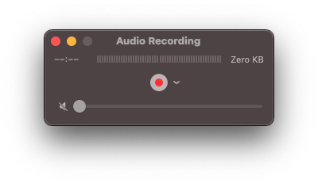

# macOS QuickTime screen recording at 48 kHz sample rate
December 3, 2020

Each time I write the title of a new article on this blog I feel even
more like a nerd. So be it.

When you do a screen recording on macOS, you can capture audio from your
microphone. Or using a tool like [BlackHole](https://github.com/ExistentialAudio/BlackHole)
you can even record your system sounds (get the direct download URL from
the [Homebrew formula](https://github.com/Homebrew/homebrew-cask/blob/master/Casks/blackhole.rb)
if you don't want to sign up)!

Either way, by default the screen recording utility that you can open
using <kbd>Command</kbd> + <kbd>Shift</kbd> + <kbd>5</kbd> (which is the
same thing as opening QuickTime and doing *File*, *New Screen
Recording*) will record your input with a sample rate of 44.1 kHz.

I don't plan on bouncing my screen recording to an audio CD, and I don't
like unnecessary sample rate conversions, so I want to record in 48 kHz.

There's no option for this, and even though the device is set to 48 kHz
(you can see that in *Audio MIDI Setup*), the screen recording utility
still records in 41.1 kHz (likely adding even one more sample rate
conversion in the pipeline).

<figure class="center">
  
</figure>

You can see that using `ffprobe`:

```sh
ffprobe Screen\ Recording\ 2020-12-03\ at\ 09.18.38.mov
```

```
    Stream #0:1(und): Audio: aac (LC) (mp4a / 0x6134706D), 44100 Hz, stereo, fltp, 2 kb/s (default)
    Metadata:
      creation_time   : 2020-12-03T14:18:40.000000Z
      handler_name    : Core Media Audio
```

However, QuickTime also allows recording *only audio* by going in
*File*, *New Audio Recording*. You then have a little down arrow next to
the record button where you can select your recording device *and* the
audio quality (between *High* and *Maximum*).

<figure class="center">
  
</figure>

<figure class="center">
  
</figure>

In my case it was *High* by default (apparently alias for 44.1 kHz), so
I set it to *Maximum*, then went back to the screen recording utility.

Magically, it remembered the audio setting, and my screen recording is
now 48 kHz!

```sh
ffprobe Screen\ Recording\ 2020-12-03\ at\ 09.19.47.mov
```

```
    Stream #0:1(und): Audio: aac (LC) (mp4a / 0x6134706D), 48000 Hz, stereo, fltp, 2 kb/s (default)
    Metadata:
      creation_time   : 2020-12-03T14:19:48.000000Z
      handler_name    : Core Media Audio
```
