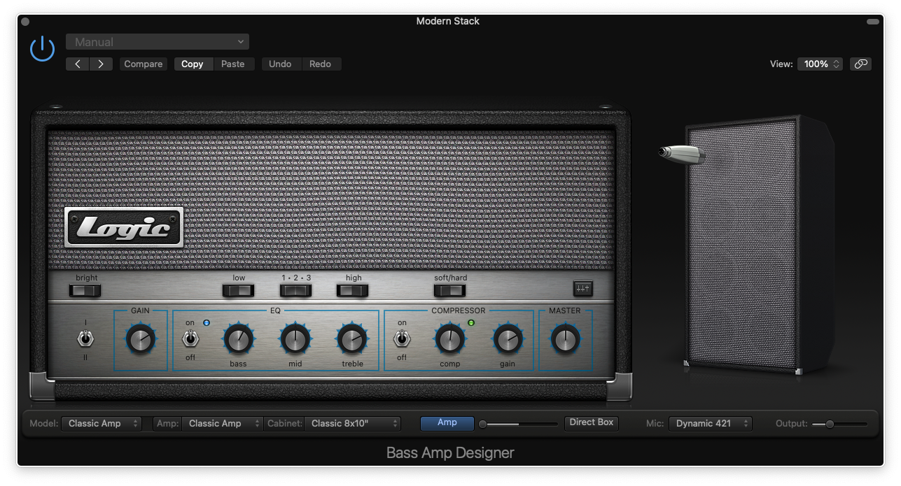
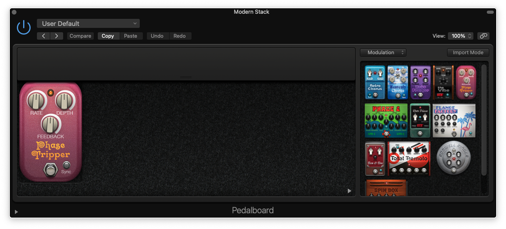

Franc Moody bass tone on Logic Pro
==================================
January 29, 2021

I'm obsessed by the bass tone in the Franc Moody songs.

If you don't know that signature tone, you can find it in many of their
tunes, for example in:

* [Dance Moves](https://youtu.be/IL8F6IoxgGw)
* [Dopamine](https://youtu.be/PMB9kcrA5dc)
* [Lunar](https://youtu.be/Yo1w-Oj52xc)
* [Pheromones](https://youtu.be/tkJoqlvnGCU)
* [Lose My Cool](https://youtu.be/31Vz6Hxqpf4)

I also made a cover a while ago where I tried to reproduce this tone,
essentially trying to mimic a wah effect using Logic's AutoFilter, in
combination with a LFO that varies the cutoff frequency.

You can hear it after 1:00 where the main line starts.

<figure class="video">
  <iframe src="https://www.youtube.com/embed/39W33nXh2JM" allowfullscreen></iframe>
</figure>

More recently, I was working on a cover of Lose My Cool, which also have
a similar tone, but this time I went with a simpler path, which yielded
surprisingly good results.

Like most of the time, I started from the Modern Stack bass amp in
Logic. I disabled the default <kbd>Noise Gate</kbd> and <kbd>Channel EQ</kbd>
it comes with, and I tweaked a couple settings on the amp:

* Set the slider between <kbd>Amp</kbd> and <kbd>Direct Box</kbd> all
  the way to the amp side.
* Flip the <kbd>low</kbd> switch all the way to the right (brighter tone).

<figure class="center">
  
</figure>

Then I added a <kbd>Pedalboard</kbD> plugin where I put the <kbd>Phase
Tripper</kbd> pedal, with the default settings.

<figure class="center">
  
</figure>

This gives something in a pretty similar vibe as the Franc Moody
legendary bass tone!

You might want to add some EQ in the mix, maybe to dim the high
frequencies as the phaser can create a lot of noise there.

Enjoy!
