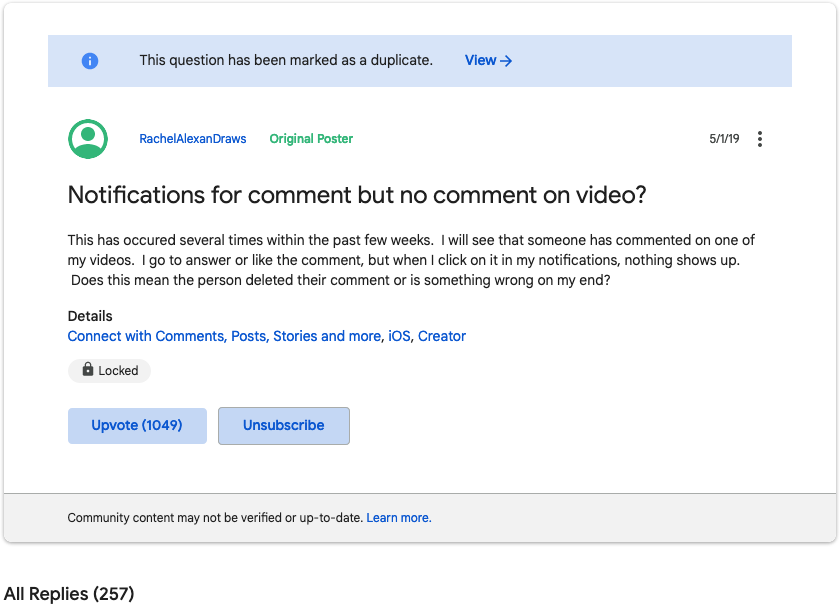
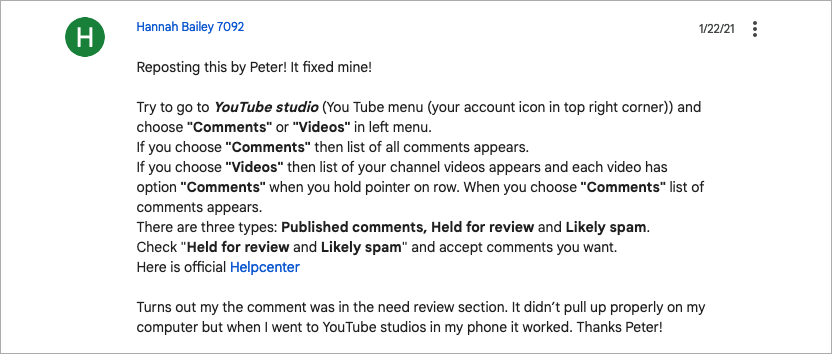
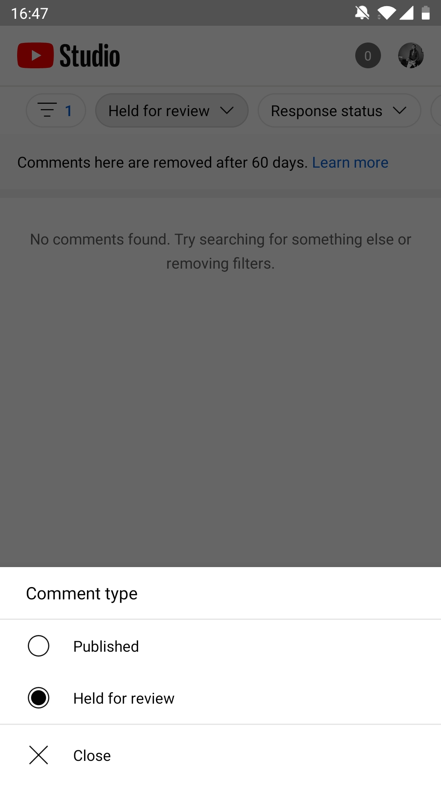
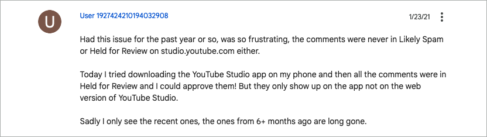

# YouTube comment notification but no comment on video
January 23, 2021

Since about a year that I'm actively posting videos on YouTube, I'm
regularly getting new comments.

But I've been having an issue that whole time where sometimes I get a
notification for a comment (via email and in the notification bell on
YouTube as well) but the comment is nowhere to be seen on the video! 🤔

I've actually seen 3 different outcomes for this issue. The third one is
quite underground and you should [jump straight to it](#use-the-youtube-studio-mobile-app)
if you feel like you tried everything already.

## Top comments

The first and easiest one was that the comment wasn't displaying when in
"top comments" display mode under the video (the default for me), for
some reason.

But when switching to "newest first", it would actually come up and I
was able to reply to it!

<figure class="center">
  
</figure>

This worked for some comments, but still many of them were missing for
me.

## Held for review & likely spam

The second possibility was that the comment ended up in the "held for
review" or "likely spam" tabs that you can find on the comments section
on YouTube Studio.

Going there you can approve the comment and then reply to it, and it
will appear under your video.

<figure class="center">
  
</figure>

**Note:** the "likely spam" tab is gone for me as you can see in the
above screenshot, but I remember seeing there in the past and people
online still mention it, so it might work for you.

## Just gone

The third option though was that the comments were just completely gone,
nowhere to be seen. Changing to "newest first" didn't help, and they
were not in "held for review" or "likely spam" either.

Maybe the user deleted their comment, but at least one of them was from
a close friend and I could ask him directly if he removed his comment,
and he surely did not.

This have been happening regularly all year and it's so frustrating
because it happens on nice, positive and constructive comments that I
really wanted to answer, and none of those were against the YouTube
rules and none of them seemed like a comment the user would go back to a
couple days later to delete.

It happened one more time this week and I decided to try to find a
solution again.

I found that [support center thread](https://support.google.com/youtube/thread/5258442)
where *a lot* of other users have the exact same issue.

<figure class="center">
  
</figure>

With 1049 upvotes and 257 replies, this showed me that I was definitely
not the first one to encounter this issue. Sadly this didn't seem to
bring any solution, everyone was essentially just complaining and
desperately trying to find the comments they were notified for.

Except for one of the last comments.

## Use the YouTube Studio mobile app!

This comment from Hannah was reposting an earlier advice about the "held
for review" (which we saw above, doesn't always work), but with one
extra key element.

<figure class="center">
  
</figure>

> Turns out my the comment was in the need review section. It didn't
> pull up properly on my computer but when I went to YouTube Studio in
> my phone it worked.

So far I only had been looking at YouTube Studio from my desktop
browser, but I never tried the *mobile app*!

I went and downloaded the YouTube Studio mobile app, and went to the
comments section, in the "held for review" part, and here they were! The
comments that I couldn't find earlier were there, and I could actually
approve them, and then reply to them.

<figure class="center">
  
  <figcaption>Where to find the missing comments on the mobile app. Nothing to see on mine because I approved them all already!</figcaption>
</figure>

Sadly this only keeps the comments from the last 60 days so the ones
from earlier last year that I knew disappeared are gone forever, but at
least I now have a solution for the future times this happens!

### More external feedback

I went on and commented on the thread as well to highlight the fact the
mobile app do seem to fix the issue, as that earlier comment went mostly
unnoticed (as did mine too in retrospective).

<figure class="center">
  
</figure>

And this seem to have worked for other people as well, as we can see in
this comment from Robert:

<figure class="center">
  
</figure>

Now nearly a year after originally writing this post, one of my favorite
French YouTubers, [Benjamin Code](https://www.youtube.com/BenjaminCode),
[shared on Twitter](https://twitter.com/benjamincode/status/1467193704482021381)
that he was having the same problem:

> Hey [@YTCreateurs](https://twitter.com/YTCreateurs), deux ans
> maintenant que je vous remonte ce bug en permanence... Deux ans qu'une
> bonne partie des commentaires qu'on me laisse sont automatiquement
> supprimés par YouTube... Je crois que c'est l'un des trucs les plus
> frustrant de la platform. Ça en est où le fix?
>
> --- [@benjamincode](https://twitter.com/benjamincode), [December 4, 2021](https://twitter.com/benjamincode/status/1467193704482021381)

Or in English, he's been having this issue for over two years where a
significant proportion of the comments he's been getting just seem to
disappear, and is looking for a fix.

I [shared him this fix](https://twitter.com/valeriangalliat/status/1467194973418409989)
and it seem to have [helped there too](https://twitter.com/benjamincode/status/1467201980309417993)!

> Ah en fait on dirait que si! J'en ai retrouvé quelques uns! À
> confirmer avec le temps! Merci beaucoup pour cette astuce perchée!

Essentially saying he managed to find at least a few ones thanks to this
far-fetched trick.

## Conclusion

If like many other YouTubers you're struggling with disappearing
comments and you're pulling your hair out because of this issue that's
been happening for years now, I hope this trick helped you recover the
comments from at least the last 60 days, even though you might have been
struggling with it like me for much longer than that.
