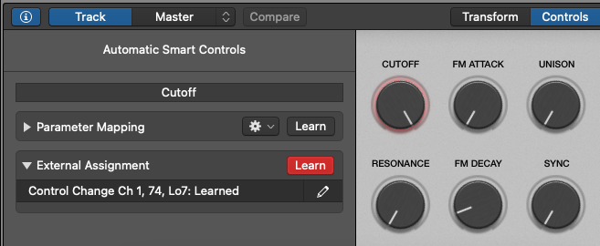

# Control MIDI instruments with keyboard knobs in Logic Pro
February 28, 2021

While this feature is well documented, see [assign hardware controls to screen controls in Logic Pro](https://support.apple.com/en-ca/guide/logicpro/lgcp0155c51f/mac),
I found that page quite hard to find when looking it up (probably because I
was using the wrong keywords), so I'm making this article in the hope to
help other people who don't necessarily think about the terms "hardware
controls" and "screen controls".

I've also made a video about this, check it out!

<figure class="video">
  <iframe src="https://www.youtube.com/embed/3YKvkiyXZMA" allowfullscreen></iframe>
</figure>

I found this feature not very intuitive to find; the last time I needed
it, I even knew it existed and that I did it in the past but I couldn't
figure where I could assign the physical knobs again.

I'm using a MIDI keyboard, actually a microKORG synth that I plug as
MIDI in Logic Pro, which comes with a set of knobs that, as a synth,
allow controlling the cutoff, resonance, attack and release, and as a
MIDI controller, send MIDI events.

By default when this keyboard is plugged in MIDI, those knobs do
nothing, and I was wondering how to make them control Logic's virtual
instruments.

## Assign physical knobs to virtual instrument

For this, you need to open the **Smart Controls** panel (e.g. by
pressing <kbd>B</kbd>). In this panel, make sure you're in the
**Controls** tab (it usually also shows **Transform** and
**EQ**).

On the top left of that panel, there's a little **ⓘ** button,
click it to show the inspector, which allows you to create external
assignments!

By the **Learn** button, you can select one of the controls on
the right (e.g. **CUTOFF**), and turn the physical knob that you
want to assign. Logic should understand the matching MIDI signal and add
the assignment.

<figure class="center">
  
</figure>

You can then click on another control, turn another physical knob again,
until you're satisfied, then you can stop the learning process by
clicking again the **Learn** button.
