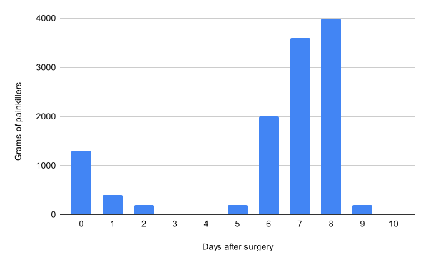

# Gum graft from a patient's perspective
April 28, 2021

Sometimes, for various reasons, the gum that covers the base of your
teeth start to fade away, exposing more and more of the root. This is
known as gum recession.

At some point this can become somewhat concerning and that's usually
when your dentist suggest you have a gum graft.

A gum graft is a surgery where gum is removed from the palate in order
to, well, graft it on the base of your teeth where you're supposed to
have gum in the first place.

I've had my second gum graft done a week ago, and I decided to write
this post to answer all the questions that I asked for myself
before, during, and after the graft, as well as some tips and tricks
learnt from my experience.

This will be useful to my future self when I need to do another one,
and hopefully that can help you too if you're considering having
a gum graft, or if you just had one and don't really know what to
expect.

## Why did my gum go away in the first place?

I am not a dentist, but my understanding is that
[many things can cause gum recession](https://www.webmd.com/oral-health/guide/receding_gums_causes-treatments "See “Why do gums recede?”").
Genetics, brushing technique and smoking seem to be the most common.

As far as I'm concerned, it's probably a mix of the first two.

All my life, I brushed my teeth pretty aggressively, thinking that it
would prevent cavities, which it probably did as I've never had a
cavity. But all those strong
[horizontal](https://www.medicalnewstoday.com/articles/326022 "See “Forceful or incorrect brushing”")
[strokes](https://kitchenerfamilydentist.com/blog/a-rational-approach-to-managing-gum-recession/ "See “Forceful tooth brushing”")
or thorough up and down vertical strokes likely played a major role in
my gum recession.

> Some people really scrub their teeth during brushing. The key to
> effective, non-harmful brushing is low-force, hi-repetitions (or
> "reps"). Some people have discovered that they can get a nice clean
> feeling quickly (low "reps") by brushing with heavy force. The problem
> with this approach is that you lose gum tissue as recession occurs
> over time.
>
> --- [Dr. Kyle Hornby "Can gum grafts fail?"](https://kitchenerfamilydentist.com/blog/can-gum-grafts-fail/ "See “What causes gum recession?”")

### Properly brushing your teeth 🪥

Instead, brushing should be done more lightly, with circular movements,
or angled strokes going from the gum to the tooth and not the other way
around. This means doing a downwards movement for the top teeth and
upwards movement for the bottom teeth.

> Brush your teeth as though you are painting a portrait. Use many
> repetitions under light force.
>
> Also, you may want to transition to a more circular motion with the
> bristles instead of side-to-side scrubbing.
>
> --- [Dr. Kyle Hornby "A rational approach to managing gum recession"](https://kitchenerfamilydentist.com/blog/a-rational-approach-to-managing-gum-recession/ "See “Forceful tooth brushing”")

> * **Use a soft bristled toothbrush** -- to prevent damage to the
>   enamel, only use a soft-bristle toothbrush.
> * **Brush at a 45-degree angle** -- the angle of the brush is
>   important, the toothbrush should be placed against the teeth at a
>   45-degree angle to the gum line.
> * **Motion correctly** -- using short gentle back, forth, and small
>   circular motions, all tooth surfaces will be gently brushed, avoid a
>   sawing or scrubbing motion.
>
> --- [Kathleen Davis "Caring for teeth and gums"](https://www.medicalnewstoday.com/articles/298531#how_to_brush)

I believe that this is also related to genetics, as I'm pretty sure lots
of people brush like I did before without ever having gum issues, and
those circular / angled brushing techniques were only ever mentioned to
me after a gum graft.

## How many teeth can you graft at a time?

I have like 5 teeth that could use some care as far as gum is concerned,
but the surgery seems to be limited by how much gum can be taken from
your palate.

If you have two teeth that need a graft that are just next to each
other, it seems more likely that they can be treated in the same graft,
but if you're like me and all the concerned teeth are all around the
place, it's probably gonna need individual surgeries.

For me, by taking gum on the left side of my palate, my dentist was only
able to treat one tooth.

I've read online experiences from people where the gum was taken from
both sides of the palate in the same surgery, which I assume would allow
to treat two different areas at the same time. But as you'll see later,
the palate wound was pretty painful and I was really happy to have one
side that didn't hurt to allow me to eat at least a little bit.

I can imagine how (even more) painful and annoying it would be to have
wounds on both side of the palate.

## Where does the gum graft comes from

Typically it's taken from your own palate, but there are alternatives.

### Gum from your own palate

In that scenario, there is two options; taking a whole chunk of gum
directly from the palate, or taking a layer of gum from *under* the
palate.

The second one yields a thinner graft but should be less painful during
the recovery period.

In my case, I had a full graft, which means my recovery period was not
fun at all.

### Other alternatives 🐖

It seems that there's two other options for getting the gum for the
graft. Instead of taking it from your own palate, which seems to be the
most common option, it can also be taken from a dead person, or from a
pig (presumably dead as well).

Those options were not offered to me. I later on asked my dentist about
the pig gum specifically, so here's what you need to know about it:

It's a collagen graft, the collagen coming from a pig. It's not as
successful as gum taken from your own palate as there's more chances of
your body rejecting the graft. Aesthetically, it's supposed to "not make
much difference".

Other than the higher risk of the graft being rejected, there is
apparently no health risk to using pig collagen for this surgery.

It would cost an extra CA$200, presumably from the pig. That seems
pretty expensive to me as you could buy a whole piggy for that price at
the market, and not only take the gum but also cook everything
else and eat it. Maybe they have some kind of special medicinal pigs
they use for this and that's why it costs so much?

I might consider using pig gum for the next ones, especially I presume
that would allow grafting many different areas at the same time without
taking a huge toll on my ability to eat because of large palate wounds.

This last point is especially important to me, as nutrition is key for
the graft to heal:

> Success in grafting depends on gum tissue already at the graft site
> connecting with grafted tissue and supplying it with blood and
> nutrition. When this doesn't occur, graft tissue can die off and gum
> grafts fail.
>
> --- [Dr. Kyle Hornby "Can gum grafts fail?"](https://kitchenerfamilydentist.com/blog/can-gum-grafts-fail/ "See “What causes gum recession?”")

Because of the palate wound, my eating was largely impacted (I lost 5 kg
in 10 days to give you an idea). Even drinking water was hurting,
despite large doses of painkillers, so I was drinking only when really
thirsty. I believe that this caused my blood to be very poor in
nutriments supplied to my gums and ultimately might have caused the
graft to fail (it's still too early to tell for sure).

By taking pig gum instead, I would have been able to maintain a more
consistent diet which makes me think that this could have lead to a more
successful result.

Also that would be a pretty fun fact.

## Surgery day 💉

So you decided to have a gum graft, and it's now surgery day. What to
expect? Here's my experience.

I showed up at the dentist for my appointment. She needed to do two
local anesthesia, one on the palate and one near the tooth that was to
be grafted.

### Anesthesia

The anesthesia itself is supposed to be somewhat painful, which is why
she rubs some kind of soothing gel on the zone a minute before the
injection. That is supposed to make it less painful. She openly told me
this is more of a placebo, but placebo works decently well for me even
when I know they're placebo, so that's fine with me.

It wasn't as painful as I expected (and as I remembered from my first
gum graft around 10 years ago). No big deal here.

The following steps are my assumption of what my dentist was doing based
on what it felt like, but I might be completely wrong.

### Taking gum from the palate

This is the part that I dreaded the most, as in my memories from my
graft when I was a teenager, this was hurting quite a bunch even with
the local anesthesia.

To my good surprise, this time this operation was totally painless. It
seemed pretty quick and I felt absolutely nothing.

### Grafting the gum on the base of the tooth

This part was much longer, I have no precise idea of the actual timing
but this probably took 30 to 45 minutes where the whole operation was 1
hour. That's just my perception of time though and I could be well far
off.

This was mildly uncomfortable the whole time but not painful whatsoever.
It's just long.

### Stitches and plaster on both the palate and the graft

The palate stitches were pretty quick, but the graft ones took a bit of
time and were a bit more uncomfortable.

### How long did it take?

The surgery took about an hour, totaling to an hour and half from when I
first passed the door until I was out in the street.

### How much did it cost?

I was charged for an hour and half surgery which was around CA$700. I'm
in Montreal for context.

### Right after the surgery

Because of the anesthesia, I think you're not supposed to drive right
after the surgery. That said I wasn't told anything about that so maybe
it's not always the case. If you're planning to drive, I would recommend
you ask your dentist before. As far as I'm concerned, I rode my bicycle
and it was fine.

My dentist told me to take 1 Tylenol (500 mg, also known as
acetaminophen and paracetamol) and 3 Advil (200 mg, also known as
ibuprofen) as soon as I got home, and repeat this dose every 6 hours
until it doesn't hurt anymore.

I also got scheduled a follow up appointment 10 days later (it seems
it's usually 7 to 10 days after the surgery), where she will remove the
plaster and stitches.

After 6 hours I did feel some pain and a single Advil was enough to tame
it.

## The week after the surgery 🤒

In this chapter, we'll talk about all the aspects of life affected by
the surgery, including pain level and management, working, talking,
eating and exercising.

For the record my surgery happened on a Thursday morning.

### Pain level and management 🥲

The morning following graft day, my palate was painful and I took a
single Advil to tame it. I felt pretty tired the whole day but not in
bad pain. I just took another Advil before bed as the pain was mildly
increasing (or I could feel it more because I wasn't focusing on
anything else).

The following day (Saturday), I didn't even need a morning painkiller
and I just took one in the evening to help me sleep.

Then I was off painkillers for 3 days where I was just uncomfortable
eating but the pain was low as long as food wouldn't touch the wounded
part of my palate.

That's until the plaster I had on the palate fell off on Tuesday night
as I was eating. It's indeed supposed to fall after a few days:

> Do not be alarmed if the bandage falls off within 1-3 days following
> the surgery.
>
> --- [Dr. Kurt Van Winkle "Periodontal cosmetic procedures instructions"](https://www.vanwinkleperio.com/procedures/after-surgery-instructions/soft-tissue-grafting/ "See “Bandage”")

A few hours after the plaster fell off, the palate wound started to hurt
like a motherfucker. That pain lasted until the following Saturday.

This means that I had to go back to the amount of painkillers that I
thought was just a single time post-surgery dose: 1 Tylenol and 3
Advil, repeated every 6 hours.

<figure class="center">
  
</figure>

I ended up adapting it to 1 Tylenol followed by 2 to 3 Advil, 2 to 3
hours later, and looping like this. The pain was waking me up at night
as soon as the painkillers effect faded. This is by far the most
painkillers I've taken in my whole life in such a short period of time.

It was still lower than the maximum recommended daily dose per day for
this kind of medicine, but not by much.

While the palate plaster was off, the stitches that presumably used to
hold it in place were also detaching, leaving a hanging sting in the
middle of my mouth. This is also expected and you can safely cut it with
small scissors.

> Sutures (stitches) are resorbable and will come out within 5-10 days.
> They may untie, become loose and hang down from the palate. Do **not**
> attempt to pull or remove the sutures. If they are long and
> bothersome, you can trim them with small scissors
>
> --- [Dr. Kurt Van Winkle "Periodontal cosmetic procedures instructions"](https://www.vanwinkleperio.com/procedures/after-surgery-instructions/soft-tissue-grafting/ "See “Sutures”")

I took my last Advil on Saturday morning when the pain woke me up at
5 AM. Finally, when I got up a couple of hours later, after 3 days of
hell where I was stuck in my bed pretty much the whole time and could do
absolutely nothing productive, the pain disappeared as fast as it came
and I was back to living a nearly normal life again.

### Working 💻

I had the graft done in the morning, and I was pretty much useless the
rest of the day. Don't expect to get a lot of work done right after a
gum graft.

The next day was pretty much the same, not much pain but feeling drained
and exhausted the whole time. I would spend half an hour working and
then had to lay down for an hour or so. I could attend the two meetings
I had that day, and I was lucky I only needed to talk for a minute or
so.

I didn't manage to do any creative work during the weekend, but I could
watch online courses and read books so it wasn't all lost.

Monday and Tuesday were solid productive days at work. Note that I don't
have many meetings and I usually don't need to talk a lot during those.

Wednesday to Friday were the worst days since the surgery, and I could
do absolutely nothing. Consuming content was fine so I used that time to
watch some more online courses.

Saturday the pain was completely gone and I was back to high
productivity, both for work and personal projects.

### Talking 💬

I was uncomfortable talking for at least a week after surgery. Then my
French started to be somewhat OK, but I still had trouble articulating
in English and it was quickly tiring and a bit painful after saying more
than a few sentences.

After two weeks, I was comfortable speaking again for extended periods
of time.

### Eating 🥕

My diet for the first 10 days was limited to soup, mashed potatoes,
yogourt, apple sauce, pudding and eggnog. I managed to eat some
scrambled eggs, salmon and mac and cheese too.

Bananas were the most solid thing I ate during that time (to give you an
idea) and it was really inconvenient and nearly painful. Also I needed
like 5 minutes to eat a whole banana. Not ideal.

If I was to give an advice to my past self, **it would definitely be to
buy a blender and/or juicer**, to make smoothies and juices out of fruit
and vegetables to keep a healthier diet.

I lost 4 to 5 kg over this period, and I'm pretty skinny in the first
place so that's no good. I normally weigh around 68 or 69 kg and I'm 185
cm tall. I got down to 64 kg.

This put me very close to a <abbr title="Body mass index">BMI</abbr>
that starts to be concerning form a health perspective, and I surely
felt really week, low energy, and empty.

For the first 4 days my palate wound was covered which made it easier to
eat, I just had to avoid the graft zone which was covered by a thick
white plaster anyways, and to some extent the palate wound zone, but it
wouldn't be a huge deal if some food touched it since it was covered.

When the palate plaster fell off, eating was always painful, even soft
or liquid food. I could only eat lukewarm soup, especially ones without
chunks in it like onions or mushrooms and such. Eggnog was the thing
that hurt the less during that time. Even water was painful to drink.
And all that even with the high dose of painkillers I was on.

When my palate stopped hurting, so nearly 10 days after surgery, I
introduced sushi, sausages, ground beef, vegetables like lentils and
beans, or anything of that kind. I still had to eat it only on the
opposite side of my palate wound but it was getting better overtime.

Eating was taking me 5 to 10 times longer than it normally would, which
was extremely frustrating, especially I love to just stuff my face with
lots of food in a record amount of time.

After two weeks, the main limitation is that I can't bite into things
since my grafted tooth is in the front and I need not use it. This means
I can't have sandwiches or burgers, and I basically need to cut
everything I eat in small pieces that I chew only with my back teeth on
only one side. Sad.

### Drinking 🍺

I read online that it was discouraged to have fizzy drinks and alcohol
before the first follow up appointment, so I didn't have any of that
(sad). I tried a sip of kombucha after 3 days and it was stinging on my
palate, I wouldn't have been able to drink it even if I wanted to.

On my follow up appointment 10 days after surgery, I asked my dentist
about it and she told me it was fine to have fizzy drinks and alcohol
again. I had a beer that night, and it tasted good and didn't hurt.
Great.

### Exercising 🏋️

[Apparently](https://drmarkblue.com/post-operative-care-instructions/instructions-following-tissue-grafting-surgery/)
you shouldn't do any kind of activity that raises your heart rate for
the first two weeks after surgery.

On the other hand my dentist told me I could exercise since day 0 as
long as it wasn't intense like running a marathon (but she probably knew
that I would not *feel* like exercising at all after such a surgery,
especially not a marathon).

I went on a short low intensity bike ride 3 days after surgery. I felt
fine but I might have increased my heart rate at points.

I went on an easy hike the weekend after that.

The evening after my 10 days follow up appointment I went on a high
intensity bike ride. Might have been a bit too soon? Cardio was
definitely way up. It felt good to exercise again, that said I
definitely didn't have as much in me as I used to, after losing nearly
5 kg since the surgery.

### Kissing 😘

After the surgery I asked my dentist how one should go about kissing.
She told me I could do it as soon as I felt like it, which made a lot of
sense later when I realized I really did not want to be kissing anyone
with the amount of pain and discomfort I had in my mouth!

That also applies to anything else you would want to do with your mouth.

## Follow up appointment

After 10 days, I had my follow up appointment. It was extremely fast.

My dentist removed the plaster and stitches from my grafted tooth. She
made sure the palate stitches had all resorbed.

I was then scheduled another appointment for 6 weeks later which I have
yet to attend. I will update this article then if I find out anything
else worth writing.

## Wrapping up

The surgery itself is not painful whatsoever.

Taking gum from the palate leaves an open wound there that can reach
fairly high levels of pain during parts of the first 10 days despite
high doses of painkillers.

Because of the palate pain plus the fact that you can't use the teeth
from your grafted area (those are not painful though), eating is
challenging, even soft foods. Drinking can be painful too, even water.

This lead me to very poor nutrition for the first 10 days or so (I lost
5 kg) and I believe that this negatively affected the chances of success
of the graft, because it heavily depends on a rich nutriment supply to
the gum tissue at the graft site.

Taking gum from a pig is an option that comes to an extra cost, and
while pig gum has lower chances of being accepted by the human body, I
like to believe that the fact this would make it easier to maintain a
healthy diet after the surgery could make it worthwhile. I will need to
discuss that with my dentist as this is a totally unfounded opinion for
now.

Either way, I wish I bought a blender and/or a juicer before the surgery
as this would have made it easier for me to get the nutriments that I
otherwise lacked.

I wish that your graft doesn't get too painful, and that you have
successful results!

If something I wrote on this page is wrong or inaccurate, or you see
something worthwhile adding here, please [contact me](/val.md) to let me
know. Cheers!
