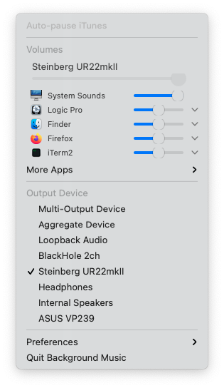
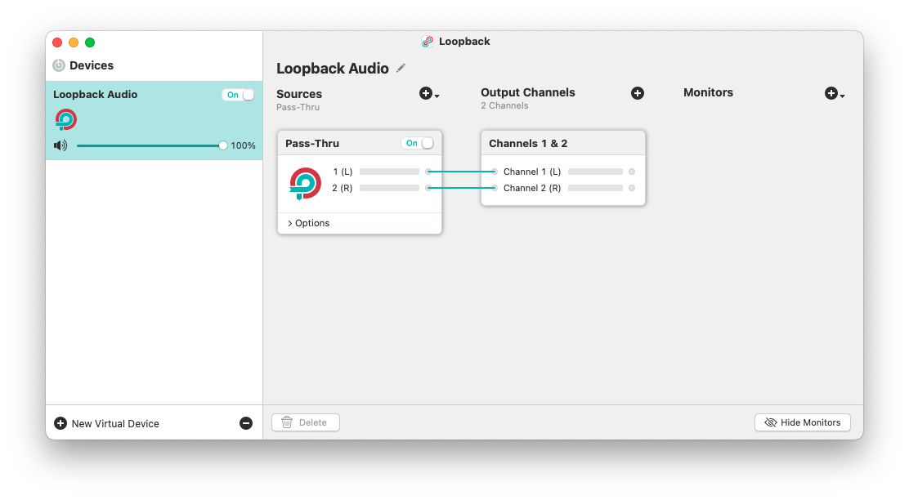

# macOS screen recording with system audio
May 13, 2021

This is surprisingly not trivial to do, even though it seems like a key
feature when doing a screen recording. It turns out you cannot do that
natively on macOS (I'm currently on Big Sur), and you need an external
software to do the magic.

As of today there's essentially 3 options: [Background Music],
[BlackHole] and [Loopback]. The first two are free and open-source, and
the last one is proprietary and costs 99 USD before tax.

[Background Music]: https://github.com/kyleneideck/BackgroundMusic
[BlackHole]: https://github.com/ExistentialAudio/BlackHole
[Loopback]: https://rogueamoeba.com/loopback/

In this post I'll try to go over the 3 of them and tell you the pros and
cons. But first, let's look at my particular use case.

## Requirements

The task I want to achieve is doing a screen recording (using QuickTime,
through <kbd>Command</kbd> + <kbd>Shift</kbd> + <kbd>5</kbd>) during
which I open Logic Pro, create a new project, and record some music in
it, capturing the audio going live through my system as I play. This is
challenging for a number of reasons:

1. As I'm gonna be playing music, I don't want any latency to be
   added on top of what I would have when I'm not recording the system
   audio. This is a problem with Background Music but can be worked
   around if you only use it to capture the system audio.
1. BlackHole doesn't add any latency by design as we're using it with a
   native macOS multi-output device, but Logic Pro resets Core Audio
   when it opens, and that used to make it crash, ending the screen
   recording unexpectedly. **The good news is that I just tried its
   latest version, and it's not an issue anymore!**
1. Loopback is a great software that can support complex audio routing
   setups without adding a lot of overhead, which justifies its price,
   but considering that I'm going to use like 1% of what it's capable
   of, that makes it pretty expensive for my needs.

## Background Music

[Background Music](https://github.com/kyleneideck/BackgroundMusic) is a
macOS audio utility which allows you to manage per-application volume,
auto-pause music when other audio sources are playing, and record system
audio.

<figure class="center">
  
</figure>

The way it's intended to work is that you set your macOS audio output to
Background Music's interface, then inside the Background Music app, you
can chose which physical interface you really want to output to, with
their extra layer of functionality in between.

<div style="text-align: center">

```
Audio interface (input) 🎸
|
Logic 🎚️
|
Background Music 🎱
|
Audio interface (output) 🔊
```

</div>

Current stable version 0.3.2 doesn't support Big Sur, but they provide a
0.4.0 snapshot that does. The 0.4.0 version works well on my machine and
I can successfully capture system audio in a screen recording with it.

The issue in my case is that when I'm playing an instrument, e.g. bass
or guitar plugged into my audio interface, and monitoring its output,
while Logic is set to output audio to Background Music's interface (and
Background Music being configured to then output to my speakers),
there's a pretty significant delay that makes it impossible to play
live while recording. Bummer.

### Making it low latency

This can be mitigated by using a multi-output device (in *Audio MIDI
Setup*, it's native to macOS Core Audio) to send the audio output
both to my speakers for monitoring, and to Background Music for
recording, in two independent channels, so that Background Music
wouldn't delay the signal that goes to my speakers.

<div style="text-align: center">

```
Audio interface (input) 🎸
|
Logic 🎚️
|
Multi-output device 🎛️
|
Audio interface (output) 🔊 | Background Music 🎱        
```

</div>

This would then be exactly the same thing that we're doing with
[BlackHole](#blackhole) below, except that we have an extra layer of
Background Music functionality that is there but we're not using
(because we're never actually listening to what Background Music
outputs, except in the screen recording).

But Background Music requires you to configure an output, it cannot be
the last node in the pipeline, so to work around this, I configured it
to output to the headphones jack of my machine (which is not plugged),
or I can configure it to output to my screen speakers and then mute it
form the screen controls itself.

So in reality it needs to be like this:

<div style="text-align: center">

```
Audio interface (input) 🎸
|
Logic 🎚️
|
Multi-output device 🎛️
|
Audio interface (output) 🔊 | Background Music 🎱        
                    |
                      Headphones (unplugged) 🔇
```

</div>

This way Background Music still thinks it's outputting somewhere (which
it really wants to) and I can use it to capture the system sounds, and
get a low latency monitoring output directly sent to my speakers without
going through Background Music.

## BlackHole

[BlackHole](https://github.com/ExistentialAudio/BlackHole) is open
source, and is sponsored by Existential Audio, which means that their
main download link requires you to subscribe (for free) on Existential
Audio's website to get access to the download.

They do have Homebrew formulas as well (`brew install blackhole-2ch` or
`brew install blackhole-16ch` depending if you want 2 or 16 channels),
and if you don't want to use Homebrew, you can just grab the direct
download link from the formula code itself ([2 channels] and [16 channels]).

[2 channels]: https://github.com/Homebrew/homebrew-cask/blob/master/Casks/blackhole-2ch.rb
[16 channels]: https://github.com/Homebrew/homebrew-cask/blob/master/Casks/blackhole-16ch.rb

Then for my use case, I create a multi-output device in *Audio MIDI
Setup* that goes both to my speakers for monitoring, and to BlackHole
for recording.

<figure class="center">
  
</figure>

This gives us a layout like this:

<div style="text-align: center">

```
Audio interface (input) 🎸
|
Logic 🎚️
|
Multi-output device 🎛️
|
Audio interface (output) 🔊 | BlackHole 🌌               
```

</div>

I can then set the screen recording audio capture to BlackHole and it
just works, and is as low latency as can be because BlackHole is not in
the way of my audio interface output!

As I mentioned earlier, BlackHole used to occasionally crash when I
opened Logic during a screen recording, because Logic resets Core Audio
on start or when opening a new project, but this was many months ago
and I just tried again with the latest version and the issue doesn't
happen anymore, so that will be my go-to from now on!

## Loopback

Finally, [Loopback](https://rogueamoeba.com/loopback/) is made by Rogue
Amoeba and costs 99 USD. It's got a very neat UI and is a vary capable
software, that can deal with complex audio input and output routing
setups, but it's coming at a pretty high price point for what I
would do with it.

<figure class="center">
  
</figure>

You can set it up like Background Music, where you route your Logic
output to Loopback, then inside Loopback add a monitor node that
goes to your physical output interface. This is fairly low latency, at
least less noticeable than Background Music, but unless you need a
complex audio routing setup, why even add *any* latency?

Instead, it's even better for what I'm doing to setup one more time a
multi-output device in *Audio MIDI Setup* to have a direct
output to my speakers as well as an independent output to Loopback for
screen recording purpose, the same way we did with BlackHole.

But that that point 99 USD is a very high price for what we're doing
with it.

## Conclusion

Background Music, BlackHole and Loopback are all great software, and
while they're all capable of capturing the system audio onto a screen
recording, they're all built with different use cases in mind and they
each have their own approach to solving that problem.

Background Music seems to be designed to be your main audio output,
adding an extra layer of functionality in front of your speakers (but
also an extra layer of latency). You can work around that with a
multi-output device and sending Background Music to a muted or unplugged
output, but while that works, it feels quite hacky.

BlackHole is meant to be used as a transparent interface to route audio
from one software to another, in a totally agnostic way. It does one
thing, and does it well, delegating the heavy lifting of splitting the
audio signal to macOS native multi-output device, which keeps things
fast and simple.

Finally, Loopback is the Swiss Army knife of audio routing. While you
can use it as your main audio output, you don't need to and it'll
happily act like BlackHole. You can dynamically add as many virtual
Loopback interfaces as you want (which is also possible with BlackHole
but requires recompiling the driver), and in each virtual interface,
layout your inputs, outputs and monitors in pretty much any possible
way. This comes to the cost of 99 USD though, so unless you really need
a tool this powerful, you might be better off using BlackHole.

As far as I'm concerned, for my very basic use case, BlackHole does a
perfect job. It's a low-level tool without any bells and whistles, and
that's precisely what makes it lightweight and fast, adding virtually no
latency when capturing the system audio while monitoring a live
input.

I hope this comparison was useful to you, and that you found the tool
that suits you best!

Also, not so long ago I wrote an article on [how to capture screen recording audio at 48 kHz](../../2020/12/macos-quicktime-screen-recording-48-khz-sample-rate.md)
instead of 44.1 kHz, so you might find that interesting as well if you
want to keep the sample rate consistent in your production pipeline.
