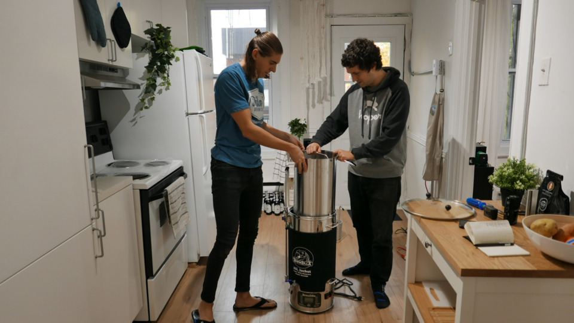
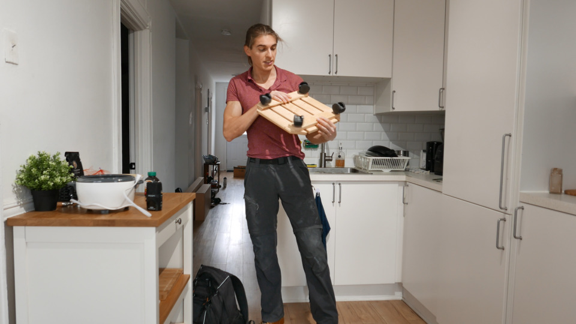
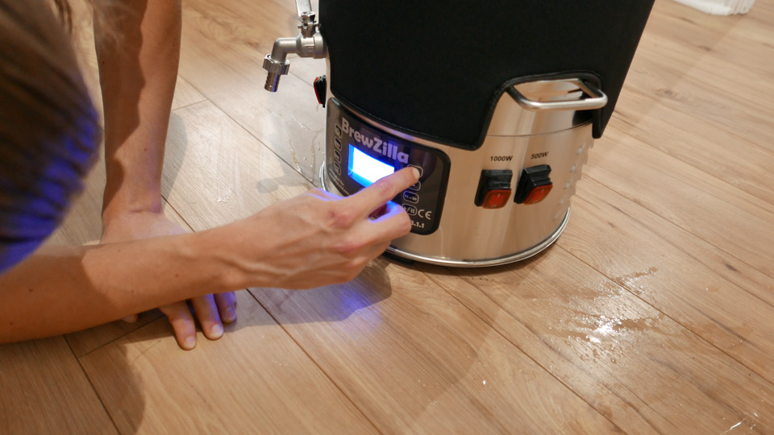
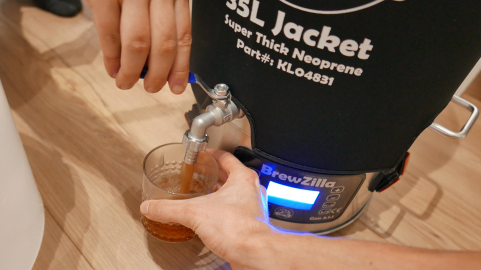
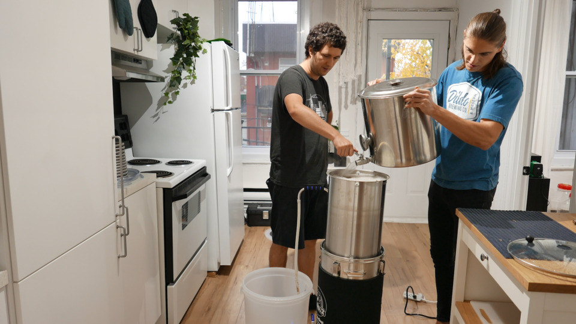
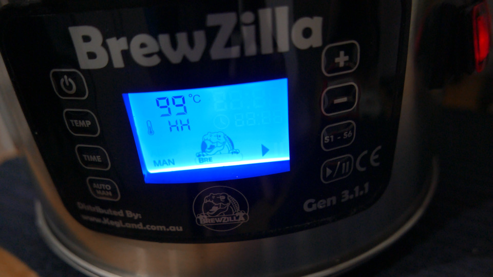
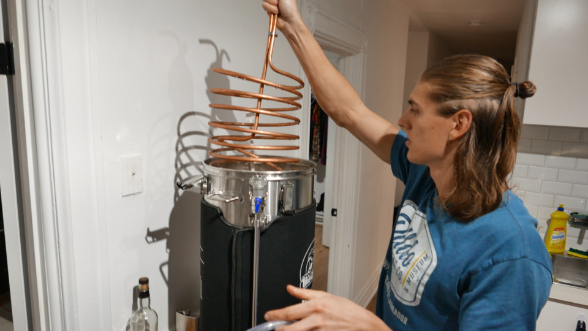
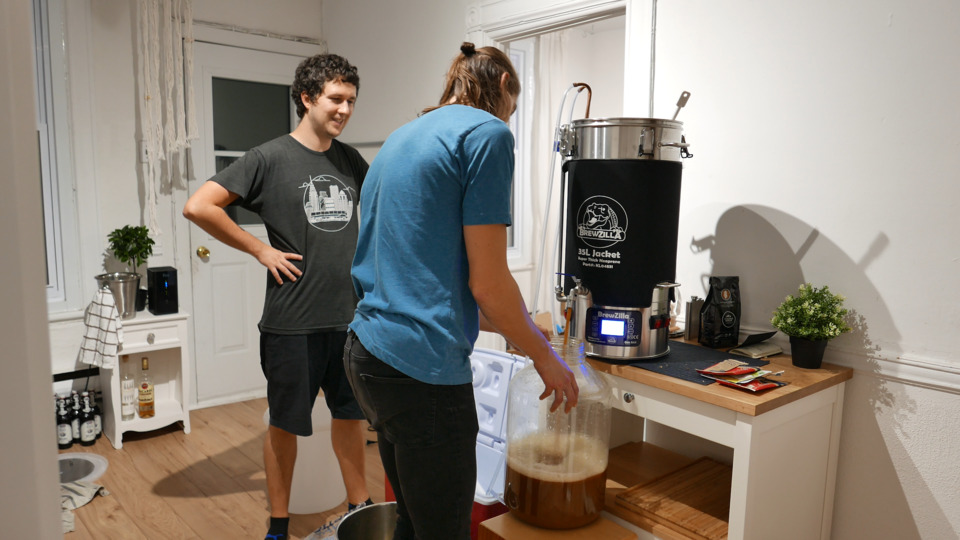
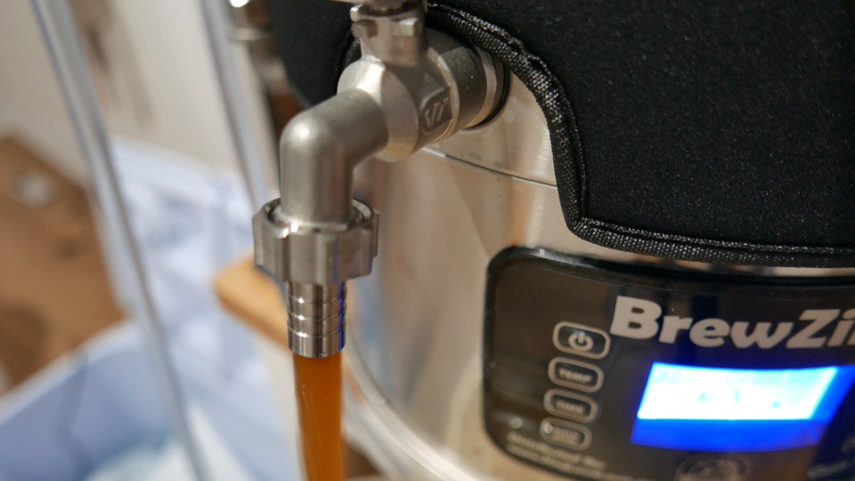

# Detailed recipe to make beer with the Robobrew BrewZilla
June 3, 2021

The BrewZilla, previously known as Robobrew, is a all in one brewing
system made by [KegLand] in Australia.

[KegLand]: https://www.kegland.com.au/

It comes in two sizes, 35 L and 65 L. I myself have the 35 L version
3.1.1.

<figure class="center">
  
</figure>

If like me, you're coming from more "traditional" brewing, e.g. with
just pots, no grain basket, no recirculating and so forth, the BrewZilla
can be a tad confusing. My goal with this blog post is to hopefully make
it more clear how to brew efficiently with the BrewZilla (both for the
beer efficiency and for your own time and energy).

But first, if you speak French, you might want to checkout the video I
made when I unboxed and first brewed with the BrewZilla!

<figure class="video">
  <iframe src="https://www.youtube.com/embed/arQ4Yutbitk" allowfullscreen></iframe>
</figure>

Otherwise, with no further due, let's get into this blog post.

## Where to put your BrewZilla?

This mainly depends on where it is going to be more practical for you to
wort chill.

As far as height is concerned, you can leave it on the ground. I tried
to put it on a counter at first because I thought it would be convenient
to use the spigot, but because there is a pump this is not necessary.

If you want the best of both worlds, so that you don't need to bend all
the way down to use its controls, consider using a chair, that being
said even that might be a bit too high to pour the sparge water.

As far as I'm concerned, I'm brewing in my kitchen, and I use a small
piece of wood with wheels (not sure of the name, found that at my local
brewing shop) to transport it to my bathroom when I need to wort chill,
as the shower is the only water input in my apartment that I can
connect to a wort chiller.

<figure class="center">
  
</figure>

## Heating water

You don't need the grain basket to be inside at that point, but I find
it convenient to put the bottom screen (the one with the feet) now to
avoid having to put it down when it's full of water.

Fill the BrewZilla to the amount of water you need for the mash. You can
use the markers inside to accurately fill it.

Put the lid on, plug the BrewZilla, and configure your mash temperature.
Turn on the two elements with the switches on the side, and press play.
Both switches should now activate.

<figure class="center">
  
</figure>

## Mash

When the water is at the right temperature (keep an eye on it as it
doesn't notify you), put the grain basket in. Your grain basket needs
the screwable pipe in place, with the little cap on top.

You can turn off the bigger element (1900 watts for the European
model, 1000 watts for the North American one) at that point, as the 500
watts one should be enough to maintain the temperature.

You can now pour the grains. I like to stir them in progressively to
avoid to build up a whole "island" of grains on top of the water that is
hard to get hydrated.

<figure class="center">
  
</figure>

That being said, you can use the pump to recirculate the wort which can
really help getting a consistent mash if needed. Also this is known to
make a clearer beer, which might or might not be what you want.

To use the pump, turn the pump switch on. There's a little valve on the
side of the tube to allow you to control the rate of the flow.

If your mash is still really thick after that, it's probably a good idea
to add a bit more water than planned in your recipe to make it more
fluid.

## Sparge

You obviously can't use the BrewZilla to heat your sparge water, so
you'll need another pot with adequate capacity, that you will heat using
other means, like your stove, or a dedicated heater.

Plan accordingly so that your sparge water is at the right temperature
when your mash is done to optimize your time.

Before you sparge, this is your friendly reminder to have a *hot
scotchie*. If you don't know about it, use the spigot to fill a small
glass with some of the hot wort, and add a drop of single match scotch.
You'll thank me later.

<figure class="grid grid-2">
  
  
</figure>

When you're ready to sparge, lift the grain basket and settle it on top
of the BrewZilla by rotating it on the hooks. Let it drain for a couple
of minutes.

This is also a good time to start heating for the boil, as it can take a
while to reach boiling temperature, so you can also turn back on both
elements. If water is getting close to a boil while you're not done
sparging, just stop the elements until you're ready.

Then, add your sparge water at a rate that keeps no more than an inch or
so of water above the grains.

**Do not stir the grains at that point, as that would only create
channels for the water to go straight down through them without
extracting anything.**

<figure class="center">
  
</figure>

You can either add a fixed amount of sparge water, or just rely on the
markings inside the BrewZilla to reach a certain level for the boil.

Remove the grain basket at the end of the sparge.

## Boil

If you started heating for the boil during the sparge, you should be
close to boiling temperature by now. When you reach a solid boil, you
can again turn off the bigger element as the 500 watts one alone should
be able to maintain the boil.

<figure class="center">
  
</figure>

Don't put the lid on during the boil. This allows <abbr title="Dimethyl sulfide">DMS</abbr>
out which is considered a good thing for the taste of your beer. That
being said I've put the lid on for many brews before knowing that and my
beers tasted delicious nevertheless, so don't overthink it. But you
certainly don't need to bother keeping the lid on for the boil.

Add your hops accordingly to your hopping schedule.

<figure class="center">
  
</figure>

5 minutes before the end of the boil, add your wort chiller inside in
order to sanitize it.

## Wort chilling

Run cold water through your wort chiller to reach a temperature that's
acceptable for the yeast that you're going to use.

<figure class="center">
  
</figure>

## Transfer beer to fermenter

Assuming your BrewZilla is still on the floor, use the pump to transfer
the beer to the fermenter. Make sure to stop the pump before it runs
dry.

  <figure class="grid grid-3 grid-grow">
    
    
    
    <figcaption>Here we didn't use the pump because we didn't know better, but really, use the pump.</figcaption>
  </figure>

If you still have room in your fermenter by then and you want to
make sure you don't loose any of this delicious beer, you can lift the
BrewZilla, incline it, and use the spigot to get the last drops.

## Pitching

You can now pitch your yeast, put an airlock or a blow off on, and
you're done for the day! Well, nearly.

<figure class="center">
  
</figure>

## Cleaning up

At that point I unplug the BrewZilla, remove the bottom screen (that I
wash separately), put it in my bath tub, and shower the inside of it.
Using the side handles, I drain it, and I repeat a couple of times,
possibly scrubbing with a sponge if needed.

When it looks clean, I fill it with a bit of water and I run the pump to
make sure the inside of the pump is clean as well, and I do the same for
the spigot.

<figure class="grid grid-2 grid-grow">
  
  
  <video src="../../img/2021/06/brewzilla/fermenting.mp4" loop controls></video>
  <figcaption>The beer during fermentation!</figcaption>
</figure>

## Conclusion

The BrewZilla is an awesome brewing tool, but it's not always
necessarily obvious what's the most optimal way to use it. I hope with
this post everything about using the BrewZilla is more clear to you, and
that it'll help you make delicious beers.

Cheers!
