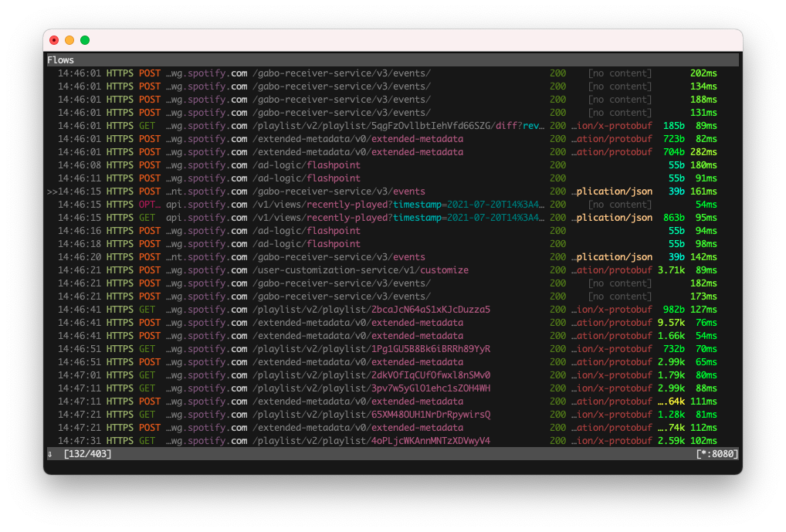

# Intercept a macOS app traffic using mitmproxy
July 20, 2021

I'll take as an example for this use case [a project of mine](https://github.com/valeriangalliat/spotify-buddylist)
that exposes a hidden endpoint of the Spotify app, allowing to see the
friend activity feed (what your friends are currently playing).

In most cases I'll try to reverse a web app directly in the browser by
monitoring the HTTP calls in the network tab of the developer tools, but
the Spotify web player doesn't support the friend activity feature, it's
only available in the desktop app, so this wasn't an option here.

In this post, I'll go through the steps necessary to intercept the
Spotify macOS app traffic using [mitmproxy], but
this could work with other apps as well.

[mitmproxy]: https://mitmproxy.org/

## What's an intercepting proxy?

An intercepting proxy like [mitmproxy] uses [HTTP tunnelling](https://en.wikipedia.org/wiki/HTTP_tunnel)
to forward (and optionally capture) all the traffic that is sent to it.

Typically, you can configure a specific app, browser, or the whole
system to use a HTTP proxy to forward requests, so that, instead of
connecting directly to the desired hosts, it sends the traffic to the
configured proxy.

This can be useful for a number of reasons, and in our case, it allows
us to configure a proxy that we control, so that we can inspect the HTTP
traffic going through it.

## Installing and running mitmproxy

Assuming you use [Homebrew](https://brew.sh/):

```sh
brew install mitmproxy
mitmproxy
```

This starts a terminal interface that will show all the requests going
through the proxy. Press <kbd>?</kbd> to see the keybindings.

By default the proxy runs on `localhost:8080`.

## First try: macOS network proxy settings

The first thing I usually try for this is to configure the proxy
settings [directly at the system level](https://support.apple.com/en-ca/guide/mac-help/mchlp2591/mac),
because most apps don't allow configuring a proxy in their settings. On
macOS, this will be in "System Preferences", "Network", "Advanced...",
"Proxies", "Web Proxy (HTTP)".

But when opening the Spotify app, I only see a single authentication
request going through (interestingly), but definitely not the whole
traffic. It appears that the Spotify app currently ignores the system
proxy settings.

For other apps, especially ones that don't allow configuring a proxy
inside the app, this might work.

## Second try: Spotify supports app-level proxy settings!

To my surprise, Spotify allows you to configure a proxy directly inside
the app. Go in "Spotify", "Preferences", "Show advanced settings",
"Proxy settings" to configure `localhost:8080` as a proxy.

<figure class="center">
  
</figure>

But after restarting the app we get an error in the mitmproxy console:

```
Warn: [::1]:65468: Client TLS handshake failed. The client may not trust the proxy's certificate for login5.spotify.com (OpenSSL Error([('SSL routines', 'ssl3_read_bytes', 'sslv3 alert certificate unknown')]))
```

This is because to inspect HTTPS traffic, mitmproxy needs to use its own
SSL certificate, otherwise all we would see would be the encrypted
traffic between the app and Spotify servers.

## Configuring the mitmproxy CA certificate

mitmproxy comes with a <abbr title="Certificate authority">CA</abbr>
certificate that trusts the certificate used by mitmproxy to
terminate the SSL connection. By [adding this CA certificate](https://docs.mitmproxy.org/stable/concepts-certificates/)
to the [system list of trusted certificate](https://support.apple.com/en-ca/guide/keychain-access/kyca2431/mac),
the app should allow the traffic to go through (unless it does [certificate pinning](https://security.stackexchange.com/questions/29988/what-is-certificate-pinning)).

To do this, open the `~/.mitmproxy` directory which contains the
certificate files, open Keychain Access, and drop
`mitmproxy-ca-cert.pem` into it.

By default, macOS will not trust that new certificate, so you need to
double-click on it, and in the "Trust" section, set "Always Trust".

After restarting the Spotify app, you should now see the traffic going
through in mitmproxy.

<figure class="center">
  
</figure>

<div class="note">

**Note:** I usually delete the certificate after I'm done inspecting
requests, just to be safe.

</div>

## Identifying the friend activity endpoint

Then it's a matter of browsing all the requests in the mitmproxy UI.

Here, it'll be particularly handy to use the filter function by pressing
<kbd>f</kbd>. This allows us to specify a [filter pattern](https://docs.mitmproxy.org/stable/concepts-filters/).

For example, if I know the URL I'm looking for contains the string
`buddylist`, I can type that in the filter prompt, which equals to the
command `set view_filter 'buddylist'`, so that mitmproxy only shows the
matching calls.

If I didn't know this string was part of the URL, but instead wanted to
match on the body, which I know contains the string `shaktirockgym` (one
of my Spotify friends), I can use `~b shaktirockgym` as a filter.

Then, most of the work will be about `curl`ing the endpoints to get
successful responses, identifying what headers are necessary, what
parameters to pass, how to deal with authentication and other security
means the app have in place.

This should be enough to get you started on reversing a macOS app
network requests, to build your own client, scripts or whatnot. Happy
hacking!
