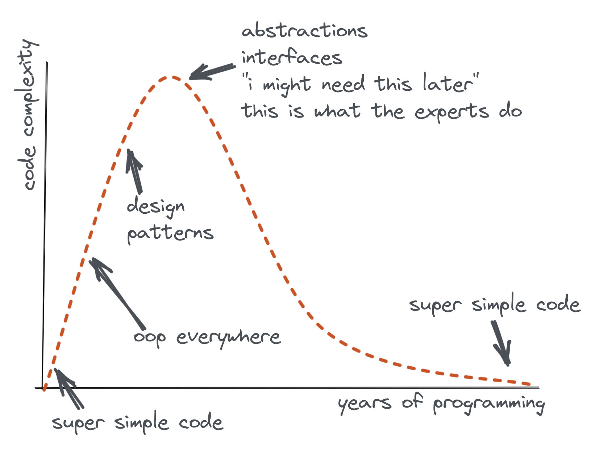

# Adding search capability to a static blog using the GitHub API
July 20, 2021

I just added a [search](/index.html#search) feature to the home page,
check it out!

Actually, it should even work here too.

<blockquote>
  <form class="search" onsubmit="return onSearchSubmit(this)">
    <p>Looking for something? Search the blog!</p>
    <p>
      <input type="text" name="query" placeholder="🔎">
      <button type="submit">Submit</button>
    </p>
    <div class="links posts"></div>
    <div class="message"></div>
  </form>
</blockquote>

This blog is fully static, written in Markdown, the source is [hosted on GitHub](https://github.com/valeriangalliat/blog),
and the live site is hosted on some static site server. Depending on my
current mood, it can be [GitHub Pages](https://pages.github.com/),
NGINX, [Netlify](https://www.netlify.com/),
[Vercel](https://vercel.com/), [Render](https://render.com/), or maybe
CloudFlare or S3 in the future, who knows.

Regardless of the hosting service, because of the static nature of the
blog, I can't just run `grep` or similar on the server side to find
matching pages and return results.

Since the blog source is hosted on GitHub as a public repository, the
GitHub API was the obvious, most simple solution.

You can see the full source code [here][source-code],
but in this blog post, I'll break it down for you.

[source-code]: https://github.com/valeriangalliat/blog/blob/01ded0c8defe399526032030bf17b912be6b6319/js/main.js#L163

## The HTML part

I don't use any framework on this blog, it's vanilla everything.

For the search form, I just added this snippet.

```html
<form class="search" onsubmit="return onSearchSubmit(this)">
  <p>Looking for something? Search the blog!</p>
  <p>
    <input type="text" name="query" placeholder="🔎">
    <button type="submit">Submit</button>
  </p>
  <div class="links posts"></div>
  <div class="message"></div>
</form>
```

By doing `onsubmit="return onSearchSubmit(this)"`, I define the action
inline from the markup. Passing `this` allows me to forward the current
`<form>` element that's being submitted for context, and the `return`
allows to propagate a `return false` from the function to cancel the
default behaviour of submitting a query.

This is actually the oldest way of scripting events, and the browser
support of this pattern is going to be way better than that of the
`async` functions in my JS. 😂

This kind of code is [often perceived as a bad practice](https://developer.mozilla.org/en-US/docs/Learn/JavaScript/Building_blocks/Events#inline_event_handlers_%E2%80%94_dont_use_these),
outdated, "smelly code", "not clean" and so on by purists (including myself),
because it usually results in poor maintainability, and it would be
better to do something like:

```js
document.querySelectorAll('form.search').forEach(form => {
  form.addEventListener('submit', onSearchSubmit)
})
```

On the other hand, this form is only going to be used on two pages on
the blog (the home page and this very post), so I can afford the
copy/paste maintenance tradeoff, and by tying the handler to the HTML, I
don't need my JS to look for `form.search` elements on every page load
where most of the time there will be none. While *this is as much of a
performance issue as the inline event handler is a maintenance
nightmare*, I'll favour this solution, just because.

Also, most modern front-end frameworks define event handlers
[in ways that are very close](https://developer.mozilla.org/en-US/docs/Learn/Tools_and_testing/Client-side_JavaScript_frameworks/React_interactivity_events_state#handling_form_submission)
to the HTML `onsubmit` attribute, and I do like this way of doing
things, so I'll just apply that to vanilla HTML, even if that means
using an "outdated" pattern.

That being said, for anything bigger than this use case, it'll probably
make more sense to use proper JS event handlers, or an actual framework.
Consider yourself warned!

## The JS part

Before going to the main JS code, I'll introduce the helpers that it
uses (don't worry, there's only two!).

The first one is called `el` and just adds some sugar around
`document.createElement`, setting attributes and adding child nodes to
it. I find it extremely convenient when scripting sites using vanilla JS.

```js
function el (name, attrs = {}, children = []) {
  const element = document.createElement(name)

  for (const [key, value] of Object.entries(attrs)) {
    element[key] = value
  }

  for (const child of children) {
    element.appendChild(child)
  }

  return element
}
```

Then I have a more specific helper that empties both the results and
message `div`s. This is useful because when show results, I also want to
clear an eventual previous error message, and when showing an error, I
want to clear an eventual previous results set.

```js
function emptyFormData (form) {
  form.querySelector('.posts').textContent = ''
  form.querySelector('.message').textContent = ''
}
```

This is followed by another quick helper to set the message.


```js
function formMessage (form, textContent) {
  emptyFormData(form)
  form.querySelector('.message').appendChild(el('p', { textContent }))
}
```

Now, to the interesting parts.

### The submit part

The `onSearchSubmit` function needs to be defined globally to be
callable from the HTML.

ESLint doesn't like this, and thinks the function is unused (it can't
guess it's being called from the HTML), so I need to add the comment
above to ignore this warning.

```js
// eslint-disable-next-line no-unused-vars
function onSearchSubmit (form) {
  searchBlog(form)
    .catch(err => {
      console.error(err)
      formMessage(form, 'An error occurred! Check the console. 🤭')
    })

  return false
}
```

It then calls the `searchBlog` asynchronous function, handles any error
by logging it and showing a message using the `formMessage` helper.

Finally it returns `false` to prevent the default behaviour of the form
submission, which is to submit the form data as query parameters on the
current URL.

The following is the breakdown of the `searchBlog` function, defined as:

```js
async function searchBlog (form) {
  // Code goes here.
}
```

### The search part

We start with a quick sanity check.

```js
const query = form.query.value.trim().toLowerCase()

if (!query.length) {
  return
}
```


The GitHub repo for my blog is public, and the GitHub API can be called
anonymously, without any kind of token, OAuth or other authentication
mechanism.

This makes the search trivial to implement:

```js
const q = `${query} in:file language:markdown repo:valeriangalliat/blog`

const result = await fetch(`https://api.github.com/search/code?q=${encodeURIComponent(q)}`)
  .then(res => res.json())
```

In practice, I also need to fetch the `posts.html` page which contains
the links to all the posts on the blog. This will allow me to find the
title of the pages that are matched without loading every single page.
In the end the code looks like this:

```js
const [result, posts] = await Promise.all([
  fetch(`https://api.github.com/search/code?q=${encodeURIComponent(q)}`)
    .then(res => res.json()),
  fetch('/posts.html')
    .then(res => res.text())
])
```

### The render part

First, I remove `index.md` and `posts.md` from the results, since those
pages include a lot of links to existing articles, they would be matched
very often, and are not usually relevant.

```js
const items = result.items.filter(item => !['index.md', 'posts.md'].includes(item.path))
```

Then, I add a quick check in case there was no match, again using the
`formMessage` helper.

```js
if (!items.length) {
  return formMessage(form, 'No matches found on the blog. 🥺')
}
```

Then I create a (native) `DOMParser` to parse the posts page, which
allows me to `querySelector` the matched posts by `href`.

```js
const parser = new DOMParser()
const postsDocument = parser.parseFromString(posts, 'text/html')

const lis = items.map(item => {
  const url = item.path.replace(/\.md$/, '.html')
  return postsDocument.querySelector(`a[href="${url}"]`).parentNode
})
```

In practice though, this page links posts relatively (e.g.
`2021/07/post-title.md`), while the search form could be included
anywhere, and require an absolute link like `/2021/07/post-title.md`. To
support this, we need to slightly modify the code:

```js
const lis = items.map(item => {
  const relativeUrl = item.path.replace(/\.md$/, '.html')
  const url = `/${relativeUrl}`
  const a = postsDocument.querySelector(`a[href="${relativeUrl}"]`)

  a.href = url

  return a.parentNode
})
```

I also want to sort the results by most recent post. The date is
included in a `<small>` element whose content is compatible with
`Date.parse` so this is convenient:

```js
lis.sort((a, b) => Date.parse(b.querySelector('small').textContent) - Date.parse(a.querySelecotr('small').textContent))
```

Finally I can show the results.


```js
const ul = el('ul', {}, lis)

emptyFormData(form)
form.querySelector('.posts').appendChild(ul)
```

### The reality is a bit more complex (just a bit)

This whole search feature is implemented in around 50 lines of code, HTML and
JS combined, including helpers. And this is awesome.

In reality, I want to search not only blog posts, but also pages. Pages
don't have a date for me to sort with, and are not listed in
`posts.html` so I can't find their title instantly.

In [the real code][source-code], I have to do a couple more things for
this to work.

1. Check if a matching `<a>` is found in the `postsDocument`,
   otherwise fetch the page itself and extract the `<h1>` as title.
1. Take into account that pages don't have a date when sorting, for
   example by using `Date.parse(b.querySelector('small').textContent) || 0`,
   so that we don't try to subtract `NaN` which would mess up the
   sorting.

For the latter, I decided to add a `customSortValue` property to the
`li` element instead, so that I can easily pass data from the loop to
the sorting function. Not exactly clean, but so convenient.

This allows me to run `Date.parse` only once per result instead of
running it at every iteration of the `sort` function, and removes the
need to use the `<small>` element content for sorting, as it's not
always valid.

Here's the full code:

```js
const lis = await Promise.all(items.map(async item => {
  const relativeUrl = item.path.replace(/\.md$/, '.html')
  const url = `/${relativeUrl}`
  const a = postsDocument.querySelector(`a[href="${relativeUrl}"]`)

  if (a) {
    const li = a.parentNode
    a.href = url
    const small = li.querySelector('small')
    li.customSortValue = small ? Date.parse(small.textContent) : 0
    return li
  }

  // Fallback to fetching `<h1>` from actual page.
  const html = await fetch(url).then(res => res.text())
  const pageDocument = parser.parseFromString(html, 'text/html')

  return el('li', { customSortValue: 0 }, [
    el('a', {
      href: url,
      textContent: pageDocument.querySelector('h1').textContent
    }),
    el('small', {
      textContent: '—'
    })
  ])
}))

lis.sort((a, b) => b.customSortValue - a.customSortValue)
```

This block starts to be a bit long and could probably be refactored into
different functions, but since it's not code that I foresee evolving a
lot, I'm fine with it like this.

## Wrapping up

I hope you find this feature useful on the blog, or this code useful for
you to implement a similar feature on your own site.

This tweet popped in my timeline yesterday, and couldn't relate more. I
think it illustrates perfectly the search implementation on this blog.

> <figure>
>   <a href="https://twitter.com/flaviocopes/status/1417007331930423298/photo/1">
>     
>   </a>
> </figure>
>
> --- [@flaviocopes](https://twitter.com/flaviocopes), [July 19, 2021](https://twitter.com/flaviocopes/status/1417007331930423298)

After more than 10 years building websites, I've had my fare share of
frameworks, design patterns, bleeding edge libraries, compiling and
transpiling everything possible and new cool, revolutionary ways of
doing one thing or another.

While those kept me excited for many years, I ended up getting bored of
it, and incidentally started writing [boring code](../../resources/simple.md).

They're all tools after all, and I won't use them unless I have a good
reason to.

Have a great day, and keep things simple! 🙏
