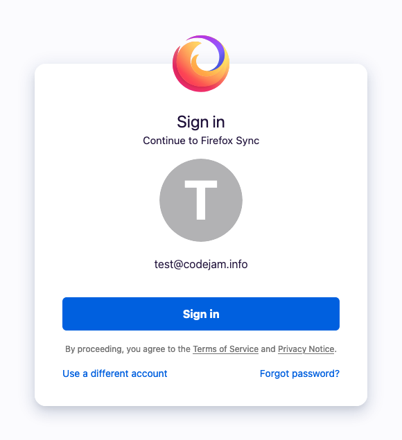
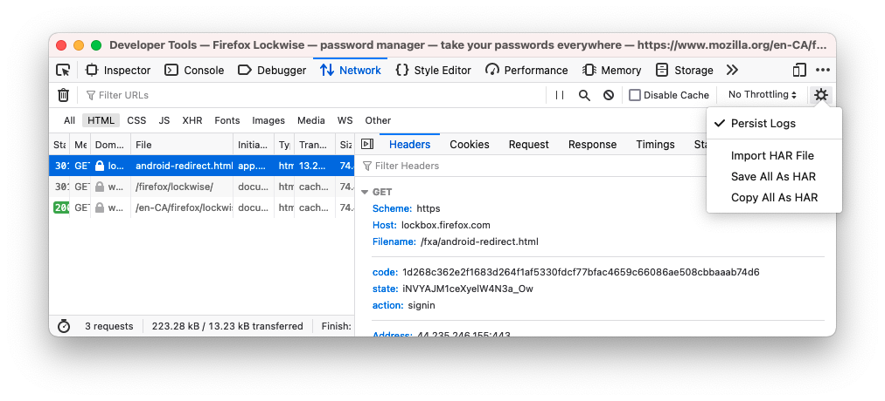

# A journey to scripting Firefox Sync / Lockwise: complete OAuth
August 8, 2021

<div class="note">

This article is part of a series about scripting Firefox Sync / Lockwise.

1. [A journey to scripting Firefox Sync / Lockwise: existing clients](scripting-firefox-sync-lockwise-existing-clients.md)
1. [A journey to scripting Firefox Sync / Lockwise: figuring the protocol](scripting-firefox-sync-lockwise-figuring-the-protocol.md)
1. [A journey to scripting Firefox Sync / Lockwise: understanding BrowserID](scripting-firefox-sync-lockwise-understanding-browserid.md)
1. [A journey to scripting Firefox Sync / Lockwise: hybrid OAuth](scripting-firefox-sync-lockwise-hybrid-oauth.md)
1. A journey to scripting Firefox Sync / Lockwise: complete OAuth

</div>

OK, this grew a bit out of hand. It all started a month ago when I just
wanted to programmatically access my Firefox Lockwise passwords. This
brought me on a long journey where I got to play with [legacy clients from 8 years ago](scripting-firefox-sync-lockwise-existing-clients.md),
[the Firefox Accounts and Firefox Sync APIs](scripting-firefox-sync-lockwise-figuring-the-protocol.md),
[the low-level details of the BrowserID protocol](scripting-firefox-sync-lockwise-understanding-browserid.md)
and finally [its modern counterpart OAuth](scripting-firefox-sync-lockwise-hybrid-oauth.md).

But as I explained [at the end of the last article](scripting-firefox-sync-lockwise-hybrid-oauth.md#going-further),
this approach still had room for improvement as we weren't using the
full benefits of OAuth. In particular, we still needed access to the
*plaintext user password* in order to authenticate to Firefox Accounts,
which results in *a "god mode" session token* that gives *full,
unrestricted access* to the user account, including fetching their
*primary key material* which is a requirement in order to decrypt the
Firefox Sync collections.

This is unideal and we can do better. The good thing is that even though
it wasn't exactly easy to figure out, it's possible.

## Logging in with OAuth

The first thing we'll need to change is logging in with OAuth instead of
email/password.

The [fxa-crypto-relier](https://github.com/mozilla/fxa-crypto-relier/tree/master/docs)
package is of great help for understanding how it works, but it seems to
be designed solely with browser extensions in mind, and is not directly
usable for us on the CLI. Otherwise, the [integration with Firefox Accounts](https://mozilla.github.io/ecosystem-platform/docs/process/integration-with-fxa)
page seems to be the main documentation about implementing OAuth.

It notably mentions that the [OAuth endpoints](https://mozilla.github.io/ecosystem-platform/docs/process/integration-with-fxa#preparing-for-production)
can be [dynamically discovered](https://accounts.firefox.com/.well-known/openid-configuration)
through the standard [OpenID Connect protocol](https://openid.net/connect/),
meaning that our OAuth authorization endpoint will concretely be
`https://accounts.firefox.com/authorization`.

The [user authentication in a nutshell](https://mozilla.github.io/ecosystem-platform/docs/process/integration-with-fxa#user-authentication-with-oauth-20--openid-connect-in-a-nutshell)
part does a great job at explaining the Firefox Accounts OAuth flow:

> 1. Create a state token (randomly generated and unguessable) and
>    associate it with a local session.
> 1. Send [`/authorization` request](https://mozilla.github.io/ecosystem-platform/docs/process/integration-with-fxa#authorization-query-parameters)
>    to Firefox Accounts. Upon completion, Firefox Accounts redirects
>    back to your app with state and code.
> 1. Confirm the returned state token by comparing it with the state
>    token associated with the local session.
> 1. Exchange the code for an access token and possibly a refresh token.
> 1. If you asked for `scope=profile` you can fetch user profile
>    information, using the access token, from the FxA profile server.
> 1. Associate the profile information with the local session and create
>    an account in the local application database as needed.

Sweet and simple. Since we don't have our own OAuth credentials
([mostly because I don't like sending emails](scripting-firefox-sync-lockwise-hybrid-oauth.md#sending-emails-how-about-no)),
we'll [keep using the client ID from the Android app](scripting-firefox-sync-lockwise-hybrid-oauth.md#harvesting-a-client-id-from-the-android-app).

### Generating the authorization URL

Let's start by building the authorization URL. The parameters we need
[are listed here](https://mozilla.github.io/ecosystem-platform/docs/process/integration-with-fxa#authorization-query-parameters).

> 1. `client_id` (required).
> 1. `scope` (required). This is a space separated string. Review the
>    list of [scopes](https://mozilla.github.io/ecosystem-platform/docs/process/integration-with-fxa#scopes).
> 1. `state` (required). This must be a randomly generated unguessable string.
> 1. `code_challenge` (required for PKCE). This is a hash of a randomly
>    generated string.
> 1. `code_challenge_method` (required for PKCE) As of this writing only
>    `S256` is supported.
> 1. `access_type` (suggested). This should be either `online` or `offline`.

I omitted other parameters that are not relevant to us. Let's look in
more details at the ones we'll use.

`scope`
: We use the scope `https://identity.mozilla.com/apps/oldsync` because
  [it is the one we need](https://github.com/mozilla/fxa/blob/main/packages/fxa-auth-server/docs/oauth/scopes.md#url-scopes)
  to access Firefox Sync data.

  While `oldsync` here makes me feel like there must be something "new"
  somewhere, it seems to be the latest and greatest way to access the Sync
  data, so be it.

`state`
: The [state parameter](https://auth0.com/docs/protocols/state-parameters)
  is designed to mitigate CSRF attacks. We'll mimic what
  fxa-crypto-relier does and create [16 bytes worth of random data](https://github.com/mozilla/fxa-crypto-relier/blob/168f4a6c47de9021a0d9ae23a3e6757013a38dbd/src/relier/OAuthUtils.js#L77)
  and encode it [as a Base64URL string](https://github.com/mozilla/fxa-crypto-relier/blob/168f4a6c47de9021a0d9ae23a3e6757013a38dbd/src/relier/util.js#L32).
  They also trim that final string to 16 characters but it seems that
  this is mostly for code reuse purpose rather than out of actual
  necessity so we'll leave that part alone.

  ```js
  const state = crypto.randomBytes(16).toString('base64url')
  ```

`code_challenge` and `code_challenge_method`
: The code challenge is a standard [PKCE](https://auth0.com/docs/flows/authorization-code-flow-with-proof-key-for-code-exchange-pkce)
  challenge, and the challenge method is `S256` (the only one
  supported). Those parameters are **required for public clients**.
  While it's not mentioned on the previous page, it's made clear on the
  [Firefox Accounts API documentation](https://github.com/mozilla/fxa/blob/f6bc0268a9be12407456fa42494243f336d81a38/packages/fxa-auth-server/docs/api.md#request-body-18):

  > Required for public OAuth clients, who must authenticate their
  > authorization code use via PKCE.

  Since the Android app we took the client ID from is a public client,
  we'll pass those parameters.

  Note that even though the `code_challenge_method` is
  [documented](https://mozilla.github.io/ecosystem-platform/docs/process/integration-with-fxa#authorization-query-parameters)
  with a lowercase `s`, it's actually [validated as uppercase](https://github.com/mozilla/fxa/blob/e5df5808be80f7e846e8ea973ed72bee454b027f/packages/fxa-auth-server/lib/routes/validators.js#L116).
  I fixed it in the quote earlier to prevent unnecessary issues.

`access_type`
: We set it to `offline` to get back a refresh token. This step is
  optional but keep it in mind if you want to be able to refresh the
token without user interaction.

This gives us the following piece of code:

```js
const crypto = require('crypto')
const qs = require('querystring')

const authorizationUrl = 'https://accounts.firefox.com/authorization'
const scope = 'https://identity.mozilla.com/apps/oldsync'
const clientId = '...'

// To prevent CSRF attacks.
const state = crypto.randomBytes(16).toString('base64url')

// Dead simple PKCE challenge implementation.
const codeVerifier = crypto.randomBytes(32).toString('base64url')
const codeChallenge = crypto.createHash('sha256').update(codeVerifier).digest('base64url')

const params = {
  client_id: clientId,
  scope,
  state,
  code_challenge_method: 'S256',
  code_challenge: codeChallenge,
  access_type: 'offline'
}

const url = `${authorizationUrl}?${qs.stringify(params)}`

console.log(url)
```

The code verifier is [defined by PKCE](https://datatracker.ietf.org/doc/html/rfc7636#section-4.1)
as a string of [43 Base64URL charaters](https://github.com/mozilla/fxa-crypto-relier/blob/168f4a6c47de9021a0d9ae23a3e6757013a38dbd/src/relier/OAuthUtils.js#L78),
which is effectively 32 bytes of entropy, hence `crypto.randomBytes(32)`.

> It is **recommended** that the output of a suitable random number
> generator be used to create a 32-octet sequence. The octet sequence is
> then Base64URL encoded to produce a 43-octet URL safe string to use as
> the code verifier.

The code challenge is also defined as a Base64URL encoded SHA-256 hash
of the code verifier, giving us a working two lines client
implementation of PKCE.

<div class="note">

**Note:** I didn't use a library like [pkce-challenge](https://www.npmjs.com/package/pkce-challenge)
here because of a weird validation quirk in the Firefox Accounts OAuth
token endpoint that we'll use later.

While the [PKCE spec](https://datatracker.ietf.org/doc/html/rfc7636#section-4.1)
defines the alphabet of the code verifier as `ALPHA / DIGIT / "-" / "." / "_" / "~"`,
the OAuth endpoint [limits it to a Base64URL alphabet](https://github.com/mozilla/fxa/blob/e5df5808be80f7e846e8ea973ed72bee454b027f/packages/fxa-auth-server/lib/oauth/validators.js#L29)
(ironically with a link to the RFC), leaving out the `.` and `~`
characters, and resulting in validation issues when using the
pkce-challenge library.

That being said this quirk is only for the [`https://oauth.accounts.firefox.com/v1/token`](https://github.com/mozilla/fxa/blob/e5df5808be80f7e846e8ea973ed72bee454b027f/packages/fxa-auth-server/lib/routes/oauth/token.js#L353)
endpoint as exposed by Mozilla through OpenID Connect, but the alternate
endpoint [`https://api.accounts.firefox.com/v1/oauth/token`](https://github.com/mozilla/fxa/blob/e5df5808be80f7e846e8ea973ed72bee454b027f/packages/fxa-auth-server/lib/routes/oauth/token.js#L382)
performs [proper validation](https://github.com/mozilla/fxa/blob/e5df5808be80f7e846e8ea973ed72bee454b027f/packages/fxa-auth-server/lib/routes/validators.js#L22)
and otherwise seems to behave in a consistent way, so it's possible to
use it instead.

For now we just implement our Base64URL compatible PKCE challenge, since
it's also a good way to see how PKCE works for learning purpose.

</div>

By visiting the generated URL, the user will be prompted to sign in with
their Firefox Account, and will be redirected to the configured OAuth
redirect URL, with an authorization code in the query string.

<figure class="center">
  
</figure>

Since we didn't register our own OAuth app, and we borrowed the Android
client ID instead, we're going to be redirected to the URL that's
configured for the Android app. This is fine for educational purpose but
we'd need to register for proper OAuth credentials for this to be usable
in production.

As a good security practice to not leave the code in the URL, this page
will itself redirect to another page without the code in the URL, so we
can't just extract it from there.

In order to grab the code and go on with the OAuth flow, we'll intercept
the redirect in the developer tools network tab. Make sure to tick the
persist/preserve logs option before logging in, otherwise the request
including the code will be wiped during the redirect. To find it more
easily, filter only HTML documents. The one we're looking for starts
with `https://lockbox.firefox.com/fxa/android-redirect.html?code=`.

<figure class="center">
  
</figure>

In the headers section on the right we can copy the value of the `code`
parameter, which we can feed to our script to continue the
authentication. Brilliant.

<div class="note">

**Note:** for a legitimate OAuth client where you control the redirect
URL, don't forget to validate that the `state` parameter matches the one
you originally passed in the authorization URL!

</div>

### Trading the OAuth code for an access token

The next step is to trade the code we get back from the OAuth flow for a
proper token. Thanks to the [OpenID Connect configuration](https://accounts.firefox.com/.well-known/openid-configuration),
we know that the token endpoint is `https://oauth.accounts.firefox.com/v1/token`.
A quick search leads us to its [API documentation](https://github.com/mozilla/fxa/blob/main/packages/fxa-auth-server/docs/oauth/api.md#post-v1token).

This is where we'll send the code from the redirect URL, as well as the
PKCE code verifier we created earlier. But first we need to prompt the
user for the code. In a basic CLI, this would look something like this:

```js
const readline = require('readline')

const rl = readline.createInterface({ input: process.stdin, output: process.stdout })

const code = await new Promise(resolve => rl.question('Code: ', resolve))
  .finally(() => rl.close())
```

Then we can prepare the payload and send it to the token endpoint.

```js
const fetch = require('node-fetch')

const tokenEndpoint = 'https://oauth.accounts.firefox.com/v1/token'

const oauthToken = await fetch(tokenEndpoint, {
  method: 'POST',
  headers: {
    'Content-Type': 'application/json'
  },
  body: JSON.stringify({
    client_id: clientId,
    grant_type: 'authorization_code',
    code_verifier: codeVerifier,
    code
  })
})
  .then(res => res.json())

console.log(oauthToken)
```

We get back an object that includes the OAuth access token, as well as a
refresh token if we specified `access_type: 'offline'` earlier.

This is great, but it doesn't actually allows us to connect to Firefox
Sync. Why? Because as we saw in the [previous post](scripting-firefox-sync-lockwise-hybrid-oauth.md#unmasking-the-x-keyid-header),
and specifically in [the TokenServer documentation](https://github.com/mozilla-services/tokenserver#using-oauth),
we need the `kid` field of some kind of encryption key that we
definitely don't have.

> To access the user's Sync data using OAuth, the client must obtain an
> FxA OAuth `access_token` with scope `https://identity.mozilla.com/apps/oldsync`,
> and the corresponding encryption key as a JWK. They send the OAuth
> token in the `Authorization` header, and the `kid` field of the
> encryption key in the `X-KeyID` header.

This is not helping me a lot, but definitely just the access token we
managed to get is not enough. Previously, when we had the user's
password and a session token for their Firefox Account, we could easily
compute the Sync key and hash it to [make the `X-KeyID` header](scripting-firefox-sync-lockwise-hybrid-oauth.md#actually-computing-the-x-keyid-header)
with the `keyRotationTimestamp`, but with our OAuth token, we can do
none of that anymore.

## Getting scoped keys: the theory

By browsing the Firefox Ecosystem Platform, where I was already reading
about [how to integrate with Firefox Accounts](https://mozilla.github.io/ecosystem-platform/docs/process/integration-with-fxa),
I find a page about [becoming a Sync client](https://mozilla.github.io/ecosystem-platform/docs/process/becoming-a-sync-client).

Sadly, this page is not very useful at the moment.

<figure class="center">
  
</figure>

When we first [started playing with OAuth](scripting-firefox-sync-lockwise-hybrid-oauth.md#unmasking-the-x-keyid-header),
we encountered [a Bugzilla issue](https://bugzilla.mozilla.org/show_bug.cgi?id=1455219)
for the TokenServer to accept OAuth tokens. This issue contains [a link
to the OAuth flow spec on Google Docs](https://docs.google.com/document/d/1IvQJFEBFz0PnL4uVlIvt8fBS_IPwSK-avK0BRIHucxQ)
titled "Scoped encryption keys for Firefox Accounts", and the first
thing in there is a note that it now [lives on the Firefox Ecosystem Platform](https://mozilla.github.io/ecosystem-platform/docs/fxa-engineering/fxa-scoped-keys).

It is nested in the "topic deep dives" category of the "for FxA
engineers" group, which explains why I didn't notice it before, and
makes me feel like I'm probably not the target audience of this
document. 😆

<div class="note">

**Note:** this document is approximately 6000 words. That's about as
long as one blog post in this series. Is it as useful though?
Definitely.

[Scoped encryption keys for Firefox Accounts](https://mozilla.github.io/ecosystem-platform/docs/fxa-engineering/fxa-scoped-keys)
is a masterpiece on end-to-end encryption, explaining in details how
they derive scoped keys for third-party apps to encrypt the user's data,
in a way that algorithmically requires the user's password, but without
exposing it to the app in question. All of that with support for
changing the primary password, as well as rotating and revoking keys.

While it's very technical and requires some base cryptography knowledge,
it's a fantastic piece that I would definitely recommend reading carefully
if you're interested in this topic. Even if you're new to cryptography,
you might end up opening dozens if not hundreds of tabs to understand
what's going on, but it'll sure be worth the journey.

</div>

In this document, we notably read that Mozilla implemented *an extension
to OAuth* in order to securely share encryption keys with third-party
apps.

> To achieve this, we propose an extension to the standard OAuth
> authorization flow by which relying applications can obtain encryption
> keys in a secure and controlled manner.

They describe this in the [protocol flow](https://mozilla.github.io/ecosystem-platform/docs/fxa-engineering/fxa-scoped-keys#protocol-flow)
section, which I'll sum up here (fasten your seatbelts).

1. Generate a [P-256 elliptic curve](https://neuromancer.sk/std/nist/P-256)
   keypair (P-256 stands for "256-bit prime field Weierstrass curve",
   and is also known as `secp256r1` and `prime256v1`) to be used for
   [<abbr title="Elliptic curve Diffie–Hellman">ECDH</abbr>](https://en.wikipedia.org/wiki/Elliptic-curve_Diffie%E2%80%93Hellman).
1. Send the public key as a Base64URL encoded [<abbr title="JSON Web Key">JWK</abbr>](https://datatracker.ietf.org/doc/html/rfc7517)
   in the OAuth parameters under `keys_jwk`.

This will make the token endpoint return not only the access and refresh
tokens, but also a `keys_jwe` property. It's formatted with
[<abbr title="JSON Web Encryption">JWE</abbr> compact serialization](https://datatracker.ietf.org/doc/html/rfc7516#section-3.1),
meaning that we have 5 Base64URL encoded segments separated by `.`: a
JSON header, an encryption key (empty in our case), the encryption [<abbr title="Initialization vector">IV</abbr>](https://en.wikipedia.org/wiki/Initialization_vector),
the [ciphertext](https://en.wikipedia.org/wiki/Ciphertext), and the
[AES-GCM](https://en.wikipedia.org/wiki/Galois/Counter_Mode)
authentication tag.

3. Split the individual segments from `keys_jwe` and decode them.
3. Use the ephemeral public key that's included in the JSON header as
   `epk` to perform ECDH against the private key of our initial P-256
   keypair.

<div class="note">

**Note:** according to Mozilla's documentation, it seems that the key
we just established with ECDH should allow to decrypt the ciphertext
segment, which is a JWK of the application scoped key, including the
`kid` field that we need to transmit to the TokenServer. In practice we
just get unusable garbage, so something was definitely missing.

The following step is not documented by Mozilla. It's what [the Rust code](https://github.com/mozilla/application-services/blob/e16821a601f7e4cedea5af8ab24486467f3fd9bf/components/support/jwcrypto/src/ec.rs#L130)
behind the browser and mobile apps is doing, as well as [the code](https://github.com/mozilla/send/blob/7130c2e7b05e43cf1a6eb0ea534982f4dff780ea/app/fxa.js#L7)
from the (now dead) Firefox Send app.

</div>

5. Perform [Concat KDF](https://datatracker.ietf.org/doc/html/rfc7518#section-4.6)
   ([I'll come back to this later](#deriving-the-shared-secret-with-concat-kdf))
   on the previously derived key using a carefully crafted `OtherInfo`
   buffer to obtain a symmetric key.
5. Use that key to decrypt the ciphertext segment with AES-256-GCM,
   using the IV and authentication tag included in the payload, as well
   as the raw Base64URL encoded header as [<abbr title="Additional authenticated data">AAD</abbr>](https://datatracker.ietf.org/doc/html/rfc5084#section-1.5).

The result JWK is our scoped key, and includes the `kid` field that we
need to send to the TokenServer in the `X-KeyID` header. The symmetric
key in the `k` field is the one we'll be able to use to encrypt and
decrypt the user's data for that scope.

[In the case of Firefox Sync](https://mozilla.github.io/ecosystem-platform/docs/fxa-engineering/fxa-scoped-keys#granting-access-to-sync-data),
that `k` field is a 64 bytes key bundle, that can be decoded and split
in two 32 bytes slices to obtain the Sync encryption key and HMAC key
[as we've done before](scripting-firefox-sync-lockwise-figuring-the-protocol.md#derive-sync-key).

Now that's a lot to unpack, so let's go through all of this again in
details, and this time with some actual code.

## Getting scoped keys: the code

Let's go back to [the code to make the authorization URL](#generating-the-authorization-url)
and include the `keys_jwk` field, that we found about earlier.

### Sending our ECDH public key in `keys_jwk`

First, we generate a [P-256 elliptic curve](https://neuromancer.sk/std/nist/P-256)
keypair. It stands for "256-bit prime field Weierstrass curve", and it's
also known as `secp256r1` and `prime256v1`.

```js
const { promisify } = require('util')

const kp = await promisify(crypto.generateKeyPair)('ec', {
  namedCurve: 'P-256'
})
```

Then we serialize the public key as a Base64URL encoded JWK.

```js
const publicJwk = kp.publicKey.export({ format: 'jwk' })
const keysJwk = Buffer.from(JSON.stringify(publicJwk)).toString('base64url')
```

Finally, we add it to the parameters of our initial example.

```js
const params = {
  client_id: clientId,
  scope,
  state,
  code_challenge_method: 'S256',
  code_challenge: codeChallenge,
  access_type: 'offline',
  keys_jwk: keysJwk
}
```

Indeed, after going through the OAuth flow and inputting the result
code, we now get back an extra `keys_jwe` parameter [from the token endpoint](#trading-the-oauth-code-for-an-access-token)!
I'll continue from this step where we have the result of the token
endpoint in a `oauthToken` variable.

### Parsing `keys_jwe`

Because `keys_jwe` is formatted according to [JWE compact serialization](https://datatracker.ietf.org/doc/html/rfc7516#section-3.1)
it's made of 5 Base64URL encoded segments separated by a `.`, so let's
parse it.

```js
const rawSegments = oauthToken.keys_jwe.split('.')
const rawHeader = rawSegments[0]
const segments = rawSegments.map(segment => Buffer.from(segment, 'base64'))
const header = JSON.parse(segments[0])
const iv = segments[2]
const ciphertext = segments[3]
const authTag = segments[4]
```

We left alone `segments[1]` because as we saw, it's defined as an
encryption key by the JWE format but is not used in this protocol.

The parsed header looks something like this:

```json
{
  "enc": "A256GCM",
  "alg": "ECDH-ES",
  "kid": "IGJXkJzwHacMq2Qc52NZ_FBmt-uksqyXs8jC-pViIXM",
  "epk": {
    "kty": "EC",
    "crv": "P-256",
    "x": "UmI2Qm4DLbawF4E6UlmMvYAEomULFEBQiiJ7rxaQnY8",
    "y": "cSC0O-tPAeJXl2s-2ACCxN6wCpDRnhB_ginYIBmfTgU"
  }
}
```

The `epk` property contains a JWK representation of the public key
matching the private key that Firefox Accounts used for its part of
ECDH. We'll refer to it as `peerKey`. In combination with the private
key from the initial P-256 keypair [we created earlier](#sending-our-ecdh-public-key-in-keys-jwk)
in the `kp` variable, we can establish a shared secret through ECDH.

```js
const peerKey = crypto.createPublicKey({
  key: header.epk,
  format: 'jwk'
})

const ikm = crypto.diffieHellman({
  privateKey: kp.privateKey,
  publicKey: peerKey
})
```

We'll name this shared secret `ikm`, for input keying material, as we're
effectively going to use it as input for a key derivation function.

### Deriving the shared secret with Concat KDF

Here, we use [Concat KDF](https://datatracker.ietf.org/doc/html/rfc7518#section-4.6),
defined in more details in section 5.8.1 of [NIST SP 800-56A](https://nvlpubs.nist.gov/nistpubs/SpecialPublications/NIST.SP.800-56Ar2.pdf)
"The single step key derivation function" to derive that shared secret
into the actual decryption key for our ciphertext.

<div class="note">

**Note:** this process is not part of any public documentation at the
time of writing, and is the result of more hours that I'm willing to
admit, going through Mozilla's codebase on GitHub, between the
[`mozilla`](https://github.com/mozilla/),
[`mozilla-lockwise`](https://github.com/mozilla-lockwise/),
[`mozilla-mobile`](https://github.com/mozilla-mobile/) and
[`mozilla-services`](https://github.com/mozilla-services/) organizations.

I was trying to understand specifically how the Lockwise mobile app
manages to access the Firefox Sync passwords, and it took me a while to
realize that the mobile apps were calling into native Rust code that was
taking care of the heavy lifting for OAuth and encryption (especially
because the [snake case](https://en.wikipedia.org/wiki/Snake_case)
functions [from the Rust code](https://github.com/mozilla/application-services/blob/e16821a601f7e4cedea5af8ab24486467f3fd9bf/components/fxa-client/src/internal/oauth.rs#L311)
are converted to [camel case](https://en.wikipedia.org/wiki/Camel_case)
in [other](https://github.com/mozilla-lockwise/lockwise-android/blob/d3c0511f73c34e8759e1bb597f2d3dc9bcc146f0/app/src/main/java/mozilla/lockbox/store/AccountStore.kt#L298)
[languages](https://github.com/mozilla-lockwise/lockwise-ios/blob/4d68f1283558a20e240527a8235c779becb1aa08/lockbox-ios/Store/AccountStore.swift#L186)).

The most interesting part was the [`handle_oauth_response`](https://github.com/mozilla/application-services/blob/e16821a601f7e4cedea5af8ab24486467f3fd9bf/components/fxa-client/src/internal/oauth.rs#L325),
function, which calls into [`decrypt_keys_jwe`](https://github.com/mozilla/application-services/blob/e16821a601f7e4cedea5af8ab24486467f3fd9bf/components/fxa-client/src/internal/scoped_keys.rs#L58),
[`decrypt_jwe`](https://github.com/mozilla/application-services/blob/e16821a601f7e4cedea5af8ab24486467f3fd9bf/components/support/jwcrypto/src/ec.rs#L60),
[`derive_shared_secret`](https://github.com/mozilla/application-services/blob/e16821a601f7e4cedea5af8ab24486467f3fd9bf/components/support/jwcrypto/src/ec.rs#L94),
and finally [`get_secret_from_ikm`](https://github.com/mozilla/application-services/blob/e16821a601f7e4cedea5af8ab24486467f3fd9bf/components/support/jwcrypto/src/ec.rs#L130)
where we get the Concat KDF implementation details.

I later found the [implementation in Firefox Send](https://github.com/mozilla/send/blob/7130c2e7b05e43cf1a6eb0ea534982f4dff780ea/app/fxa.js#L7)
which was also really useful to figure this out.

</div>

[This answer on Stack Exchange](https://crypto.stackexchange.com/a/85672)
gives a great overview of how Concat KDF works:

> Concat KDF hashes the concatenation of a 4-byte counter initialized at 1
> (big-endian), the shared secret obtained by ECDH, and some other
> information passed as input. The counter is incremented and the process
> is repeated until enough data was produced.

Since in our case the output key length is equal to the hash length
(they're both 256 bits), we only need a partial implementation of Concat
KDF that performs a single iteration and doesn't bother trimming the
output to the desired length.

```js
// For readability, helper to return a big-endian unsigned 32 bits
// integer as a buffer.
function uint32BE (number) {
  const buffer = Buffer.alloc(4)
  buffer.writeUInt32BE(number)
  return buffer
}

function sha256 (buffer) {
  return crypto.createHash('sha256').update(buffer).digest()
}

// Partial implementation of Concat KDF that only does a single
// iteration and no trimming, because the length of the derived key we
// need matches the hash length.
function concatKdf (key, otherInfo) {
  return sha256(Buffer.concat([uint32BE(1), key, otherInfo]))
}
```

That being said, for fun, here's my understanding of a full Concat KDF
function (I'm not a cryptography expert though so get that properly
reviewed if you're going to use it).

<details>
  <summary>See the implementation</summary>

```js
function concatKdf (key, keyLengthBits, otherInfo) {
  const hashLengthBits = 256
  const hashLengthBytes = Math.ceil(hashLengthBits / 8)
  const keyLengthBytes = Math.ceil(keyLengthBits / 8)
  const out = Buffer.alloc(keyLengthBytes)
  const iterations = Math.ceil(keyLengthBytes / hashLengthBytes)

  for (let i = 0; i < iterations; i++) {
    const hash = sha256(Buffer.concat([uint32BE(i + 1), key, otherInfo]))
    const offset = hashLengthBytes * i
    hash.copy(out, offset)
  }

  return out
}
```

</details>

Anyways, we need to compute the `OtherInfo` parameter first. Concat KDF
only defines it [as a bit string](https://nvlpubs.nist.gov/nistpubs/SpecialPublications/NIST.SP.800-56Ar2.pdf)
(see section 5.8.1.2), but Mozilla crafts a very specific one that we
need to reproduce. From their [Rust code](https://github.com/mozilla/application-services/blob/e16821a601f7e4cedea5af8ab24486467f3fd9bf/components/support/jwcrypto/src/ec.rs#L142)
and the [Firefox Send JavaScript code](https://github.com/mozilla/send/blob/7130c2e7b05e43cf1a6eb0ea534982f4dff780ea/app/fxa.js#L7),
I ended up with:

```js
// Internal Mozilla format for Concat KDF `OtherInfo`, copied from
// Firefox Application Services and Firefox Send code.
const otherInfo = Buffer.concat([
  uint32BE(header.enc.length),
  Buffer.from(header.enc),
  uint32BE(0),
  uint32BE(0),
  uint32BE(256)
])
```

<details>
  <summary>See the original code for comparison</summary>

[In Rust](https://github.com/mozilla/application-services/blob/e16821a601f7e4cedea5af8ab24486467f3fd9bf/components/support/jwcrypto/src/ec.rs#L142):

```rust
fn get_secret_from_ikm(
    ikm: InputKeyMaterial,
    apu: &str,
    apv: &str,
    alg: &str,
) -> Result<digest::Digest> {
    let secret = ikm.derive(|z| {
        let mut buf: Vec<u8> = vec![];

        // Concat KDF (1 iteration since `keyLen <= hashLen`).
        // See RFC 7518 section 4.6 for reference.
        buf.extend_from_slice(&1u32.to_be_bytes());
        buf.extend_from_slice(&z);

        // `OtherInfo`
        buf.extend_from_slice(&(alg.len() as u32).to_be_bytes());
        buf.extend_from_slice(alg.as_bytes());
        buf.extend_from_slice(&(apu.len() as u32).to_be_bytes());
        buf.extend_from_slice(apu.as_bytes());
        buf.extend_from_slice(&(apv.len() as u32).to_be_bytes());
        buf.extend_from_slice(apv.as_bytes());
        buf.extend_from_slice(&256u32.to_be_bytes());

        digest::digest(&digest::SHA256, &buf)
    })?;
    Ok(secret)
}
```

[In JavaScript](https://github.com/mozilla/send/blob/7130c2e7b05e43cf1a6eb0ea534982f4dff780ea/app/fxa.js#L7):

```js
const encoder = new TextEncoder()

function getOtherInfo (enc) {
  const name = encoder.encode(enc)
  const length = 256
  const buffer = new ArrayBuffer(name.length + 16)
  const dv = new DataView(buffer)
  const result = new Uint8Array(buffer)
  let i = 0

  dv.setUint32(i, name.length)
  i += 4
  result.set(name, i)
  i += name.length
  dv.setUint32(i, 0)
  i += 4
  dv.setUint32(i, 0)
  i += 4
  dv.setUint32(i, length)

  return result
}
```

</details>

We can now derive that `OtherInfo` together with the input key material
we established earlier to get the decryption key.

```js
const key = concatKdf(ikm, otherInfo)
```

### Decrypting the ciphertext

Finally, we have everything we need to decrypt the ciphertext of the JWE
that [we got back earlier](#parsing-keys-jwe).

```js
const decipher = crypto.createDecipheriv('aes-256-gcm', key, iv)

decipher.setAuthTag(authTag)
decipher.setAAD(rawHeader)

const keys = JSON.parse(Buffer.concat([
  decipher.update(ciphertext),
  decipher.final()
]))

console.log(keys)
```

This gives us something like this:

```json
{
  "https://identity.mozilla.com/apps/oldsync": {
    "kty": "oct",
    "scope": "https://identity.mozilla.com/apps/oldsync",
    "k": "e_9j35zPyTng1QT1ioegeZxPQOVUS10FdMNV1YIZuJ8zJIvQ-OZMiHiy3tLCMcc_mKTEopDpjzS9kqq-FmS4og",
    "kid": "1628100899317-sLLG5AsHn9Fc1gPhW_rfaQ"
  }
}
```

If we had requested an [application specific key](https://mozilla.github.io/ecosystem-platform/docs/fxa-engineering/fxa-scoped-keys#application-specific-keys),
we would have gotten back a 32 bytes scoped key [as defined in "deriving scoped keys"](https://mozilla.github.io/ecosystem-platform/docs/fxa-engineering/fxa-scoped-keys#deriving-scoped-keys-ks).

However since we requested the special scope
`https://identity.mozilla.com/apps/oldsync` which is meant to give
access to Firefox Sync in a backwards compatible way, [it's treated a bit differently](https://mozilla.github.io/ecosystem-platform/docs/fxa-engineering/fxa-scoped-keys#granting-access-to-sync-data)
and we get 64 bytes of key material, the same that we previously
[derived from the user's primary key](scripting-firefox-sync-lockwise-figuring-the-protocol.md#derive-sync-key)
using HKDF in the `deriveKeys` function of our non-OAuth implementation.

The main difference is that here, the Firefox Accounts login page
[is the one](https://github.com/mozilla/fxa-crypto-relier/blob/168f4a6c47de9021a0d9ae23a3e6757013a38dbd/src/deriver/ScopedKeys.js#L107)
to perform HKDF, so that we never get access to the user's primary key,
which is a cool security feature.

## Putting it all together

Because the JWK we get back after decrypting `keys_jwe` from that custom
OAuth dance contains the same 64 bytes of key material that we used to
derive from the user's primary key, it means that by splitting it in two
32 bytes slices, we get the exact same Sync encryption key and HMAC key
than before.

As importantly, this JWK also contains the `kid` field which is the
missing piece of the puzzle to be able to [call the TokenServer](https://github.com/mozilla-services/tokenserver#using-oauth)
in order to get the Firefox Sync API credentials.

> To access the user's Sync data using OAuth, the client must obtain an
> FxA OAuth `access_token` with scope `https://identity.mozilla.com/apps/oldsync`,
> and the corresponding encryption key as a JWK. They send the OAuth
> token in the `Authorization` header, **and the `kid` field of the
> encryption key in the `X-KeyID` header**.

```js
const tokenServerUrl = 'https://token.services.mozilla.com'

const token = await fetch(`${tokenServerUrl}/1.0/sync/1.5`, {
  headers: {
    Authorization: `Bearer ${oauthToken.access_token}`,
    'X-KeyID': keys[scope].kid
  }
})
  .then(res => res.json())
```

From there, the rest of the code is going to be [the same as our original BrowserID implementation](scripting-firefox-sync-lockwise-figuring-the-protocol.md#actually-calling-firefox-sync)!

The only difference is that we already have the Sync key bundle in our
JWK, so we don't need the `deriveKeys` function anymore. Instead, we
only to need to split the `k` field to separate the encryption key from
the HMAC key:

```js
const rawBundle = Buffer.from(keys[scope].k, 'base64')

const syncKeyBundle = {
  encryptionKey: rawBundle.slice(0, 32),
  hmacKey: rawBundle.slice(32, 64)
}
```

This is enough to decrypt the response of `storage/crypto/keys`, which
in turn gives us the keys to decrypt the user's passwords, bookmarks
and other collections.

## The code, all the code!

If you were to take all the small blocks of code from this post and put
them together, you would get something like this:

```js
const { promisify } = require('util')
const crypto = require('crypto')
const qs = require('querystring')
const readline = require('readline')
const fetch = require('node-fetch')

const authorizationUrl = 'https://accounts.firefox.com/authorization'
const tokenEndpoint = 'https://oauth.accounts.firefox.com/v1/token'
const tokenServerUrl = 'https://token.services.mozilla.com'
const scope = 'https://identity.mozilla.com/apps/oldsync'
const clientId = 'e7ce535d93522896'

// For readability, helper to return a big-endian unsigned 32 bits
// integer as a buffer.
function uint32BE (number) {
  const buffer = Buffer.alloc(4)
  buffer.writeUInt32BE(number)
  return buffer
}

function sha256 (buffer) {
  return crypto.createHash('sha256').update(buffer).digest()
}

// Partial implementation of Concat KDF that only does a single
// iteration and no trimming, because the length of the derived key we
// need matches the hash length.
function concatKdf (key, otherInfo) {
  return sha256(Buffer.concat([uint32BE(1), key, otherInfo]))
}

async function main () {
  // To prevent CSRF attacks.
  const state = crypto.randomBytes(16).toString('base64url')

  // Dead simple PKCE challenge implementation.
  const codeVerifier = crypto.randomBytes(32).toString('base64url')
  const codeChallenge = crypto.createHash('sha256').update(codeVerifier).digest('base64url')

  // Keypair to obtain a shared secret from Firefox Accounts via ECDH.
  const kp = await promisify(crypto.generateKeyPair)('ec', {
    namedCurve: 'P-256'
  })

  const publicJwk = kp.publicKey.export({ format: 'jwk' })
  const keysJwk = Buffer.from(JSON.stringify(publicJwk)).toString('base64url')

  const params = {
    client_id: clientId,
    scope,
    state,
    code_challenge_method: 'S256',
    code_challenge: codeChallenge,
    access_type: 'offline',
    keys_jwk: keysJwk
  }

  const url = `${authorizationUrl}?${qs.stringify(params)}`

  console.log(url)

  const rl = readline.createInterface({ input: process.stdin, output: process.stdout })

  const code = await new Promise(resolve => rl.question('Code: ', resolve))
    .finally(() => rl.close())

  const oauthToken = await fetch(tokenEndpoint, {
    method: 'POST',
    headers: {
      'Content-Type': 'application/json'
    },
    body: JSON.stringify({
      client_id: clientId,
      grant_type: 'authorization_code',
      code_verifier: codeVerifier,
      code
    })
  })
    .then(res => res.json())

  const rawSegments = oauthToken.keys_jwe.split('.')
  const rawHeader = rawSegments[0]
  const segments = rawSegments.map(segment => Buffer.from(segment, 'base64'))
  const header = JSON.parse(segments[0])
  const iv = segments[2]
  const ciphertext = segments[3]
  const authTag = segments[4]

  const peerKey = crypto.createPublicKey({
    key: header.epk,
    format: 'jwk'
  })

  const ikm = crypto.diffieHellman({
    privateKey: kp.privateKey,
    publicKey: peerKey
  })

  // Internal Mozilla format for Concat KDF `OtherInfo`, copied from
  // Firefox Application Services and Firefox Send code.
  const otherInfo = Buffer.concat([
    uint32BE(header.enc.length),
    Buffer.from(header.enc),
    uint32BE(0),
    uint32BE(0),
    uint32BE(256)
  ])

  const key = concatKdf(ikm, otherInfo)
  const decipher = crypto.createDecipheriv('aes-256-gcm', key, iv)

  decipher.setAuthTag(authTag)
  decipher.setAAD(rawHeader)

  const keys = JSON.parse(Buffer.concat([
    decipher.update(ciphertext),
    decipher.final()
  ]))

  const token = await fetch(`${tokenServerUrl}/1.0/sync/1.5`, {
    headers: {
      Authorization: `Bearer ${oauthToken.access_token}`,
      'X-KeyID': keys[scope].kid
    }
  })
    .then(res => res.json())

  const rawBundle = Buffer.from(keys[scope].k)

  const syncKeyBundle = {
    encryptionKey: rawBundle.slice(0, 32),
    hmacKey: rawBundle.slice(32, 64)
  }

  console.log(token)
  console.log(syncKeyBundle)
}

main()
```

From there, you have everything you need to [actually call Firefox Sync](scripting-firefox-sync-lockwise-figuring-the-protocol.md#actually-calling-firefox-sync)
and decrypt its responses. This piece of code is already long enough so
I won't include that part again here.

Needless to say this code is not production ready, and can be considered
to be more of an academic resource for learning purpose. If you're going
to use it, please refactor it in a more maintainable way and add proper
error handling! Also if you need help integrating Firefox Accounts to
your app, feel free to [reach out](/val.md#contact), I'm open to
contracting work.

## A note about granular scopes

Mozilla's [OAuth scopes documentation](https://github.com/mozilla/fxa/blob/main/packages/fxa-auth-server/docs/oauth/scopes.md#url-scopes)
mentions a set of scopes that would allow granular access to the Sync
data, for instance `https://identity.mozilla.com/apps/oldsync/bookmarks`
to get access to the user's bookmarks data only but not other
collections, `https://identity.mozilla.com/apps/oldsync#read` to get
read-only access, or even
`https://identity.mozilla.com/apps/oldsync/history#write` for write-only
access to just the history collection.

Because the encryption key is shared by every Firefox Sync client, we
can decrypt any of the user's Sync collections, even if we had requested
a more restricted scope.

The permissions are instead implemented at the API level, so that for
instance, a Sync client with a "bookmarks" scope in its OAuth token
cannot retrieve data from the "history" collection, [as explained here](https://mozilla.github.io/ecosystem-platform/docs/fxa-engineering/fxa-scoped-keys#granting-access-to-sync-data):

> The existing Sync service does not support using different encryption
> keys to access different subsets of its data, so we must give the same
> key material for scope `sync` or for `sync:bookmarks`. But we can
> enforce access restrictions at the service level by ensuring that an
> access token with scope `sync:bookmarks` cannot be used to retrieve
> the user's encrypted history data.

Similarly, I assume that read/write restrictions are also ensured at
the service level, by only allowing `GET` requests for clients with a
`#read` scope, or `POST`, `PUT` and `DELETE` for `#write` clients.

In practice though, I couldn't find any such restriction in [`syncstorage-rs`](https://github.com/mozilla-services/syncstorage-rs),
the code behind the Firefox Sync API. I also found out that I couldn't
request granular scopes during the OAuth process. When I requested a
collection-specific scope, a read-only or a write-only scope, the OAuth
token endpoint didn't return a `keys_jwe` even though I specified
`keys_jwk` as part of the authorization parameters.

This makes me think that while the granular scopes are documented,
they're not yet implemented, and the only way to get access to Firefox
Sync data right now is to request full access.

Please let me know if I missed something, or if this was to change!

## A note about client ID and redirect URL

In this post, for convenience and learning purpose, we used the public
OAuth client ID [from the Android app](scripting-firefox-sync-lockwise-hybrid-oauth.md#harvesting-a-client-id-from-the-android-app),
because we'd otherwise need to [email Mozilla](scripting-firefox-sync-lockwise-hybrid-oauth.md#sending-emails-how-about-no)
to "document our expectations and timelines" to get proper OAuth
credentials.

As we saw, I'm not interested in documenting my expectations and
timeline. This means that we need to inspect the network traffic during
the OAuth redirect to harvest the authorization code and inject it back
in our script. But if you're reading this, you might be have a real-life
application that justifies getting your own OAuth credentials. If it's
your case, everything you need to know is [here](https://mozilla.github.io/ecosystem-platform/docs/process/integration-with-fxa).

Lastly, even if I could configure my own OAuth redirect URL, the current
flow doesn't make it convenient to build a CLI or embedded application.
Maybe accessing Firefox Sync collections from a TV, toaster, or a remote
headless server isn't the top use cases one would think of, but I
wouldn't be surprised if someone came up with applications for those.

For example, Google have an [alternative flow for limited input devices](https://developers.google.com/identity/protocols/oauth2/limited-input-device)
which works by displaying a short URL and code to the user to grant
permissions to an embedded application from a more capable device.

They also support [a copy/paste method](../02/google-oauth-from-cli-application.md)
where instead of being redirected, the user gets back a code to paste in
the application, making it convenient for a CLI running on a remote
headless server, where you otherwise would need to setup SSH port
forwarding or similar to support a loopback redirect URL.

While Google discourages this method, it solves a real use case for me
and I think that it's a good inspiration for future improvements to the
Firefox Accounts OAuth flow. The limited input device method is also a
nice fallback!

## A note about security, and more...

I strongly believe that proper security is achieved by ensuring that the
most secure options are the easiest to implement and to use by design.
Obviously this is idealistic and not always possible.

In the case of Lockwise and Firefox Sync, not only the OAuth method was
far from obvious to learn about, but I think that the [manual process](scripting-firefox-sync-lockwise-hybrid-oauth.md#sending-emails-how-about-no)
required to create new OAuth clients adds some unnecessary friction to
building a more secure web.

While the complete OAuth flow we explored in this posts brings great
security improvements by introducing a mechanism to grant third-party
access to the user's data without revealing their password and primary
key, it is in practice much harder to implement than the Firefox
Accounts "god mode" session token that I started with, which also
happens to comes with a fully featured JS client and easy to find
real-world examples online.

Overall, it feels to me that Mozilla doesn't expect people to be
interested in building third-party apps off Firefox Sync. For example
[in this response on GitHub](https://github.com/mozilla/fxa/issues/5794#issuecomment-652025759)
they seem surprised that someone would try to authenticate to Firefox
Accounts from their own code, or [in this email thread reply](https://www.mail-archive.com/sync-dev@mozilla.org/msg01711.html),
Ryan is curious about why one would want to programmatically access
Firefox Sync data, and the fact the [scoped encryption keys](https://mozilla.github.io/ecosystem-platform/docs/fxa-engineering/fxa-scoped-keys)
documentation is hidden in a "for FxA engineers" section shows that they
only expect Mozillians to build off those blocks.

It's undeniable that the openness of Let's Encrypt (alright, also the
fact it's free) greatly contributed to its whopping success, and the
[literally hundreds](https://letsencrypt.org/docs/client-options/) of
third-party clients and integrations demonstrate that. I think that the
ecosystem Mozilla built around Firefox Accounts and Firefox Sync
features some awesome pieces of technology and infrastructure that are
well worth basing off and extending, and I could see it having a similar
success if it was more inviting to integrate with.

## Closing thoughts

After nearly 20,000 words, this is the end of this in-depth exploration
of Lockwise, Firefox Sync and their underlying APIs and protocols.

This series is the result of the distillation of [FORTY TWO pieces of content online](#documentation)
as well as learning from the code of [11 different repositories](#code).

While I thought that I would just quickly put together a CLI app to my
access my Lockwise passwords, my quest for perfection pushed me to
continue and spend **a whole month** to grasp all the details of the
protocol, and not only have functional code to read and write to Firefox
Sync, but more importantly write everything down in a comprehensive way,
that I believe is the most up-to-date, accurate and practical
documentation on the topic as of the time of writing.

In this last post, we saw how to leverage the full OAuth flow to access
Firefox Sync collections without ever gaining access to the user's
password and primary key, effectively delegating more of the security
responsibilities to Firefox Accounts.

Generally, we gained a deep understanding of how Firefox Accounts and
Firefox Sync implement end-to-end encryption for its user data, and how
they do so in a way that's reviewable, and that we tested by interacting
at a low-level with their APIs and encryption schemes. While I'm not
qualified to tell if this is bulletproof for any possible threat model,
I definitely feel *even more confident* using Lockwise as my password
manager after reviewing its underlying implementation.

I'm grateful for Mozilla to share their source code and publicly document
the protocols they use and designed, even if it was not always perfectly
accurate or up-to-date. Their work allowed me to deepen my understanding
of cryptography in order to build a compatible client, and I believe
that the schemes behind Firefox Accounts and Sync encryption are
exemplary in respect to encrypting user data end-to-end, without
sacrificing too much (if any) convenience or flexibility.

## Bonus: references

Let's use the following script to extract all the references from this
series.

```sh
grep -Eoh '[(<]http[^)]+[)>]' 2021/08/scripting-firefox-sync-lockwise-* \
  | sed 's/^.//;s/.$//' | sed 's/#.*$//' \
  | sort | uniq -c
```

With some quick filtering and formatting, here's the list!

### Documentation

| References | Domain                            | Name                                                                                                                                                                        |
|-----------:|-----------------------------------|-----------------------------------------------------------------------------------------------------------------------------------------------------------------------------|
| 1          | `auth0.com`                       | [Confidential and public applications](https://auth0.com/docs/applications/confidential-and-public-applications)                                                            |
| 1          | `auth0.com`                       | [Authorization code flow with proof key for code exchange (PKCE)](https://auth0.com/docs/flows/authorization-code-flow-with-proof-key-for-code-exchange-pkce)               |
| 1          | `auth0.com`                       | [Prevent attacks and redirect users with OAuth 2.0 state parameters](https://auth0.com/docs/protocols/state-parameters)                                                     |
| 1          | `base64.guru`                     | [Base64URL](https://base64.guru/standards/base64url)                                                                                                                        |
| 3          | `bugzilla.mozilla.org`            | [Accept FxA OAuth tokens for authorization in TokenServer](https://bugzilla.mozilla.org/show_bug.cgi?id=1455219)                                                            |
| 1          | `crypto.stackexchange.com`        | [How does the Concat KDF work?](https://crypto.stackexchange.com/a/85672)                                                                                                   |
| 1          | `datatracker.ietf.org`            | [Using AES-CCM and AES-GCM authenticated encryption in the cryptographic message syntax (CMS)](https://datatracker.ietf.org/doc/html/rfc5084)                               |
| 2          | `datatracker.ietf.org`            | [JSON Web Encryption (JWE)](https://datatracker.ietf.org/doc/html/rfc7516)                                                                                                  |
| 3          | `datatracker.ietf.org`            | [JSON Web Key (JWK)](https://datatracker.ietf.org/doc/html/rfc7517)                                                                                                         |
| 4          | `datatracker.ietf.org`            | [JSON Web Algorithms (JWA)](https://datatracker.ietf.org/doc/html/rfc7518)                                                                                                  |
| 1          | `datatracker.ietf.org`            | [Proof key for code exchange by OAuth public clients](https://datatracker.ietf.org/doc/html/rfc7636)                                                                        |
| 2          | `docs.google.com`                 | [Scoped encryption keys for Firefox Accounts](https://docs.google.com/document/d/1IvQJFEBFz0PnL4uVlIvt8fBS_IPwSK-avK0BRIHucxQ)                                              |
| 1          | `en.wikipedia.org`                | [Elliptic curve Diffie–Hellman](https://en.wikipedia.org/wiki/Elliptic-curve_Diffie%E2%80%93Hellman)                                                                        |
| 1          | `github.com`                      | [Firefox Accounts OAuth server API](https://github.com/mozilla/fxa-auth-server/blob/master/fxa-oauth-server/docs/api.md)                                                    |
| 2          | `github.com`                      | [onepw protocol](https://github.com/mozilla/fxa-auth-server/wiki/onepw-protocol)                                                                                            |
| 9          | `github.com`                      | [Firefox Accounts authentication server API](https://github.com/mozilla/fxa/blob/main/packages/fxa-auth-server/docs/api.md)                                                 |
| 1          | `github.com`                      | [Firefox Accounts OAuth server API](https://github.com/mozilla/fxa/blob/main/packages/fxa-auth-server/docs/oauth/api.md)                                                    |
| 2          | `github.com`                      | [OAuth scopes](https://github.com/mozilla/fxa/blob/main/packages/fxa-auth-server/docs/oauth/scopes.md)                                                                      |
| 1          | `github.com`                      | [Firefox Accounts scoped key relier documentation](https://github.com/mozilla/fxa-crypto-relier/tree/master/docs)                                                           |
| 1          | `github.com`                      | [Unable to sign in with fxa-js-client](https://github.com/mozilla/fxa/issues/5794)                                                                                          |
| 1          | `github.com`                      | [Unified fxa-auth-client](https://github.com/mozilla/fxa/pull/5993)                                                                                                         |
| 3          | `github.com`                      | [Hawk introduction](https://github.com/mozilla/hawk/blob/main/API.md)                                                                                                       |
| 11         | `github.com`                      | [BrowserID specification](https://github.com/mozilla/id-specs/blob/prod/browserid/index.md)                                                                                 |
| 1          | `hacks.mozilla.org`               | [Introducing BrowserID – easier and safer authentication on the web](https://hacks.mozilla.org/2011/07/introducing-browserid-easier-and-safer-authentication-on-the-web/)   |
| 1          | `medium.com`                      | [How Firefox Sync keeps your secrets if TLS fails](https://medium.com/mozilla-tech/how-firefox-sync-keeps-your-secrets-if-tls-fails-14420d45885c)                           |
| 8          | `mozilla.github.io`               | [Scoped encryption keys for Firefox Accounts](https://mozilla.github.io/ecosystem-platform/docs/fxa-engineering/fxa-scoped-keys)                                            |
| 1          | `mozilla.github.io`               | [Becoming a Sync client](https://mozilla.github.io/ecosystem-platform/docs/process/becoming-a-sync-client)                                                                  |
| 9          | `mozilla.github.io`               | [Integration with FxA](https://mozilla.github.io/ecosystem-platform/docs/process/integration-with-fxa)                                                                      |
| 1          | `mozilla.github.io`               | [BrowserID specs - public key format](https://mozilla.github.io/id-specs/docs/formats/keys/)                                                                                |
| 4          | `mozilla-services.readthedocs.io` | [SyncStorage API v1.5](https://mozilla-services.readthedocs.io/en/latest/storage/apis-1.5.html)                                                                             |
| 1          | `mozilla-services.readthedocs.io` | [Sync client documentation](https://mozilla-services.readthedocs.io/en/latest/sync/index.html)                                                                              |
| 5          | `mozilla-services.readthedocs.io` | [Global storage version 5](https://mozilla-services.readthedocs.io/en/latest/sync/storageformat5.html)                                                                      |
| 2          | `neuromancer.sk`                  | [Standard curve database - P-256](https://neuromancer.sk/std/nist/P-256)                                                                                                    |
| 3          | `nodejs.org`                      | [Node.js documentation - `crypto`](https://nodejs.org/api/crypto.html)                                                                                                      |
| 2          | `nvlpubs.nist.gov`                | [Recommendation for pair-wise key establishment schemes using discrete logarithm cryptography](https://nvlpubs.nist.gov/nistpubs/SpecialPublications/NIST.SP.800-56Ar2.pdf) |
| 1          | `openid.net`                      | [OpenID Connect](https://openid.net/connect/)                                                                                                                               |
| 1          | `stackoverflow.com`               | [Firefox Sync API - does it exist?](https://stackoverflow.com/questions/35313330/firefox-sync-api-does-it-exist)                                                            |
| 3          | `vladikoff.github.io`             | [About Firefox Accounts](https://vladikoff.github.io/app-services-site/docs/accounts/welcome.html)                                                                          |
| 1          | `mail-archive.com`                | [Getting `X-KeyID`](https://www.mail-archive.com/sync-dev@mozilla.org/msg01710.html)                                                                                        |
| 1          | `mail-archive.com`                | [Re: Getting `X-KeyID`](https://www.mail-archive.com/sync-dev@mozilla.org/msg01711.html)                                                                                    |
| 4          | `npmjs.com`                       | [browserid-crypto](https://www.npmjs.com/package/browserid-crypto)                                                                                                          |
| 3          | `npmjs.com`                       | [fxa-js-client](https://www.npmjs.com/package/fxa-js-client)                                                                                                                |

### Code

| References | Path                                                                                                                                                                                                                                |
|-----------:|-------------------------------------------------------------------------------------------------------------------------------------------------------------------------------------------------------------------------------------|
| 1          | [`mozilla/application-services/components/fxa-client/src/internal/oauth.rs`](https://github.com/mozilla/application-services/blob/e16821a601f7e4cedea5af8ab24486467f3fd9bf/components/fxa-client/src/internal/oauth.rs)             |
| 1          | [`mozilla/application-services/components/fxa-client/src/internal/scoped_keys.rs`](https://github.com/mozilla/application-services/blob/e16821a601f7e4cedea5af8ab24486467f3fd9bf/components/fxa-client/src/internal/scoped_keys.rs) |
| 5          | [`mozilla/application-services/components/support/jwcrypto/src/ec.rs`](https://github.com/mozilla/application-services/blob/e16821a601f7e4cedea5af8ab24486467f3fd9bf/components/support/jwcrypto/src/ec.rs)                         |
| 3          | [`mozilla/browserid-crypto/lib/algs/ds.js`](https://github.com/mozilla/browserid-crypto/blob/69b23d9d70dfbf9bccdf5330545aebb12657c496/lib/algs/ds.js)                                                                               |
| 3          | [`mozilla/browserid-crypto/lib/algs/rs.js`](https://github.com/mozilla/browserid-crypto/blob/69b23d9d70dfbf9bccdf5330545aebb12657c496/lib/algs/rs.js)                                                                               |
| 1          | [`mozilla/fxa/packages/fxa-auth-server/lib/routes/sign.js`](https://github.com/mozilla/fxa/blob/6027041fe4d7accb37e0704271545a0bff80adfd/packages/fxa-auth-server/lib/routes/sign.js)                                               |
| 2          | [`mozilla/fxa/packages/fxa-js-client/client/FxAccountClient.js`](https://github.com/mozilla/fxa/blob/96161f37753101c1a64d9588d5cdc5434243e91f/packages/fxa-js-client/client/FxAccountClient.js)                                     |
| 1          | [`mozilla/fxa/packages/fxa-auth-server/lib/routes/oauth/key_data.js`](https://github.com/mozilla/fxa/blob/d1283314c15d81a85f08dcba5bce329db7c6fd51/packages/fxa-auth-server/lib/routes/oauth/key_data.js)                           |
| 1          | [`mozilla/fxa/packages/fxa-auth-server/lib/oauth/validators.js`](https://github.com/mozilla/fxa/blob/e5df5808be80f7e846e8ea973ed72bee454b027f/packages/fxa-auth-server/lib/oauth/validators.js)                                     |
| 2          | [`mozilla/fxa/packages/fxa-auth-server/lib/routes/oauth/token.js`](https://github.com/mozilla/fxa/blob/e5df5808be80f7e846e8ea973ed72bee454b027f/packages/fxa-auth-server/lib/routes/oauth/token.js)                                 |
| 2          | [`mozilla/fxa/packages/fxa-auth-server/lib/routes/validators.js`](https://github.com/mozilla/fxa/blob/e5df5808be80f7e846e8ea973ed72bee454b027f/packages/fxa-auth-server/lib/routes/validators.js)                                   |
| 2          | [`mozilla/fxa-crypto-relier/src/deriver/ScopedKeys.js`](https://github.com/mozilla/fxa-crypto-relier/blob/168f4a6c47de9021a0d9ae23a3e6757013a38dbd/src/deriver/ScopedKeys.js)                                                       |
| 2          | [`mozilla/fxa-crypto-relier/src/relier/OAuthUtils.js`](https://github.com/mozilla/fxa-crypto-relier/blob/168f4a6c47de9021a0d9ae23a3e6757013a38dbd/src/relier/OAuthUtils.js)                                                         |
| 1          | [`mozilla/fxa-crypto-relier/src/relier/util.js`](https://github.com/mozilla/fxa-crypto-relier/blob/168f4a6c47de9021a0d9ae23a3e6757013a38dbd/src/relier/util.js)                                                                     |
| 2          | [`mozilla/fxa/packages/fxa-auth-client`](https://github.com/mozilla/fxa/tree/main/packages/fxa-auth-client)                                                                                                                         |
| 1          | [`mozilla/fxa/packages/fxa-auth-server`](https://github.com/mozilla/fxa/tree/main/packages/fxa-auth-server)                                                                                                                         |
| 1          | [`mozilla/fxa/packages/fxa-content-server`](https://github.com/mozilla/fxa/tree/main/packages/fxa-content-server)                                                                                                                   |
| 1          | [`mozilla-lockwise/lockwise-android`](https://github.com/mozilla-lockwise/lockwise-android/search?q=clientId&type=code)                                                                                                             |
| 1          | [`mozilla/PyFxA`](https://github.com/mozilla/PyFxA)                                                                                                                                                                                 |
| 1          | [`mozilla/PyFxA/fxa/core.py`](https://github.com/mozilla/PyFxA/blob/6c3f803b3c27c665f417b0c5bd3ca79add8e2027/fxa/core.py)                                                                                                           |
| 3          | [`mozilla/send/app/fxa.js`](https://github.com/mozilla/send/blob/7130c2e7b05e43cf1a6eb0ea534982f4dff780ea/app/fxa.js)                                                                                                               |
| 3          | [`mozilla-services/syncclient`](https://github.com/mozilla-services/syncclient)                                                                                                                                                     |
| 1          | [`mozilla-services/syncclient/syncclient/client.py`](https://github.com/mozilla-services/syncclient/blob/efe0d49a8bd00d341b6e926f6783325b3fe7b676/syncclient/client.py)                                                             |
| 3          | [`mozilla-services/syncstorage-rs`](https://github.com/mozilla-services/syncstorage-rs)                                                                                                                                             |
| 19         | [`mozilla-services/tokenserver`](https://github.com/mozilla-services/tokenserver)                                                                                                                                                   |
| 1          | [`mozilla-services/tokenserver/tokenserver/views.py`](https://github.com/mozilla-services/tokenserver/blob/39239dd7a8d6b8270e22c9b6fef3f6be147e0df4/tokenserver/views.py)                                                           |
| 5          | [`zaach/node-fx-sync`](https://github.com/zaach/node-fx-sync)                                                                                                                                                                       |

<div class="note">

Check out the other posts in this series!

1. [A journey to scripting Firefox Sync / Lockwise: existing clients](scripting-firefox-sync-lockwise-existing-clients.md)
1. [A journey to scripting Firefox Sync / Lockwise: figuring the protocol](scripting-firefox-sync-lockwise-figuring-the-protocol.md)
1. [A journey to scripting Firefox Sync / Lockwise: understanding BrowserID](scripting-firefox-sync-lockwise-understanding-browserid.md)
1. [A journey to scripting Firefox Sync / Lockwise: hybrid OAuth](scripting-firefox-sync-lockwise-hybrid-oauth.md)
1. A journey to scripting Firefox Sync / Lockwise: complete OAuth

</div>
