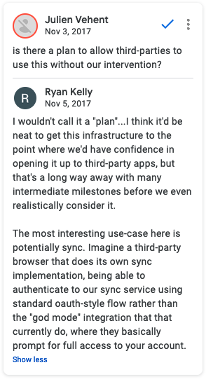

# A journey to scripting Firefox Sync / Lockwise: hybrid OAuth
Impersonating the Android app to replace deprecated BrowserID with OAuth  
August 8, 2021

<div class="note">

This article is part of a series about scripting Firefox Sync / Lockwise.

1. [A journey to scripting Firefox Sync / Lockwise: existing clients](scripting-firefox-sync-lockwise-existing-clients.md)
1. [A journey to scripting Firefox Sync / Lockwise: figuring the protocol](scripting-firefox-sync-lockwise-figuring-the-protocol.md)
1. [A journey to scripting Firefox Sync / Lockwise: understanding BrowserID](scripting-firefox-sync-lockwise-understanding-browserid.md)
1. A journey to scripting Firefox Sync / Lockwise: hybrid OAuth
1. [A journey to scripting Firefox Sync / Lockwise: complete OAuth](scripting-firefox-sync-lockwise-complete-oauth.md)

</div>

Welcome to ~~the last post~~ of this series about scripting Firefox
Sync! So far we've managed to [run the Sync clients we found in the wild](scripting-firefox-sync-lockwise-existing-clients.md)
(dating from 8 years ago), and taking inspiration from them, plus all
the available documentation online, we [built our own client](scripting-firefox-sync-lockwise-figuring-the-protocol.md),
which required us to [deconstruct the BrowserID protocol](scripting-firefox-sync-lockwise-understanding-browserid.md).

And while I was pretty satisfied with this, there was still one little
thing bugging me.

See, while I was reading everything possible online about the Firefox
Accounts, Firefox Sync and BrowserID protocols in order to make this
work, including the code of the production clients and servers involved,
I stumbled upon [this comment](https://github.com/mozilla/fxa/blob/6027041fe4d7accb37e0704271545a0bff80adfd/packages/fxa-auth-server/lib/routes/sign.js#L54)
in the Firefox Accounts server `/certificate/sign` endpoint, that we use
to sign a BrowserID public key and get back a certificate:

> ```js
> // This is a legacy endpoint that's typically only used by clients
> // connected to Sync, so assume `service=sync` for metrics logging
> // purposes unless we're told otherwise.
> ```
> 
> > ```js
> > // This is a legacy endpoint that's typically only used by clients
> > // connected to Sync.
> > ```
> >
> > > ```js
> > > // This is a legacy endpoint.
> > > ```

I don't like the idea of using a legacy endpoint when writing new code.
There must be something better.

## Exploring OAuth

While the TokenServer [documents OAuth](https://github.com/mozilla-services/tokenserver#using-oauth)
as an alternative to BrowserID to get credentials, it's unclear how to
use it. All that page says is "the client must obtain an OAuth access
token and the corresponding encryption key as a JWK", but doesn't mention
where to get the OAuth token and the corresponding key.

The BrowserID instructions weren't necessarily clearer, but at least it
had the competitive advantage of having multiple working implementations
in the wild that made it easier to understand how it works. OAuth was
a different kind of beast.

### Sending emails? How about no

The [Firefox Ecosystem Platform](https://mozilla.github.io/ecosystem-platform/)
documents [how to integrate with Firefox Accounts](https://mozilla.github.io/ecosystem-platform/docs/process/integration-with-fxa)
using OAuth, but the first thing we can read there is:

> Before starting integration, please send a request to
> fxa-staff\[at\]mozilla.com to request a short meeting so we can all
> document our expectations and timelines.

Follow a bit later by:

> Register for staging OAuth credentials by filing a [deployment bug](https://bugzilla.mozilla.org/).

The last thing I want to do is *send an email* to Mozilla to *document
my expectations*, and *file a bug* to get credentials. **I just want to
programmatically access my Firefox Sync data!**

By looking up `fxa browserid oauth` on Google, one of the countless
searches I made to try and understand what's going on, I found [this document](https://vladikoff.github.io/app-services-site/docs/accounts/welcome.html),
which states a couple more things.

> All new relying services should integrate with Firefox Accounts via
> the [OAuth 2.0 API](https://github.com/mozilla/fxa-oauth-server/blob/master/docs/api.md).
> There is also a legacy API based on the BrowserID protocol, which is
> available only in some Firefox user agents and is not recommended for
> new applications.

This confirms what I had only read in a code comment on the Firefox
Accounts server so far. **The BrowserID protocol is indeed deprecated**,
and it's not just [the browserid-crypto package that's unmaintained](scripting-firefox-sync-lockwise-understanding-browserid.md)
as I initially thought.

> The OAuth 2.0 API is the preferred method of integrating with Firefox
> Accounts. To delegate authentication to Firefox Accounts in this
> manner, you will first need to register for OAuth relier credentials,
> then add support for a HTTP redirection-based login flow to your service.
>
> Firefox Accounts integration is currently recommended only for
> Mozilla-hosted services. We are exploring the possibility of allowing
> non-Mozilla services to delegated authentication to Firefox Accounts,
> and would welcome discussion of potential use cases on the mailing
> list.

This matches the documentation I found earlier about the fact that we
need to contact Mozilla in order to register for OAuth credentials. At
that point it seems like a dead end, and I'm considering to build my
client on top of the legacy BrowserID API, since it still works after
all, and I spent so much time to understand it in depth anyways.

### Circling back

Going back to the [OAuth 2.0 API](https://github.com/mozilla/fxa-oauth-server/blob/master/docs/api.md)
link from the former quote, this points to a page in an archived repo on
Github, [`mozilla/fxa-oauth-server/docs/api.md`](https://github.com/mozilla/fxa-oauth-server/blob/master/docs/api.md),
itself saying that the page moved to [`mozilla/fxa-auth-server/fxa-oauth-server/docs/api.md`](https://github.com/mozilla/fxa-auth-server/blob/master/fxa-oauth-server/docs/api.md),
which is also an archived repo, and with no link this time.

I noticed before that Mozilla archived many of its repos because they
moved to a monorepo in [`mozilla/fxa`](https://github.com/mozilla/fxa),
which contains the latest version of [fxa-auth-server](https://github.com/mozilla/fxa/tree/main/packages/fxa-auth-server)
and its [API](https://github.com/mozilla/fxa/blob/main/packages/fxa-auth-server/docs/api.md),
an API that I had already encountered multiple times since [the beginning](scripting-firefox-sync-lockwise-existing-clients.md)
of this series. Maybe there's some hope?

We do have a [whole OAuth section](https://github.com/mozilla/fxa/blob/main/packages/fxa-auth-server/docs/api.md#oauth)
in there, but I pretty much instantly hit a wall when I see that all
those endpoints require an OAuth client ID, which is part of the OAuth
credentials I'm supposed to email Mozilla in order to get.

It feels like I'm going in circles. 🧐

## Harvesting a `client_id` from the Android app

While those endpoints require a client ID, it's not necessary to provide
a client secret for public clients (see [OAuth grant types](https://auth0.com/docs/applications/confidential-and-public-applications)).
And because the client ID of public clients is... public, we should be
able to easily borrow one from any of the public clients out there (for
instance, mobile apps), whether it's from the source code, by
decompiling the app, or by inspecting its traffic. And indeed, there is
one directly in the [`lockwise-android`](https://github.com/mozilla-lockwise/lockwise-android/search?q=clientId&type=code)
repo!

With that client ID in hand, we can start playing with [the endpoints we found earlier](https://github.com/mozilla/fxa/blob/main/packages/fxa-auth-server/docs/api.md#oauth).
At first, I'm thinking that I have to do some kind of OAuth login dance,
with the usual redirect URL and code challenge, but it turns out
[it's not a requirement if we already have a session token](https://github.com/mozilla/fxa/blob/main/packages/fxa-auth-server/docs/api.md#post-oauthtoken),
which we do by logging in directly with the user's credentials.

That part was not documented anywhere else, probably because it's not
meant to be used by third-party developers like me, but more by [the code](https://github.com/mozilla/fxa/tree/main/packages/fxa-content-server)
behind [accounts.firefox.com](https://accounts.firefox.com/).

The [fxa-js-client I'm using](scripting-firefox-sync-lockwise-figuring-the-protocol.md#sign-in-to-firefox-accounts)
even [has a method for it](https://github.com/mozilla/fxa/blob/96161f37753101c1a64d9588d5cdc5434243e91f/packages/fxa-js-client/client/FxAccountClient.js#L2671),
where I can specify a `scope` of `https://identity.mozilla.com/apps/oldsync`
[as documented](https://github.com/mozilla-services/tokenserver#using-oauth),
and I do get back a valid OAuth token. Sweet.

```js
const scope = 'https://identity.mozilla.com/apps/oldsync'
const oauthToken = await client.createOAuthToken(creds.sessionToken, clientId, { scope })
```

## Unmasking the `X-KeyID` header

Now that's not enough to authenticate to the TokenServer, I also [need to pass](https://github.com/mozilla-services/tokenserver#using-oauth)
"the `kid` field of the encryption key in the `X-KeyID` header".

This is not really obvious to me because I don't have a `kid` field in
any of the encryption keys I have been manipulating so far. I found out
later where that `kid` should otherwise come from, and let me tell you
it was a whole journey of its own. I'll develop that [in the 5th post of this series](scripting-firefox-sync-lockwise-complete-oauth.md).
Wait, didn't I say earlier that this one was the last post?

When googling `firefox sync "x-keyid"`, there was essentially 3 results.

1. [The very page I came from](https://github.com/mozilla-services/tokenserver).
1. [A Bugzilla issue](https://bugzilla.mozilla.org/show_bug.cgi?id=1455219)
   by [our friend Ryan](scripting-firefox-sync-lockwise-understanding-browserid.md#ryan)
   for the TokenServer to accept OAuth tokens.
1. [The `sync-dev@mozilla.org` mailing list on mail-archive.com](https://www.mail-archive.com/search?l=sync-dev@mozilla.org&q=subject:%22%22&o=newest&f=1),
   not a specific thread but it turned out that the latest messages on the list before [it gets migrated to Google Groups](https://www.mail-archive.com/sync-dev@mozilla.org/msg01714.html) earlier this year were [about the `X-KeyID` header](https://www.mail-archive.com/sync-dev@mozilla.org/msg01710.html).

The second link doesn't say anything about `X-KeyID`, and while it links
a few other resources, they don't mention this header either (but they
turned out to be critical when I later tried to [implement the full OAuth flow](scripting-firefox-sync-lockwise-complete-oauth.md)).

Finally, in the mailing list thread, the <abbr title="Original poster">OP</abbr>
seems to be trying to do exactly the same thing as me, and they
apparently got a step further because they have a whole algorithm to
compute the `X-KeyID` header, involving a number of parameters I don't
have and some key derivation logic. I'm not sure where that algorithm
comes from, but what's clear from the mail is that it's not working.

[Ryan delivers one more time](https://www.mail-archive.com/sync-dev@mozilla.org/msg01711.html)
by replying with an explanation and a link to the production code
generating the said key.

> For legacy backwards compatibility reasons, the key-derivation for
> Sync is different than the derivation for general FxA scoped keys. The
> simplest way to explain the differences is probably to link to the
> [code we have here](https://github.com/mozilla/fxa-crypto-relier/blob/168f4a6c47de9021a0d9ae23a3e6757013a38dbd/src/deriver/ScopedKeys.js#L107),
> which does the derivation.

This is both a good and a bad news for me.

The good news is that with the algorithm from the original message of
the thread, plus the code in Ryan's link, I should be able to generate a
working `X-KeyID` which might be all I need to make my OAuth version work!

The bad news is that this key deriving code I'm going to rely on is
called `_deriveLegacySyncKey`, and you know form the beginning of this
very post that I don't like using code that's called "legacy", because
it most necessarily means that there's a better alternative.

But let's put that aside for now. This will be an adventure for another
day. For now we're so close to getting this code work that I can't just
move on to something else right now.

## Tracking `keyRotationTimestamp`

I start with the Python code form the original email:

```python
kid = str(keyRotationTimestamp) + '-' + base64.urlsafe_b64encode(tmp[:16]).decode('utf-8').rstrip('=')
```

The first thing we see is that we need `keyRotationTimestamp`, and I
happen to not have encountered anything named `keyRotationTimestamp`
yet.

I look it up on the [API documentation of Firefox Accounts](https://github.com/mozilla/fxa/blob/main/packages/fxa-auth-server/docs/api.md)
which I'm already on, hoping that it's returned by some endpoint there
but no luck.

<figure class="center">
  <a href="https://www.flickr.com/photos/71204861@N07/7297048442">
    
  </a>
</figure>

What follows is a number of searches:

* `keyRotationTimestamp`
* `keyRotationTimestamp mozilla`
* `keyRotationTimestamp site:github.com`

Followed by me searching that string directly [on all of GitHub](https://github.com/search?q=keyRotationTimestamp&type=code)
and browsing the first couple pages of results (out of 49) without luck.

Then I tried to [scope my search to the `mozilla/fxa` repo](https://github.com/mozilla/fxa/search?q=keyRotationTimestamp&type=code)
which had been a good source of information in the past, and bingo! The
first result is from [the `/account/scoped-key-data` endpoint of fxa-auth-server](https://github.com/mozilla/fxa/blob/d1283314c15d81a85f08dcba5bce329db7c6fd51/packages/fxa-auth-server/lib/routes/oauth/key_data.js)
(you know, the Firefox Accounts server), which do return the
`keyRotationTimestamp`! It's just that the documentation I checked
earlier doesn't include the details of the payload [for this endpoint](https://github.com/mozilla/fxa/blob/main/packages/fxa-auth-server/docs/api.md#post-accountscoped-key-data).

This one too, [has a neat matching function in fxa-js-client](https://github.com/mozilla/fxa/blob/96161f37753101c1a64d9588d5cdc5434243e91f/packages/fxa-js-client/client/FxAccountClient.js#L2718)
and I can move to the next step.

## Actually computing the `X-KeyID` header

Let's get back one more time to the Python code from the email we're
trying to adapt.

```python
kid = str(keyRotationTimestamp) + '-' + base64.urlsafe_b64encode(tmp[:16]).decode('utf-8').rstrip('=')
```

Now we figured the first part, the rest is the Base64URL representation
of the first 16 bytes of `tmp`, which is the result of some key
derivation. According to the email thread, the key derivation part
isn't working, so we're not going to try to port it, but Base64URL
encoding the first 16 bytes of a key reminds me of something.

We can also see this pattern in [the code Ryan pointed to](https://github.com/mozilla/fxa-crypto-relier/blob/168f4a6c47de9021a0d9ae23a3e6757013a38dbd/src/deriver/ScopedKeys.js#L107)
in order to address the key derivation issue:

```js
scopedKey.kid = options.keyRotationTimestamp + '-' + base64url(kHash.slice(0, 16))
```

While it's not immediately clear to me what `kHash` is, the
`base64url(kHash.slice(0, 16))` is again awfully familiar. It is exactly
what we used to do [to compute the `X-Client-State` header](scripting-firefox-sync-lockwise-figuring-the-protocol.md#compute-client-state)
for the BrowserID version!

```js
const clientState = sha256(syncKey).slice(0, 16).toString('hex')
```

This is especially promising since [the Python code behind the TokenServer](https://github.com/mozilla-services/tokenserver/blob/39239dd7a8d6b8270e22c9b6fef3f6be147e0df4/tokenserver/views.py#L247)
also calls it `client_state`:

```python
kid = request.headers.get('X-KeyID')
keys_changed_at, client_state = parse_key_id(kid)
```

So I try to combine the `keyRotationTimestamp` I just retrieved with the
hexadecimal representation of my previous `X-Client-State`, and guess
what. It works!

## I want to see the code!

The great news is that this not only makes our code use the latest and
greatest way to connect to Firefox Sync, without relying on anything
legacy or deprecated, but it also makes our implementation much simpler!

Here's the updated version of the code we previously built in this
series, up to getting the Sync token from the TokenServer. [Calling the Sync API](scripting-firefox-sync-lockwise-figuring-the-protocol.md#actually-calling-firefox-sync)
from there is not affected, so I won't include it again here.

```js
const crypto = require('crypto')
const fetch = require('node-fetch')
const AuthClient = require('fxa-js-client')

const authServerUrl = 'https://api.accounts.firefox.com/v1'
const tokenServerUrl = 'https://token.services.mozilla.com'
const scope = 'https://identity.mozilla.com/apps/oldsync'
const clientId = '...'
const email = '...'
const pass = '...'

async function main () {
  const client = new AuthClient(authServerUrl)

  const creds = await client.signIn(email, pass, {
    keys: true,
    reason: 'login'
  })

  const accountKeys = await client.accountKeys(creds.keyFetchToken, creds.unwrapBKey)
  const oauthToken = await client.createOAuthToken(creds.sessionToken, clientId, { scope })
  const scopedKeyData = await client.getOAuthScopedKeyData(creds.sessionToken, clientId, scope)

  const syncKey = Buffer.from(accountKeys.kB, 'hex')
  const clientState = crypto.createHash('sha256').update(syncKey).digest().slice(0, 16).toString('base64url')
  const keyId = `${scopedKeyData[scope].keyRotationTimestamp}-${clientState}`

  // See <https://github.com/mozilla-services/tokenserver#using-oauth>.
  const token = await fetch(`${tokenServerUrl}/1.0/sync/1.5`, {
    headers: {
      Authorization: `Bearer ${oauthToken.access_token}`,
      'X-KeyID': keyId
    }
  })
    .then(res => res.json())
}

main()
```

Here's the equivalent code from the previous article for comparison:

<details>
  <summary>Legacy BrowserID code</summary>

```js
const { promisify } = require('util')
const crypto = require('crypto')
const fetch = require('node-fetch')
const AuthClient = require('fxa-js-client')
const njwt = require('njwt')

const authServerUrl = 'https://api.accounts.firefox.com/v1'
const tokenServerUrl = 'https://token.services.mozilla.com'
const email = '...'
const pass = '...'

function base64to10 (data) {
  return BigInt('0x' + Buffer.from(data, 'base64').toString('hex')).toString(10)
}

async function main () {
  const client = new AuthClient(authServerUrl)

  const creds = await client.signIn(email, pass, {
    keys: true,
    reason: 'login'
  })

  const accountKeys = await client.accountKeys(creds.keyFetchToken, creds.unwrapBKey)

  const kp = await promisify(crypto.generateKeyPair)('rsa', {
    modulusLength: 2048
  })

  const jwk = kp.publicKey.export({ format: 'jwk' })

  const publicKey = {
    algorithm: jwk.algorithm.slice(0, 2),
    n: base64to10(jwk.n),
    e: base64to10(jwk.e)
  }

  // Time interval in milliseconds until the certificate will expire, up to a
  // maximum of 24 hours as documented in <https://github.com/mozilla/fxa/blob/f6bc0268a9be12407456fa42494243f336d81a38/packages/fxa-auth-server/docs/api.md#request-body-32>.
  const duration = 1000 * 60 * 60 * 24

  const { cert } = await client.certificateSign(creds.sessionToken, publicKey, duration)

  // Generate an "identity assertion" which is a JWT as documented in
  // <https://github.com/mozilla/id-specs/blob/prod/browserid/index.md#identity-assertion>.
  const signedObject = njwt.create({ aud: tokenServerUrl, iss: authServerUrl }, kp.privateKey, 'RS256')
    .setClaim('exp', Date.now() + duration)
    .compact()

  // Certs are separated by a `~` as documented in <https://github.com/mozilla/id-specs/blob/prod/browserid/index.md#backed-identity-assertion>.
  const backedAssertion = [cert, signedObject].join('~')

  // See <https://github.com/mozilla-services/tokenserver#using-browserid>.
  const syncKey = Buffer.from(accountKeys.kB, 'hex')
  const clientState = crypto.createHash('sha256').update(syncKey).digest().slice(0, 16).toString('hex')

  const token = await fetch(`${tokenServerUrl}/1.0/sync/1.5`, {
    headers: {
      Authorization: `BrowserID ${backedAssertion}`,
      'X-Client-State': clientState
    }
  })
    .then(res => res.json())
}

main()
```

</details>

But while this is a solid improvement from what we had previously built
since the beginning of this series, there's still a bit more to unwrap.

## Going further

You can probably tell by now that I love digging into rabbit holes and
I'm eternally unsatisfied.

While I thought that I had found the last piece of the puzzle with the
OAuth method described in this post, in order to integrate with Firefox Sync as
cleanly as possible, it occurred to me that *something was off* as I was
trying to explain it.

One of the main benefits of OAuth is to be able to grant *granular
permissions* to a third-party service, without giving them *knowledge of
your password*.

Yet with the solution from this post, not only do we still need to have
knowledge of the user's password in order to login with the
email/password scheme and derive the Sync encryption keys, but this
method also grants us a Firefox Accounts session token which allows us
to do *virtually anything* to that user account through the API. **This
defeats both advantages of OAuth mentioned above; permissions are not
granular and we have access to the plaintext password.**

<div class="float-wrapper">
  <figure class="left">
    
  </figure>
  <div class="float-inner">

This authentication scheme is even referred by Ryan as "god mode" in [a comment](https://docs.google.com/document/d/1IvQJFEBFz0PnL4uVlIvt8fBS_IPwSK-avK0BRIHucxQ/edit?disco=AAAABgay7bs)
on [the OAuth flow spec on Google Docs](https://docs.google.com/document/d/1IvQJFEBFz0PnL4uVlIvt8fBS_IPwSK-avK0BRIHucxQ)
(that I encountered [earlier](#unmasking-the-x-keyid-header) through [a Bugzilla issue](https://bugzilla.mozilla.org/show_bug.cgi?id=1455219)).

> Imagine a third-party browser that does its own Sync implementation,
> being able to authenticate to our Sync service using standard
> OAuth-style flow rather than the "god mode" integration that \[they\]
> currently do, where they basically prompt for full access to your
> account.

This is a concern that's also addressed in the introduction of the
document:

> Key material can only be accessed through a bespoke authorization
> protocol that is \[...\] **far too powerful**. The protocol gives the
> application complete control of the user's Firefox Account, and hands
> it a copy of their master key material. There is currently no
> provision for scoping access down to a subset of data or capabilities.

  </div>
</div>

In the [final article](scripting-firefox-sync-lockwise-complete-oauth.md)
(for real this time, I promise) we'll see how to use the full OAuth flow
to authenticate to Firefox Accounts and access Firefox Sync, so that we
never have knowledge of the user's password, and request only the
permissions that we need instead of full access.

<div class="note">

Check out the other posts in this series!

1. [A journey to scripting Firefox Sync / Lockwise: existing clients](scripting-firefox-sync-lockwise-existing-clients.md)
1. [A journey to scripting Firefox Sync / Lockwise: figuring the protocol](scripting-firefox-sync-lockwise-figuring-the-protocol.md)
1. [A journey to scripting Firefox Sync / Lockwise: understanding BrowserID](scripting-firefox-sync-lockwise-understanding-browserid.md)
1. A journey to scripting Firefox Sync / Lockwise: hybrid OAuth
1. [A journey to scripting Firefox Sync / Lockwise: complete OAuth](scripting-firefox-sync-lockwise-complete-oauth.md)

</div>
