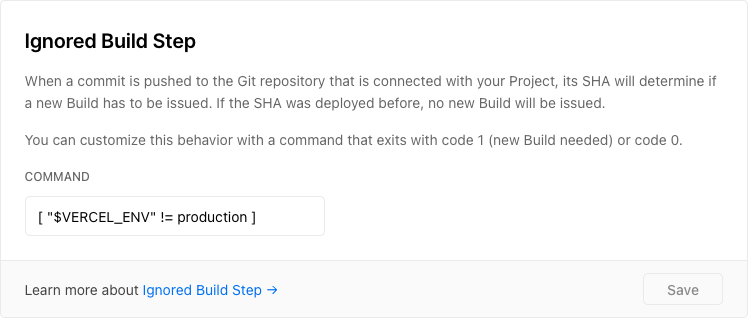
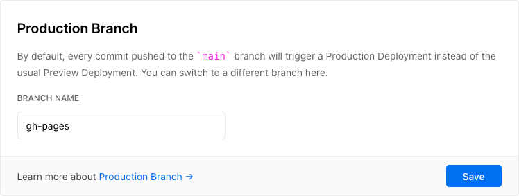
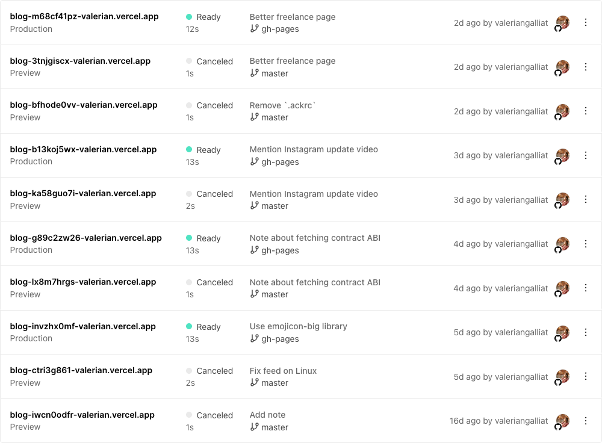

# Using Vercel without preview deployments
Keeping Vercel clean and silent  
September 21, 2021

[Vercel](https://vercel.com/) is a cool hosting service and is my go-to
for free static hosting. Why? While I prefer the experience of
[GitHub Pages](https://pages.github.com/), [Netlify](https://www.netlify.com/)
and [Render](https://render.com/), Vercel [is the only one](free-static-hosting-server-side-analytics.md)
to allow raw access to HTTP logs for free. GitHub Pages and Render don't
have this feature and Netlify charges a premium fee for it that's over
my budget for a small website.

And while I don't use client-side analytics scripts (because they
technically cannot be reliable), I like to have a sense of my website
traffic through HTTP logs (the only proper source of truth).

<div class="note">

**Note:** if you're interested in this topic, I specifically wrote an
article on [how to get access to raw HTTP logs on a Vercel website](vercel-custom-log-drain.md).
Check it out!

</div>

## The problem with Vercel

Vercel works. It works well. But it doesn't fit my workflow at all.

I like to keep things simple and minimal, and have the least amount of
noise possible. Vercel likes to make things complicated, over-engineered
(relative to what I'm doing with it), and noisy.

Let's take the example of this very blog, if I wanted to host it on
Vercel. The [source](https://github.com/valeriangalliat/blog) is on
GitHub, I keep my Markdown files neatly in the `master` branch, I
render them to HTML using a [dependency-based incremental build system](https://github.com/valeriangalliat/blog/blob/03a140f7c02e540b4bf97c470261d23e3a156fad/Makefile#L49)
(also known as makefile) in the `gh-pages` branch (could be called
anything else but hey, it was once hosted on GitHub Pages after all).

I don't *need* to re-render the whole site every time I deploy, which is
why I commit the HTML files on a separate branch, instead of asking
Vercel or any other hosting platform to compile everything from `master`
on every deploy. This keeps things *fast as fuck* and low energy.

### Preview deployments

By default, Vercel expects every branch to be deployable, and they have
that cool feature of automatically deploying every single commit to a
random URL (preview deployments). I don't need preview deployments for
my blog, but there's no way to turn them off.

### Very verbose Vercel

They also have the annoying habit of posting a comment on every GitHub
PR and commit with the deployment URL by default. I hate noise and this
is pure noise for me. Luckily there's a non-intuitive way of turning it
off and I'll show you how.

### Managing garbage

Finally, because each PR and commit is going to trigger a deployment
with a not-so-temporary URL. This creates a lot of old, unused, garbage
deployments, and Vercel doesn't know when you don't need them anymore
and consider them garbage (for me, like, instantly, for anything that's
not the latest production build).

You can either remove them manually (sad), or you can periodically run a
command that does just that for you (also sad, but less sad), and I'll
show you how.

Let's get into it.

## Turning off preview deployments (kinda)

I guess that the whole point of Vercel is to offer preview deployments,
so they didn't really consider the use case where you would want to
remove them.

But if you go in your project settings, under the Git section, you can
configure a "ignored build step" command.

<figure class="center">
  
</figure>

It's a command whose exit code will determine whether Vercel will
actually deploy the branch. When the command errors out (exits with a
nonzero code), a new build will be triggered, but if the commands
succeeds (exits with 0), this build will be ignored.

You can [run Git commands there](https://vercel.com/docs/projects/overview#ignored-build-step),
but I like to keep it simple and just rely on the `VERCEL_ENV`
environment variable to only allow builds on the production branch
(`gh-pages` in my case) as defined in "production branch".

<figure class="center">
  
</figure>

By using the following command, I can effectively ignore all builds that
are not in the production branch.

```sh
[ "$VERCEL_ENV" != production ]
```

This uses the
[`test(1)`](https://man7.org/linux/man-pages/man1/test.1.html) command
(commonly aliased to `[`) to exit with an error when we're on the
production branch, in order to trigger a build.

The ignored build will still show up in your deployments list as
"cancelled" deployments, and there's no way around that, but I show you
below [how to garbage collect them](#garbage-collecting-dangling-deployments).

## Getting rid of bot comments

By default Vercel will comment on every PR and commit with the link to
the deployment.

To avoid that, create a `vercel.json` file in every branch where you
want to turn this off, with the following content:

```json
{
  "github": {
    "silent": true
  }
}
```

<div class="note">

**Note:** if you used the previous trick to only run builds in the
production branch, you only need to add this configuration there.

</div>

## Garbage collecting dangling deployments

Vercel knows to create preview deployments, but doesn't know when to
delete them. This means that you need to more or less manually delete
the old preview deployments that are not needed anymore.

It usually doesn't cause any harm to have hundreds of older versions of
your website available on random public URLs that most likely only your
team knows about. I just don't like them being *there* in the first
place.

<figure class="center">
  
  <figcaption>I don't know about you, but that makes me anxious.</figcaption>
</figure>

With the [Vercel CLI](https://vercel.com/docs/cli), which you can
install with `npm install -g vercel`, you can use the [`vercel remove`](https://vercel.com/docs/cli#commands/remove)
command to remove deployments.

Specifically, to remove everything but deployments with an active production or preview URL, run:

```sh
vercel remove <project> --safe
```

<figure class="center">
  
  <figcaption>Now this is better!</figcaption>
</figure>

## Final thoughts

I'm not blaming Vercel for all of this, I'm happy they provide this
service for free and [they're the only ones](free-static-hosting-server-side-analytics.md)
to include HTTP logs access in the free offer.

Sadly their approach to deploying websites if very far from mine, and
this requires me to work around those default behaviors to have
something that fits me better.

If you're in a similar situation, I hope you found this post useful!
