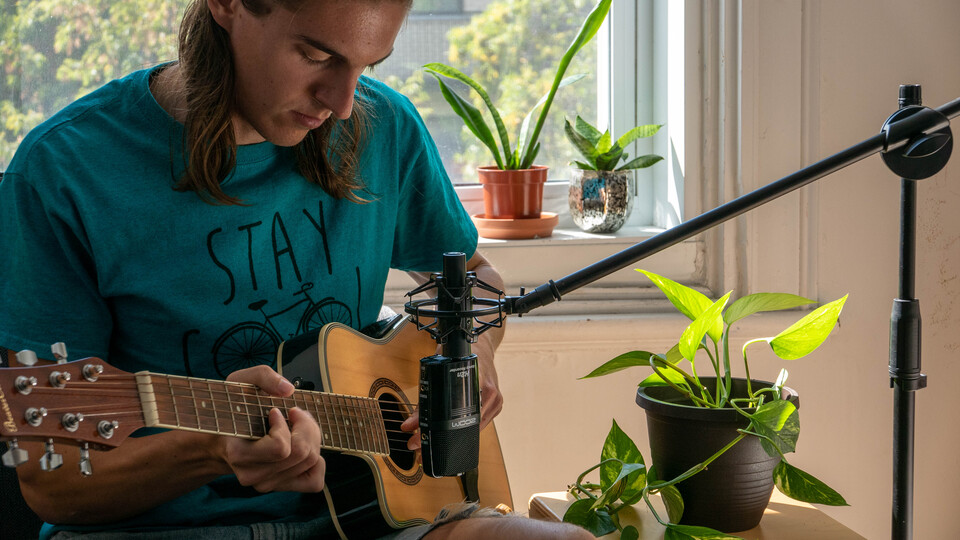
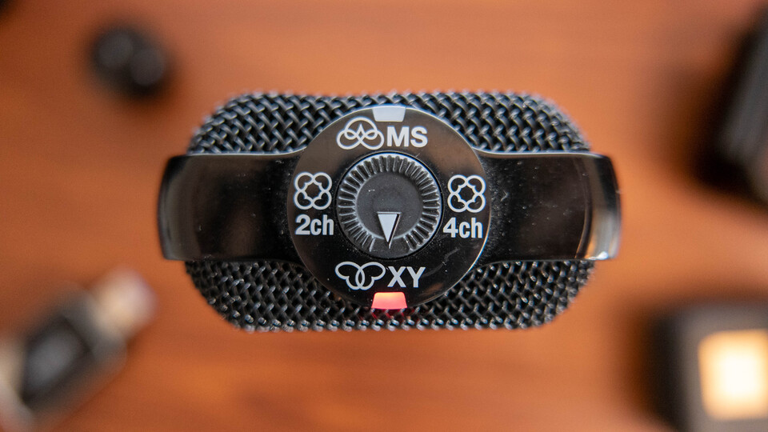
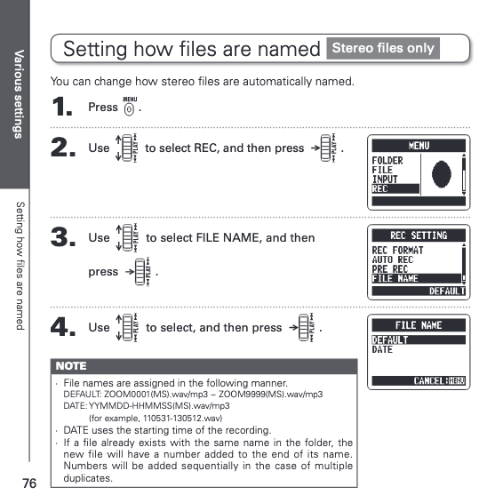
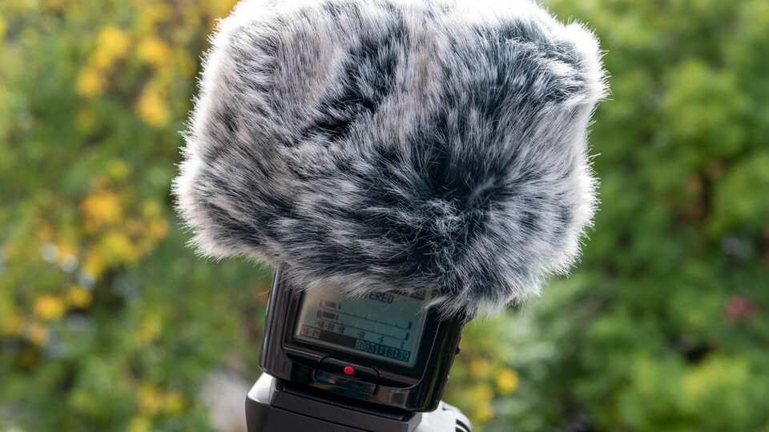
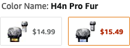
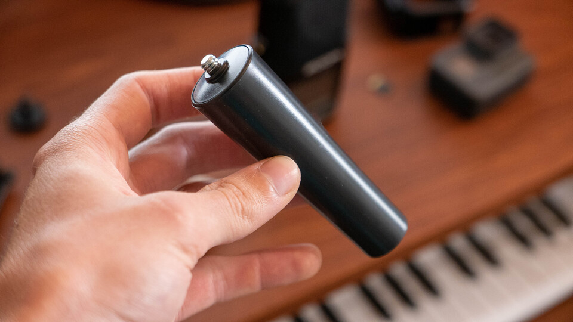
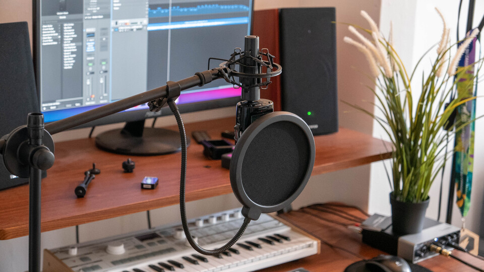
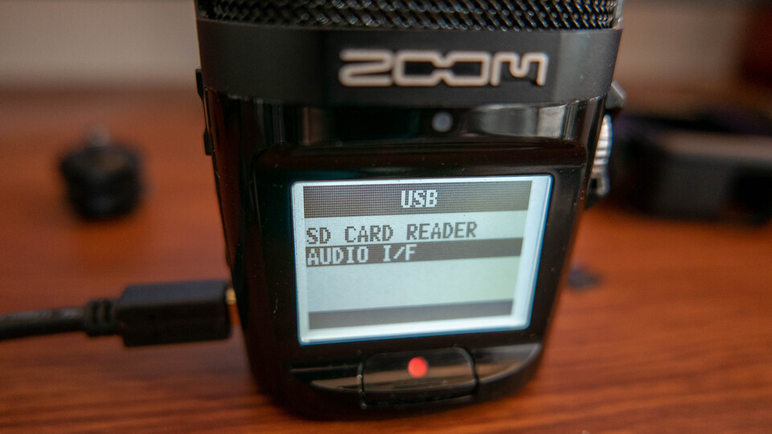
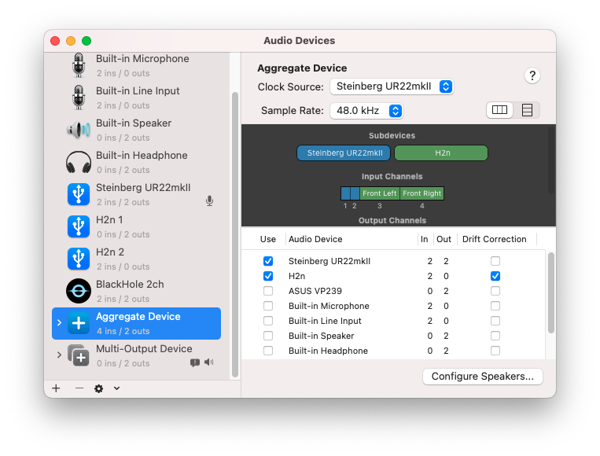
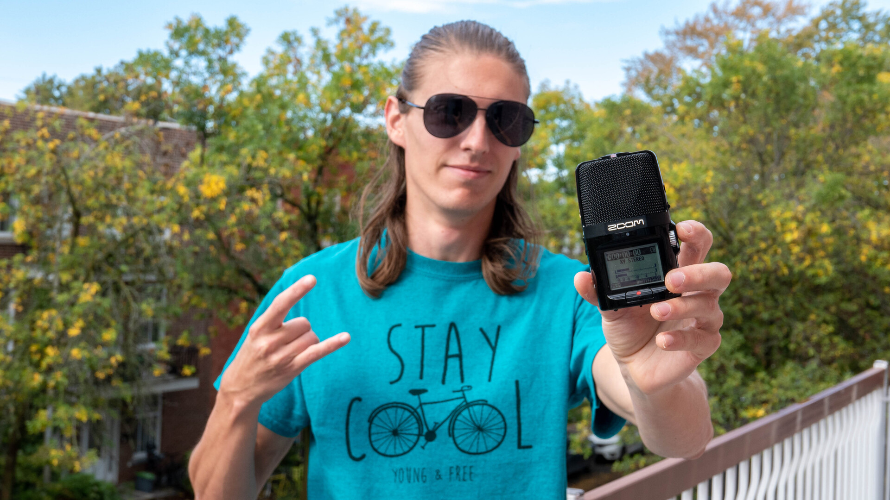

# Zoom H2n: pro tips and tricks
Everything I wish I knew when I got my H2n  
September 24, 2021

The [Zoom H2n](https://amzn.to/3GwRCAL) is an awesome portable
microphone with a long battery life. It's very versatile and delivers a
solid sound.

In this post, I'll give you all of the tips and tricks that I discovered
over the years using my H2n, that made me more efficient at using it and
allowed me to do even more with it.

<figure class="center">
  
</figure>

But first, I'll give you a little bit of backstory about how I got
there in the first place. Feel free to [skip it](#my-do-to-microphone-setting).

## The story about my H2n

The reason I got it in the first place was put it in my motorcycle
jacket while I ride to record clean engine sound for my
[GoPro recordings](https://www.youtube.com/playlist?list=PL3gQ6-WYh7kU8QjpRSMpDknhAwvccFiMu).
This is how [Royal Jordanian](https://www.youtube.com/c/royaljordanianR),
a famous motorcycle YouTuber, [uses his H2n](#record-motorcycle-sound-rj-style),
and his results are remarkable.

I used to have a [Zoom H4n](https://amzn.to/3DR0D68) because I liked
that it could act as an external sound card where I could plug XLR
microphones and jack instruments as well, but it was too big to fit in
my motorcycle jacket, which turned out to be what allowed me to get the
[best sounding audio on a motorcycle](#record-motorcycle-sound-rj-style).

Anyways, because I had that mic around when I started [making more YouTube videos](https://www.youtube.com/@FunkyVal),
it became my main device to record voice in various settings (indoors,
outdoors, multiple people interviews, live streaming). I also use it to
record acoustic instruments.

<figure class="grid grid-2">
  
  
</figure>

While specialized microphones might give you even better results in
specific situations, the H2n has allowed me to record high quality audio
in an impressively wide set of settings.

After years of using it, I have a couple of tips to share with you that
will make you even more productive with your H2n and enable you to do
even more with it.

## My go-to mic setting

The H2n has 5 built-in microphones and lets you use them in the
[following settings](https://composerfocus.com/zoom-h2n-review/):

* [X-Y stereo](https://en.wikipedia.org/wiki/Stereophonic_sound#X-Y_technique:_intensity_stereophony):
  2 mics in the front.
* [M/S mid/side](https://en.wikipedia.org/wiki/Stereophonic_sound#M/S_technique:_mid/side_stereophony):
  1 mic in the back, 2 mics on the sides with adjustable recording width.
* 2-channel surround: X-Y and M/S converted to 1 stereo track.
* 4-channel surround: X-Y and M/S converted to 2 stereo tracks.

I personally use X-Y stereo the vast majority of the time. If you don't
know which one to chose, I would default to this one.

<figure class="center">
  
</figure>

It's going to record from the front of the Zoom (where the screen is),
which is convenient because you're facing the front of the mic when
you're recording. This allows you to easily monitor the levels on the
screen, and puts the record button right in front of you.

That being said the H2n is well designed because the clipping light on
top is visible from both sides, meaning that if you want to record in
M/S mode, you'll still see the light while facing the back of the Zoom!

## My go-to gain setting

When I first got my H2n, I wasn't sure where to put the gain. My usual
rule of thumb with gain is to put it **as high as possible** at the
source so that **the highest peaks** I plan to have are gonna be **close
to 0 dB, but won't clip**.

Most of the time, I [mount the Zoom on top of my camera](#hot-shoe-mount),
or I [put it on a surface](#the-potholder-trick) about an arm's length
in front of me. In those conditions, I found that **leaving the gain on
8 all the time** gave me the best results. It's perfect to record my
voice clearly and any meaningful context sound, without clipping,
and leaving enough headroom for any reasonable surprise peaks.

<figure class="center">
  
</figure>

Because it stays there most of the time, I ensure that all the
recordings that are made in similar conditions will have consistent
levels, so that I don't have to adjust them one by one in post. I just
boost the gain a bit more at the track level, and add some compression
to avoid unnecessary peaking.

So I always leave my Zoom with a gain of 8 by default, and if I'm in a
recording setting that [differs from my usual use case](#mic-stand-adapter),
like singing very close to the mic through a pop filter or recording an
instrument, I'll go back to step one where I try to get the gain as high
as possible while making sure it doesn't clip during the highest peaks I
plan to have. FWIW in those settings, I rarely needed to go below 6.

## Battery and clock reset trick

You might have noticed that the H2n internal clock is reset when you
remove the AA batteries to change or recharge them. It's pretty
frustrating to have to configure the date and time again every time you
recharge the Zoom!

But there's a neat trick that I've found [on Reddit](https://www.reddit.com/r/livesound/comments/ci181c/comment/evc0nt0/).
If you change the batteries **one at a time**, e.g. without ever having no
battery in the Zoom at all, it will keep the clock intact!

<figure class="center">
  
</figure>

## Preventing the filename counter to reset

By default, the H2n names files like `ZOOM0001.WAV`, incrementing the
number for every new file.

This is fine with me, but every time I empty the SD card, the file
resets to `ZOOM0001.WAV`! There's no persistent internal counter like
with my camera.

This is annoying because I end up with conflicting filenames, and I
can't uniquely identify a specific Zoom recording by its name. Not
great.

If you want to keep incrementing the number after wiping your SD card
clean, just **leave the latest file you recorded there**! For example if
you recorded all the way to `ZOOM0363.WAV`, just leave that file there,
and the next one to be recorded will be called `ZOOM0364.WAV`.

If even this single file is large enough that you want to remove it as
well, you can drop an empty file instead with the same filename, and
that'll do the trick. 👌

But beware, if you ever reach `ZOOM9999.WAV`, the H2n will not let you
record any further and will just error with `DATA FULL`, even if there's
still technically enough free space on the SD card.

For this reason, and also because it's even easier overall, I recommend
switching to [naming files after the date](#using-date-and-time-as-filename),
which is something that I didn't know was possible until very recently!

## Using date and time as filename

If you want something more deterministic to name files that the default
strategy of incrementing a counter that resets every time you empty the
SD card, I recommend switching to using the date file naming strategy
instead.

You'll find it from the `MENU` button on the right, in `REC`, `FILE
NAME`, and set it to `DATE` there.

<figure class="center">
  
  <figcaption>From the operation manual</figcaption>
</figure>

## Hot shoe mount

Because I often record [YouTube videos](https://www.youtube.com/@FunkyVal),
I like to mount my H2n on top of my camera to get high quality audio in
my videos.

I know most YouTubers use the [Rode VideoMicPro](https://amzn.to/3dL7cMA)
or one of its declinations, but since I already had the H2n, I didn't
want to bother buying a new mic for video.

It turns out the H2n can easily be mounted on top of a camera as well,
with the help of a cheap [hot shoe adapter](https://amzn.to/3EMi6xK)!

<figure class="center">
  
</figure>

**Note:** in that setup, I noticed that the H2n picked up noise from my
camera strap rubbing and bouncing on the camera body and tripod when
moving around, e.g. when vlogging.

To avoid that, make sure to **remove the camera strap before you
record**, if you usually have one attached!

On my camera it's a bit annoying to do, but definitely worth it to have
a clean sound. I'm looking forward to buying the [Leash by Peak Design](https://amzn.to/31SMN5z),
even though it's a bit more expensive than what I'd like to pay for a
camera strap, it's super simple to attach and detach and that would make
my life much easier.

**Edit:** I ended up buying a simple (and much cheaper) [quick release
connector](https://amzn.to/3GBVUqn) from Amazon which does wonders with
the original strap from my camera.

## Wind muff

A wind muff is a must for outdoor recording especially if it's a bit
windy. This is [the one I use](https://amzn.to/3yeiwdE), it's for the
H4n but works perfectly on the H2n as well!

<figure class="center">
  
</figure>

**Note:** if like me you're confused between the "H4n Fur" and "H4n Pro
Fur" variations and don't know which one to pick, keep in mind that
it's "H4n" and "H4n Pro" furs, not a "Pro Fur™". 😂

<figure class="grid">
  
  
</figure>

Zoom also provides one as part of their [H2n accessory pack](https://amzn.to/3dIhtcs),
and if you're going to buy a few of the items that are part of it, it
might be cheaper to just get the pack!

## Mic stand adapter

Another thing that's part of the [accessory pack](https://amzn.to/3dIhtcs)
that I didn't get but probably should have, is the [mic stand adapter](https://amzn.to/31MZzmD).

<figure class="center">
  
</figure>

It allows you to mount your H2n directly on a mic stand, which is very
practical if you want to record high quality audio while singing
directly into it, recording a podcast, live streaming, voice-over or
recording acoustic instruments.

<figure class="center">
  
  
</figure>

This is the stack that I personally use for this kind of work and I'm
super happy with it:

* [Mic stand](https://amzn.to/31QFlbt), this one is a bit on the cheap
  side but gets the job done. You can even put two mics on it!
* [Shock mount](https://amzn.to/3ES5KUY), key element to avoid noise in
  the recording from vibrations around the mic. This one specifically is
  compatible with the [H2n mic stand adapter](https://amzn.to/31MZzmD).
  Double-check the diameter if you get another one.
* [Pop filter](https://amzn.to/3GygpV1), to remove artifacts or
  distortion from pronouncing letters like P, T, K and S very close to
  the mic.
* And obviously the [mic stand adapter](https://amzn.to/31MZzmD) to
  mount the Zoom on the whole thing.

Here's an awesome article on [why a shock mount and pop filter are important](https://www.lewitt-audio.com/blog/do-i-need-a-shock-mount-and-a-pop-filter-for-my-microphone)
if you're not sure if you need them or not.

## Use as an audio interface

If you have the proper cable, you can connect your H2n to your computer
via USB and use it as an audio interface, meaning that you can capture
sound from it directly from a screen recording or from your
<abbr title="Digital audio workstation">DAW</abbr>!

<figure class="center">
  
</figure>

They don't seem to mention it anywhere though but keep in mind that you
specifically need a Mini-B USB connector on the H2n side (which is not
that common).

Again, [this is the cable I use](https://amzn.to/30gb2KN), but if like
me you're gonna need so many accessories that turn out to be part of the
[H2n accessory pack](https://amzn.to/3dIhtcs), you might as well
get that in the first place. That being said the cable I bought is
significantly longer than the one they provide in the pack and that
comes in handy to have a bit more moving freedom during studio sessions.

Here's what it looks like once plugged, to set it as input device inside
Logic:

<figure class="center">
  
</figure>

But if you want to use another audio interface to record instruments, MIDI, and
other mics at the same time (I personally have a [Steinberg UR22mkII](https://amzn.to/3ICsjiD)
for that), you can't just switch input device in your DAW like this.

Instead, on macOS, I recommend in *Audio MIDI Setup* to configure an
aggregate device that includes both your sound card and the H2n. This
way, you can set that aggregate device as input in your DAW and you'll
get all the channels from your sound card plus all the channels from the
Zoom!

<figure class="center">
  
</figure>

## Record motorcycle sound, RJ style

As I mentioned earlier [Royal Jordanian](https://www.youtube.com/c/royaljordanianR)
is a famous motorcycle YouTuber, and makes some of the best sounding
motorcycle videos out there.

He records mainly with a H2n and that's the reason I got one in the
first place! But if you're going to record your motorcycle rides with
it, you'll quickly realize that's not enough information.

* Were to put the H2n?
* What recording mode to use?
* What direction should the mic be facing?
* What gain to use?

Luckily, RJ once made a Q&A video where he shows exactly [how he uses is H2n](https://youtu.be/PVULgH3mOtw?t=9).
What I love is that even though it lasts a few seconds, we can see precisely that:

1. The mic is in X-Y stereo mode (arrow pointing to the front of the mic).
1. He puts it in his motorcycle jacket chest pocket.
1. Specifically, the mic is placed facing downwards, with the front of
   the mic on his chest (so facing towards the back of the
   motorcycle).

This makes sense, as most of the sound is going to be heard at the
exhaust level, which is behind him, and definitely below his chest.

<figure class="center">
  
</figure>

This leaves us with the question of the gain. That's gonna be very
specific to your jacket and your motorcycle in general, so you should do
a couple of tests, going at relatively high revs, to see if it's
clipping or not. When in doubt, I would recommend using a lower gain for
this as distorted audio from recording a motorcycle engine quickly gets
unusable. Maybe start around 5 and go up or down from there!

I'll add from my personal experience that it's a good idea to put the
`HOLD` mode on the right side of the H2n while riding (same button you
use to power it on but sliding it up). This will make sure that any
accidental contact with buttons around the mic won't stop the recording
or open menus and change random things there.

## The potholder trick

Lastly, I'll share with you a small trick that I use when I put the Zoom
on a hard surface in front of me, like a table or a desk.

If you just leave it directly on the hard surface, it'll pick up all the
vibrations from it as noise, so it's gonna be especially bad when you
take or put objects on the same surface as the Zoom is on.

To avoid that, I just place a potholder below it. Anything similar
should work, like a folded towel. With that, it's much less affected by
interactions with the hard surface, giving you a cleaner sound quality
overall!

<figure class="center">
  
</figure>

## Zooming out

That's it for today! I hope that you learnt a thing or two today thanks
to this post. Consider subscribing to my [YouTube channel](https://www.youtube.com/@FunkyVal)
where I also share video versions of those articles (and much more).
Happy recording!

<figure class="center">
  
</figure>

