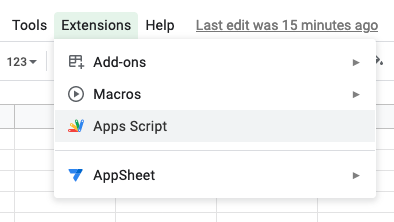
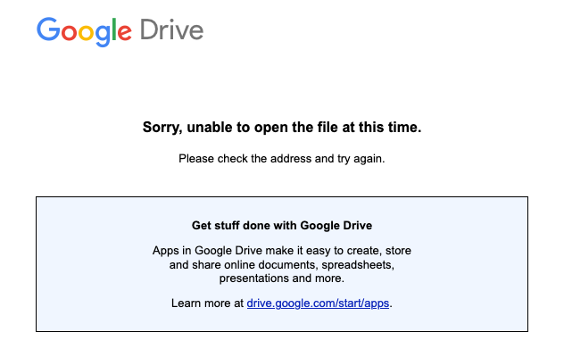

# Google Apps Script: sorry, unable to open the file at this time
April 1, 2022

I was casually trying to open Google Apps Script on a spreadsheet of
mine:

<figure class="center">
  
</figure>

When I ran in the following error:

<figure class="center">
  
</figure>

Definitely not getting stuff done with Google Drive today. 🤦‍♀️

A quick search for this error leads to [this support thread](https://support.google.com/docs/thread/99474963)
where people report encountering the same problem and say it magically
goes away after a while without knowing why.

The thread was eventually locked without a reliable solution. Not good.

## The reliable solution

Turns out the cause of the problem (in my case) was that I was logged in
multiple Google accounts in this browser. Google Apps Script was working
well for the default Google account, but trying to open it in any of my
other Google accounts would result in this error.

<figure class="center">
  
  <figcaption>Not my actual emails obviously</figcaption>
</figure>

I didn't find a way to properly associate a new spreadsheet with a
Google Apps Script on a Google account that's not the default one, so
the solution is to **log in to that Google account in a private window
(or another browser) so that it's the default account, and use Google
Apps Script from there**.

After you associated a new Google Apps Scripts project to the
spreadsheet of your choice, you can come back to your main browser and
open [Google Apps Scripts](https://script.google.com/) directly there.
Using the user switcher on the top right you can connect to the proper
account and manage your project from there. Note that the Google Apps
Scripts UI doesn't handle multiple users very well and might return you
at any time to the default user.

I know, not a fantastic solution, but now you know!
