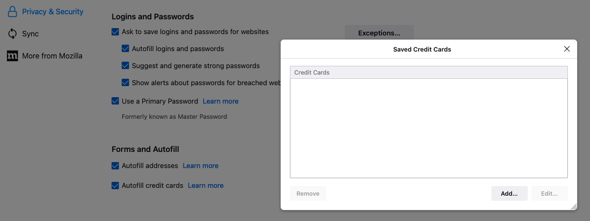

# Firefox credit card autofill not working on Linux
May 5, 2022

Firefox 79 [introduced](https://techdows.com/2020/07/firefox-autofiil-credit-card.html)
credit card autofill capability back in summer 2020. The feature is
limited to a few regions, starting with US, and now supporting US, CA,
UK, FR and DE.

Today, I'm using Firefox 101 in Canada, and I noticed this feature
wasn't working on my Linux computer. In this post I'll show what the
problem was, how I debugged it and especially how I fixed it!

## Symptoms

I know I have a few credit cards saved in my Firefox Sync account, they
work perfectly on macOS and Android versions of Firefox, and Firefox was
configured to sync them. Yet, the "saved credit cards" window in the
privacy preferences pane was empty!

<figure class="center">
  
</figure>

Also if I clicked the <kbd>Add...</kbd> button and try to add a credit
card (e.g. `4111111111111111` for a Visa card to pass the validation for
testing), the <kbd>Save</kbd> button was completely unresponsive.

## Debugging

I opened the browser console from "more tools" in the application menu.
Every time I clicked <kbd>Save</kbd>, an error would pop: "User canceled
OS unlock entry".

```
[Exception... "User canceled OS unlock entry" nsresult: "0x80004004 (NS_ERROR_ABORT)" location: "JS frame :: resource://gre/modules/OSKeyStore.jsm :: encrypt :: line 332" data: no] OSKeyStore.jsm:332:24
```

Luckily this problem is already reported [on the Arch Linux bug tracker](https://bugs.archlinux.org/task/74373),
and the solution seems to be to install a software providing
`org.freedesktop.secrets`, which as of today is either `gnome-keyring`
or `keepassxc`.

I installed `gnome-keyring` and had to reboot for it to start
automatically (ain't no time to figure how this thing work under the
hood for now). Yet the bug persisted, despite people on that thread
mentioning this solves the issue for them!

The "User canceled OS unlock entry" exception is thrown
during the [`OSKeyStore.encrypt`](https://github.com/mozilla/gecko-dev/blob/bf243bc817f97b0bb74af710bd9d874370468e8b/toolkit/modules/OSKeyStore.jsm#L333)
call, because the `ensureLoggedIn` function determined we were not
authenticated. The underlying reason seemed to be the
[`nativeOSKeyStore.asyncGenerateSecret`](https://github.com/mozilla/gecko-dev/blob/bf243bc817f97b0bb74af710bd9d874370468e8b/toolkit/modules/OSKeyStore.jsm#L254)
call returning `NS_ERROR_FAILURE`.

More likely Firefox wasn't able to generate a secret in GNOME Keyring.
So I installed [Seahorse](https://en.wikipedia.org/wiki/Seahorse_(software))
to test it myself, and indeed, I couldn't store new secrets from there
either, it would fail with `No such secret collection at path: /`. This
bug is also [documented](https://wiki.archlinux.org/title/GNOME/Keyring#No_such_secret_collection_at_path:_/)
on the ArchWiki, but sadly the solution there didn't work for me.

## The underlying issue

I use LightDM autologin to automatically start my compositor on boot
(where I [greet myself with a lock screen](https://www.codejam.info/2021/08/lock-screen-as-login-screen-linux.html)).
It turns out GNOME Keyring doesn't play well with autologin. From the
[ArchWiki](https://wiki.archlinux.org/title/GNOME/Keyring#Using_the_keyring):

> To use automatic unlocking with automatic login, you can set a blank
> password for the default keyring. Note that the contents of the
> keyring are stored unencrypted in this case.

That's not ideal. And I already have a primary password configured in
Firefox so it would suck to set a second one on GNOME Keyring just for
Firefox to deal with credit cards differently...

In the end I decided to ditch my automatic login and go back to TTY
login and [starting Sway automatically upon login on TTY1](https://wiki.archlinux.org/title/Sway#Automatically_on_TTY_login).
This is the recommended way to start Sway anyway, and they officially
don't support display managers, so that definitely can't hurt.

All I had to do was to edit `/etc/pam.d/login` according to the "when
using console-based login" instructions of the [PAM
step](https://wiki.archlinux.org/title/GNOME/Keyring#PAM_step) in the
GNOME Keyring page on ArchWiki, appending the following:

```
auth       optional     pam_gnome_keyring.so
session    optional     pam_gnome_keyring.so auto_start
```

## The KeePassXC alternative

In the bug tracker there's also [an answer](https://bugs.archlinux.org/task/74373#comment207641)
describing how to fix this issue with KeePassXC:

> 1. KeePassXC needs to be running.
> 2. The secret service integration must be enabled in settings.
> 3. A database must be setup where at least one group is accessible to the secret service.

That's a solid alternative, but then if I want secrets to be properly
secured, I need to add another password to that KeePassXC database, on
top of my encrypted filesystem password, login password and Firefox
primary password. That starts to be quite a lot of passwords... so I'll
stick with GNOME Keyring for now because it's able to reuse my login
password for that purpose.

## Final words

I now have a successful credit card sync and autofill in Firefox on
Linux! I hope this becomes a bit simpler in the future, but at least I
learnt a thing or two about the underlying implementation and the
technical challenges and tradeoffs it involves.
