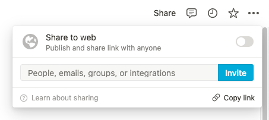

# Notion: import CSV with Markdown page content
May 11, 2022

As I was [migrating a GitHub project to Notion](https://github.com/valeriangalliat/github-to-notion),
one of the solutions I considered was to import a CSV using the native
import feature.

Sadly, there was no way to set the page content from the rows in the CSV
file. All the columns are imported as custom attributes and we
can't pick one to be used as page content.

So I ended up making a [custom script](https://github.com/valeriangalliat/github-to-notion/blob/master/import-to-notion.js)
using the [Notion API](https://developers.notion.com/). And while this
script is very specific to my use case, I figured it would be good to
generalize it and go back to my original CSV idea, this way other people
can leverage it for their own projects!

## The way it works

The idea is simple. First, we import a CSV using the native import
feature, which results in our "content" column being imported as a page
attribute. Then we run a simple scripts that goes through all the pages
with a non-empty "content" column, and moves it to the page body
instead!

I named this script [Notion property to content](https://github.com/valeriangalliat/notion-property-to-content)
(I know, I suck at naming things), and with a bit terminal fu, you can
use it on your own Notion imports!

## Running the script

It requires [Node.js](https://nodejs.org/) version 18 or later.

```sh
git clone https://github.com/valeriangalliat/notion-property-to-content
cd notion-property-to-content
npm install
```

From there, we need a Notion token. For this, you need to
[create a new integration](https://www.notion.so/my-integrations). The
default parameters should do. At the end Notion will give you a token
that we'll set in an environment variable (lines starting with `$` means
an actual command that you run, but don't type the `$`):

```console
$ read NOTION_TOKEN
Paste the token here
$ export NOTION_TOKEN
```

Now you need to share the database you're working on with your newly
created integration. On the top right corner of your database page, hit
the "share" button:

<figure class="center">
  
</figure>

Click on the search field to reveal your integration, and click
"invite":

<figure class="center">
  
</figure>

While you're on the database page, copy its ID from the URL bar, for
example if the current URL is:

```
https://www.notion.so/513bff94c55a4cf09a66a336c87e7964?v=0eb7b11463c94c3a84786bd3191e4032
```

Copy this part:

```
513bff94c55a4cf09a66a336c87e7964
```

Finally, back to the terminal, you can run the following command to
move the property of your choice to the page content:

```sh
node property-to-content.js <database-id> <property> --remove
```

Where `<database-id>` is the ID of your database and `<property>` is the
name of the property you want to use as page content. For example if
your database ID is `513bff94c55a4cf09a66a336c87e7964` and your property
is named "Page Content", run:

```sh
node property-to-content.js 513bff94c55a4cf09a66a336c87e7964 'Page Content' --remove
```

<div class="note">

**Note:** I recommend you to run this on a test database first just to
make sure it behaves the way you want with your data!

</div>

The `--remove` part is to empty the property after writing its value to
the actual page content. It is useful so that if you were to run the
script again, it doesn't copy the content a second time at the end of
the page, as the script only goes through non-empty content values.

If you plan to only run this once and want to keep the content in its
original property, don't add the `--remove` part.

## Need some help?

If you need help with this, or importing data to your Notion workspace
and working with the Notion API in general, don't hesitate to
[shoot me an email](/val.md#contact), I'll be happy to help you on a
consulting basis! You'll even get a 20% discount if you tell me you're
coming from this article. 😜
