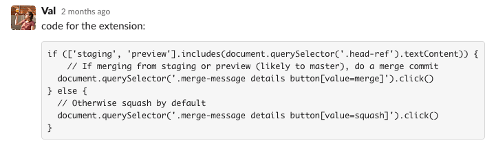

# GitHub: disable squash & merge on specific branches
Or how to associate different merging strategies to different branches  
August 15, 2022

**Note:** this is a mirror of the blog post originally published on
[Hookdeck blog](https://hookdeck.com/blog/post/building-chrome-extension-disable-squash-and-merge-github-branches)!

At Hookdeck, we use a branching flow somewhat similar to the [GitLab flow](https://docs.gitlab.com/ee/topics/gitlab_flow.html),
where we have `staging` as our main branch, and regularly merge
`staging` into `main` to deploy to production.

We like to **squash & merge** feature branches into `staging`, but we
want to **create a merge commit** when merging `staging` into `main`.

<figure class="center">
  
</figure>

The problem is: *GitHub always defaults to the last used merge
strategy*, meaning that after you squash a feature branch into
`staging`, you're guaranteed to have squash & merge selected by default
when you want to merge `staging` to `main`.

In practice, this leads to accidentally squashing `staging` into `main`,
losing meaningful history, plus causing weird diff issues in the
subsequent PRs.

## Introducing the contextual merge strategy extension!

We realized [we weren't the only ones with this issue](https://github.com/community/community/discussions/10809),
and decided to build an extension to mitigate it in the meantime GitHub
addresses it natively.

<figure class="center">
  
</figure>

The result: [GitHub Contextual Merge Strategy](https://github.com/hookdeck/github-contextual-merge-strategy).

We didn't publish this extension on the Chrome and Firefox store, but
nevertheless you can easily clone it and install it using the *developer
mode* to *load unpacked extensions*.

By default, it preselects **create a merge commit** when the source
branch is any of `main`, `master`, `staging` and `preview`, and
otherwise selects **squash & merge**.

You'll only need to tweak the URL host and prefix you want it to run on in
[`background.js`](https://github.com/hookdeck/github-contextual-merge-strategy/blob/main/background.js)
(by default we only run it on the GitHub Hookdeck organization).

Also feel free to tweak the [`script.js`](https://github.com/hookdeck/github-contextual-merge-strategy/blob/main/script.js)
file accordingly to your own branching conventions and needs!

## How we built it

Here's the nitty gritty details of the implementation. The first idea
was very basic:

<figure class="center">
  
</figure>

Run this in your browser console on a GitHub PR page, and it will work
like a charm.

But when we tried to put that in a content script as part of an
extension, it broke down: GitHub loads asynchronously the block at the
bottom where we get the different merge options! So running at
`document_end` is not enough to be able to preselect a merging strategy,
as the merging strategies element is not loaded yet.

### Asynchronous loading of the merge block

To work around that, we used a [`MutationObserver`](https://developer.mozilla.org/en-US/docs/Web/API/MutationObserver)
in order to watch the parent element for any change to its child tree.
This allows us to get a callback when the merge options are loaded into
the DOM, and effectively select the one appropriate to the current
branch being merged!

But soon after, we realized this wasn't enough. The extension seemed to
be working *sometimes, but not all the time*. After further
investigation, it turned out that GitHub uses single-page navigation
with the [`History.pushState` API](https://developer.mozilla.org/en-US/docs/Web/API/History/pushState).

### Supporting single-page navigation

The symptoms: if you open a PR page directly, the extension works, but
if you open any other page on GitHub and then browse your way to a PR
page, it won't!

To my dismay, [there's no web API allowing us to subscribe to the `pushState` events](https://stackoverflow.com/questions/4570093/how-to-get-notified-about-changes-of-the-history-via-history-pushstate).

A common solutions is to [proxy](https://developer.mozilla.org/en-US/docs/Web/JavaScript/Reference/Global_Objects/Proxy)
the `history.pushState` function, but this isn't easily done in an
extension since we don't have a shared global object with the page being
manipulated (`unsafeWindow` doesn't seem to be a thing anymore for
security reasons).

An alternative is to use the extensions API [`webNavigation.onHistoryStateUpdated`](https://developer.mozilla.org/en-US/docs/Mozilla/Add-ons/WebExtensions/API/webNavigation/onHistoryStateUpdated),
which was music to my ears until I realized that [it only works from a background script and not a content script](https://stackoverflow.com/questions/48318004/is-it-possible-to-use-onhistorystateupdated-event-in-content-script)!

Fair enough, I [refactored the extension to use a background script](https://github.com/hookdeck/github-contextual-merge-strategy/pull/1)
in order to hook into the navigation events and trigger the script
accordingly.

I didn't like the idea of running a background script but it seems that
browsers optimized them in a way that they only run when triggered by
specific events, here `onHistoryStateUpdated`, only on `github.com` and
when the path starts with `/hookdeck`! This means the extension overhead
is very limited and that's a good thing.

## Wrapping up

After this last change, the extension was finally doing its job
reliably. We've been using it for a few weeks now without any accidental
squash!

If you also need to default the merge strategy differently on specific
branches, go check out the [GitHub repo](https://github.com/hookdeck/github-contextual-merge-strategy)
and adapt it to your organization!

I hope GitHub will soon support such a setting natively and make this
extension obsolete (so we don't have to maintain it 😬), but in the
meantime, I hope you enjoy it!
