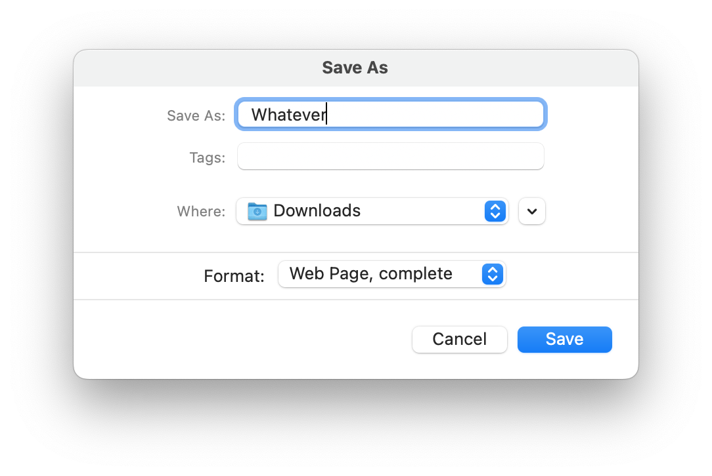

# Embedding high DPI screenshots at normal size in HTML
April 2, 2023

Since I moved to a Retina display, the screenshots I take are twice as
big as before!

This is a problem because, when embedded in an HTML page, they look
ginormous.

Let's take a dummy example of some UI element screenshot:

```html

```

<figure class="center">
  
</figure>

This is huge. Crazy huge. It disturbs the reading flow and you only see
that oversized, slightly blurry image. Just bad.

How to fix it then?

## Downsize the image

We can resize the image by 50% before embedding it. For example using
ImageMagick:

```sh
convert save-as-example.png -resize 50% save-as-example-small.png
```

This will work, but we introduce a loss in quality from the downscaling
operation. It's not gonna be as "sharp" as if the UI element was
rendered at the lower resolution in the first place, without being
downsized at the pixel level later on.

On top of that, when viewed on a high DPI screen, the image will not be
as crisp as what you saw when you took the screenshot, because half the
pixels got lost.

## Take the screenshot on a low DPI screen

On macOS, if you have an external screen that has a low DPI, you can
take the screenshot on that screen. Then the screenshot will be taken at
a normal-looking native resolution, because there's no scaling factor.

The downside is that you need a low DPI screen handy, and to plug it.
Not always applicable.

And on top of that, like the previous method, it won't look as good when
viewed on a high DPI screen.

## Use `srcset` with a `2x` factor!

If you want to go the lazy and easy way, `srcset` is the way.

It allows to specify a _pixel density descriptor_ for the image being
referenced. In our case, because the screenshot was rendered at double
the size for the Retina display, we can specify `2x`.

```html

```

<figure class="center">
  
</figure>

This looks perfect! On a high DPI screen, we get the exact original
quality of the screenshot, as crisp as can be. On a low DPI screen, the
browser knows how to adapt the size of the screenshot to make it look
just right.

The only downside is that for low DPI screens, we'll still send the
heavier image with twice as much pixels, even if we don't need it. If
that's a problem for you, then you can use one of the earlier solutions
to generate a `1x` version of the screenshot, and use it as part of the
`srcset`.
