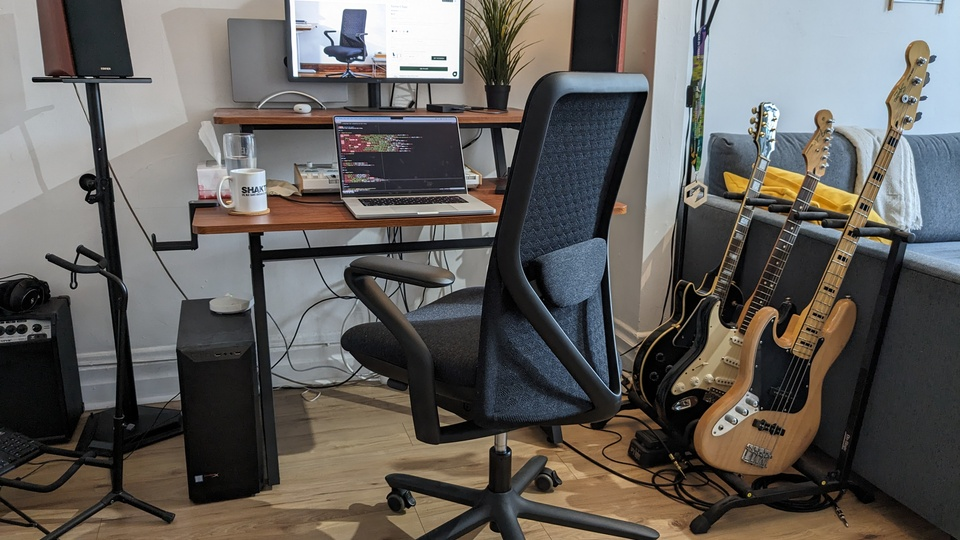

# Branch Verve office chair: make it taller!
July 28, 2023

I recently bought the [Verve chair](https://www.branchfurniture.ca/products/verve-chair)
by Branch as an upgrade for my office. It was quite pricey, but not
Herman Miller pricey, and it's really comfortable.

Before that, I was sitting on the [JÄRVFJÄLLET chair from Ikea](https://www.ikea.com/ca/en/p/jaervfjaellet-office-chair-with-armrests-grann-white-70521855/),
and to be fair, for half the price of the Verve chair, it was easily 80%
of the comfort. I had no trouble sitting on it all day long, and that's
even without putting the armrests because I like to play guitar!

**Anyways, I've had only one complaint about the Verve chair: it's too
short!** Its highest setting is still pretty low, and that just doesn't
cut it for 1. me being a tall guy and 2. my workstation being a tad
higher than your typical office desk.

Quite a number of reviews did mention that issue, but you know how it
is, I only searched the reviews for that particular problem once I
encountered it. 😬

## How to make the chair taller

As far as I know, this is gonna be applicable to pretty much any office
chair. **The best thing you can do is replace the gas cylinder for a
taller one.**

Luckily, this seems to be standard, and the Verve chair was no
exception. I've got [one off Amazon](https://amzn.to/455kzjv). Pretty
much any replacement ones I browsed through were taller than the one
that came with the chair, and tall enough for me. Double check the size
for your particular situation though!

In order to replace the cylinder, I also had to buy a
[mallet](https://amzn.to/44BRIDD) in order to pop the old one out
without damaging it. (Really, get a mallet if you don't have one, I
struggled pretty hard with a hammer and couldn't get it out, then a
single tap with the mallet once I got it got the job done.)

I've also got some [replacement casters with brakes](https://amzn.to/3Y9d3lr)
because [my floor is still slanted](../../2021/01/ikea-office-chair-lock-wheels-uneven-floor.html).
If even with a new cylinder your chair is not tall enough, you can
consider getting some those [rollerblade-style casters](https://amzn.to/3OxpnbT)
that are gonna be taller than standard wheels, and apparently have a
bunch of advantages like not damaging floors, working better on carpets,
and being smoother in general, and obviously a sick look. Although I
didn't get to try them yet.

## Conclusion

<figure class="center">
  
</figure>

In the beginning I was so disappointed to find that I couldn't use my
brand new chair because it was too short, but at the end of the day it
was actually pretty easy to fix. A $30 replacement gas cylinder and a
cheap mallet got the job done in no time.

That being said, given the price of the chair,  I wish I didn't have to
go through that extra trouble.
