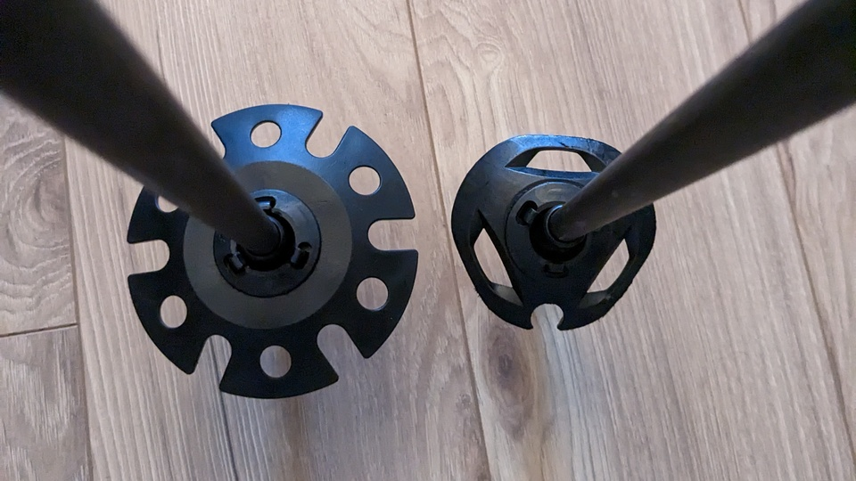

# Völkl Touristick ski poles & Komperdell Ice-Flex baskets
July 27, 2023

I recently bought adjustable ski poles as I was getting into backcountry
skiing. I got the [Völkl Touristick AC](https://volkl.com/en-ca/p/touristick-ac-poles-adjustable-2023).

The poles are great. They're lightweight (224 g per pole), the extended
grip is super convenient, and they feel really solid.

However the "powder baskets" they came with are as tiny as they look on
the product picture. In fact, they have a diameter of 7 cm, which is
just 1 cm more than my groomer poles baskets. 😅

Here's a comparison of the stock basket (right) with an actual, 10 cm
powder basket (left).

<figure class="center">
  
</figure>

This is much smaller than the competition for backcountry touring ski
poles. For example the [Atomic BCT Touring](https://www.atomic.com/en-ca/shop/product/bct-touring-aj5005732.html)
comes with 8.5 cm baskets, and their [Backland
Freeride](https://www.atomic.com/en-ca/shop/product/backland-fr-aj5005314.html)
model comes with 9.7 cm baskets. The [Black Diamond Traverse](https://www.blackdiamondequipment.com/en_US/product/traverse-ski-poles/)
have 10 cm baskets, and the [Black Crows
Oxus](https://www.black-crows.com/ca/fr/p/-batons-oxus/101724-020-115.html)
have 9 cm baskets.

Even a random [cheap powder basket you find on Amazon](https://amzn.to/3OyATE8)
is 8.7 cm.

Those small stock baskets provide little to no flotation on deep fluffy
powder. And what do we backcountry skiers like to ski the most? Deep.
Fluffly. Powder.

<figure class="grid grid-2">
  
  
  <figcaption>You can evaluate the performance of the stock baskets on the second image.</figcaption>
</figure>

So why am I writing this instead of buying the aforementioned cheap
powder baskets on Amazon and installing it on my new poles?

## Introducing the Komperdell Ice-Flex system

It turns out the Touristick poles come with a proprietary basket system
by Komperdell. It means you can't just screw on any replacement baskets.
It's only compatible with Komperdell Ice-Flex(tm) baskets.

It's defined as a **"moveable basket system, that adapts up to 28° to the
slope inclination"**. It's not exactly obvious what this means, so I
made a quick video to show the mechanism.

<figure class="video">
  <iframe src="https://www.youtube.com/embed/hloFNTuovyo" allowfullscreen></iframe>
</figure>

It doesn't seem that this mechanism is widely adopted. I've only found
it on Komperdell's own poles and Völkl. Depending on where you live
around the world, it may be extremely hard if not impossible to put your
hand on a wider, compatible basket.

**Note:** don't confuse it with the Vario basket system (which is
defined as "easy and quick to change") because the mounting mechanism is
not gonna be compatible, although it seems a bit more common.

Sidenote, the Ice-Flex baskets were definitely _not_ easy and quick to
change. It took quite a lot of force to clip the basket to the tip, and
same to remove it. Although after a few times taking off and on the
same basket and clip piece, it gets much easier.

On their website you can look for baskets
[specifically compatible with the Ice-Flex system](https://www.komperdell.com/en/Poles/Accessories/Baskets/?order=price-desc&p=1&properties=0b437375a8a343b89a327d5f8d327cf0),
but they don't ship outside Europe, and even if you do live in Europe,
paying €20 for a €11.95 pair of baskets is quite steep.

You've got 4 options:

* [Regular UL Ice-Flex basket](https://www.komperdell.com/en/Regular-UL-Iceflake-Basket/K9949-925-UNI)
* [Regular Ice-Flex basket](https://www.komperdell.com/en/Ice-Flex-Basket/K9396-925-UNI)
* [Large UL Ice-Flex basket](https://www.komperdell.com/en/Large-UL-Iceflake-Basket/K9950-925-UNI)
* [Large Ice-Flex basket](https://www.komperdell.com/en/Ice-Flex-Winter-Basket-XL/K9385-925-UNI)

It's not clear to me what UL means (maybe ultralight?), but it's
basically the "rounded hexagon" shape you can see on the right in [this
picture](../../img/2023/07/poles/comparison.jpg), while the other kind (not UL) is a
more standard snowflake shape.

They don't list the basket diameters on the website, but my guess based
on the ones I managed to get is:

* **Regular UL Ice-Flex basket:** 7 cm <small>(assuming those are the ones that came with my poles)</small>
* **Regular snowflake Ice-Flex basket:** 8.5 cm <small>(I don't have those, but they list 8.5 cm on [this site](https://www.tradeinn.com/trekkinn/en/komperdell-ice-flex-winter-basket/136969928/p))</small>
* **Large UL Ice-Flex basket:** 9.5 cm
* **Large snowflake Ice-Flex basket:** 10 cm

I hope you found the information you were looking for. Let me know if
you have any questions or if you want to add any extra information that
could make this post even more useful.

Hopefully someday Komperdell will distribute those wider baskets in
North America. Cheers!
