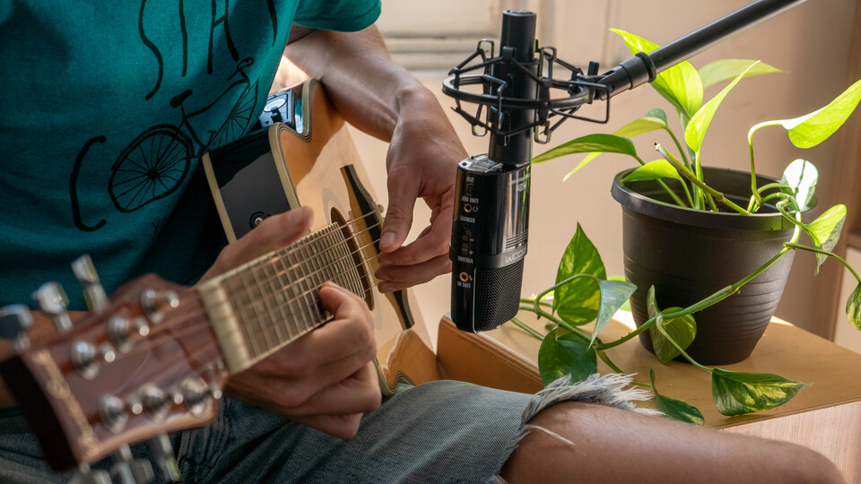

# The gear I use
Updated on **March 17, 2023**.

On this page you'll find the gear that I use for various aspects of my life.  
[Tech](#tech), [music](#music), [photography](#photography), [video](#video), [sports](#sports) and [coffee](#coffee).

## Tech 💻

### Hardware

* M1 MacBook Pro 16"
* [LG UltraFine 4K 24"](https://amzn.to/3LB5CiR)
* [Sony WH-1000XM4](https://amzn.to/40d3yS7)
* [Pixel 6A](https://store.google.com/product/pixel_6a)
* [Kobo Nia](https://ca.kobobooks.com/products/kobo-nia)

### Software

* macOS, [Arch Linux](https://archlinux.org/)
* [Vim](https://www.vim.org/)
* [Visual Studio Code](https://code.visualstudio.com/)
* [Node.js](https://nodejs.org/)
* [Google Cloud](https://cloud.google.com/) (this blog runs on a free tier VM 😜)
* [Firefox](https://www.mozilla.org/firefox/) with [uBlock Origin](https://ublockorigin.com/) and [Vimium](https://vimium.github.io/)

## Music 🎸

### Recording 🎤

<table>
  <tr>
    <td><a href="https://amzn.to/3ICsjiD">Steinberg UR22mkII</a></td>
    <td>The audio interface I use for recording! I like it because I
    can plug two jacks in front (or XLR) as well as my keyboard in
    MIDI in the back. It can output to both headphones and speakers
    with knobs to control both outputs individually which is very
    practical when recording!</td>
  </tr>
  <tr>
    <td><a href="https://amzn.to/3GwRCAL">Zoom H2n</a></td>
    <td>Portable battery-powered microphone. It's extremely versatile
    and it's the single microphone I use for everything form recording
    my motorcycle engine sound while I ride to recording vocals and
    acoustic instruments as well as vlogs when mounted on top of my
    camera. It's probably not the very best at any of those categories
    but it delivers solid results for all of them which is quite
    impressive. I wrote a <a href="2021/09/zoom-h2n-pro-tips-and-tricks.html">full article</a>
    about it on the blog!</td>
  </tr>
  <tr>
    <td><a href="https://amzn.to/31RfFLy">Edifier R2000DB Studio Monitors</a></td>
    <td>I didn't want to spend a crazy amount of money on studio
    monitors. Those get the job done real well for me! I also have the
    <a href="https://amzn.to/3pLQoe9">R1700BT</a> connected to my
    turntable in my living room.</td>
  </tr>
  <tr>
    <td><a href="https://amzn.to/3GBZ3qb">Sennheiser HD 598 Headphones</a></td>
    <td>Great open-back headphones for studio recording! Although they
    don't seem to be sold anymore. I also have the <a href="https://amzn.to/3oS3vLP">Sennheiser HD 558</a>
    that are closed-back which was a must when working in an office (so
    that my colleagues can't hear audio leaks of what I'm listening to).
    Also not sold anymore. Oh and I also have the <a href="https://amzn.to/3oJ00Hh">Sennheiser CX 300B MK II Precision Enhanced Bass Earbuds</a>
    because I really like what Sennheiser does and I especially like
    "enhanced bass".</td>
  </tr>
  <tr>
    <td><a href="https://amzn.to/3dDT4F0">On-Stage WS7500 Workstation</a></td>
    <td>I'll also include here the desk I use for music recording which
    I also <a href="2020/11/on-stage-ws7500-workstation-review.html">wrote about here</a>!</td>
  </tr>
</table>

### Playing 🎸

<table>
  <tr>
    <td>Fender Standard Stratocaster Left-Handed</td>
    <td>The guitar I always dreamed to have. 😍</td>
  </tr>
  <tr>
    <td>Epiphone Les Paul Custom PRO Left-Handed</td>
    <td>To play <a href="https://youtu.be/cYXp69O4DFc">Money for Nothing</a>.</td>
  </tr>
  <tr>
    <td>Fender Squier Vintage Modified Jazz Bass '70s Left-Handed</td>
    <td>Solid sounding bass for a great price. Awesome.</td>
  </tr>
  <tr>
    <td>BeaverCreek Travel Size Acoustic-Electric Left-Handed</td>
    <td>Guitar I bring to the lake, camping, chalet, or just to jam
    around without plugging anything! See my <a href="https://youtu.be/8ejJZoURasY">review</a>
    on YouTube!</td>
  </tr>
  <tr>
    <td><a href="https://amzn.to/3Gy8CGW">Korg microKORG S</a></td>
    <td>Great synthesizer that can also act as a MIDI controller. I
    got it because the fact I can easily use it with my talk box (see
    below) unlike with a MIDI-only keyboard that would require to go
    through a virtual instrument first and back out to the talk box.
    Also it can run on battery and has a built-in speaker which is
    awesome to take on the go! I really love it.</td>
  </tr>
  <tr>
    <td><a href="https://amzn.to/3ycDoSI">Dunlop Cry Baby 535Q Multi-Wah</a></td>
    <td>I overuse it and I love it. Make it funky!</td>
  </tr>
  <tr>
    <td><a href="https://amzn.to/3DR5ZOM">Dunlop MXR Talk Box</a></td>
    <td>For some sick G-funk vibes.</td>
  </tr>
</table>

## Photography 📸

<table>
  <tr>
    <td><a href="https://amzn.to/3dL1QRu">Panasonic LUMIX DMC-LX100K</a></td>
    <td>The camera I use for everything! It's small and lightweight
    yet has the biggest sensor you can find on a compact camera (Micro
    Four Thirds as opposed to 1 inch for the majority of compact
    cameras). Allows to get more light in for higher image quality and
    low light response. Easily carryable, I always take it with me
    strapped around my side while I hike so I can draw it in a matter
    of seconds if I want to capture something. All the pictures you
    can see on my <a href="https://photography.codejam.info/">photograpy website</a>
    are taken with it. You can also check out the
    <a href="2020/05/my-settings-for-panasonic-lumix-lx100.html">settings I use</a>
    for it. Nowadays, you might want to look at the new version the
    <a href="https://amzn.to/31HCwtA">LX100 II</a>.</td>
  </tr>
</table>

## Video 🎥

<table>
  <tr>
    <td><a href="https://amzn.to/3dL1QRu">Panasonic LUMIX DMC-LX100K</a></td>
    <td>I just mentioned it in the photo category, but this also does
    an awesome job at video! It can shoot 4K (albeit not at 60 FPS)
    which looks especially crisp when scaled down to 1080p or 1440p
    for YouTube and allows for some cropping margin in post without
    losing quality. Because it's small and lightweight it's convenient
    to vlog with, especially with the hot shoe mount that
    allows adding a microphone on top (that said it doesn't have a
    mini jack input so you have to record and sync the audio
    separately). Here's the <a href="2020/05/my-settings-for-panasonic-lumix-lx100.html">settings I use</a>
    for it. And again, check out the <a href="https://amzn.to/31HCwtA">LX100 II</a>
    which is the latest model if you want this camera!</td>
  </tr>
  <tr>
    <td><a href="https://www.amazon.ca/gp/search/ref=as_li_qf_sp_sr_tl?ie=UTF8&tag=funkyval-20&keywords=lx100 dc coupler&index=aps&camp=15121&creative=330641&linkCode=ur2&linkId=23605cf5057f8d4e3e8d1b6ba7119649">LX100 DC Coupler</a></td>
    <td>This allows to power my LX100 from DC power (wall outlet) so
    that when I do very long shooting sessions I don't need to change
    the battery every few hours. Game changer for me!</td>
  </tr>
  <tr>
    <td><a href="https://amzn.to/3GBVUqn">Quick Release Connector</a></td>
    <td>Allows to connect the stock strap of my LX100 in a way that I
    can very easily remove it. This is crucial for me when vlogging
    because otherwise the strap rubbing and shaking around when I move
    is picked up by the microphone. With this I can just remove the
    strap in a few seconds when I want to vlog! I initially considered
    the <a href="https://amzn.to/31SMN5z">Peak Design Leash</a> for that
    but I figured that it was overkill for me, I don't need to be that
    fancy. 😂</td>
  </tr>
  <tr>
    <td><a href="https://amzn.to/3oJkzmT">GoPro HERO (2018)</a></td>
    <td>That's probably one of the cheapest GoPro that I could buy new
    back then! Same hardware as the HERO5 Black but with some software
    limitations. I give you the settings I use on it in <a
    href="2020/06/my-settings-for-gopro-hero-2018-and-hero5-black.html">this article</a>.</td>
  </tr>
</table>

## Sports

### Climbing 🧗

* Rope: [Beal Booster III 9.7 mm Unicore Dry Cover 80 m](https://www.beal-planet.com/en/dynamic-ropes/1433-9922-booster-iii-97mm.html)
* Quickdraws: [Edelrid Slash 10 cm](https://www.trueoutdoors.ca/slash-set-10cm-night-oasis.html) (12)
* Master beaner: [Petzl WILLIAM Triact-Lock](https://www.petzl.com/US/en/Professional/Connectors/WILLIAM)
* Large beaners: [Petzn Am'D Screw-Lock](https://www.petzl.com/US/en/Sport/Carabiners-and-quickdraws/Am-D) (2)
* Small beaners: [Petzl Spirit Screw-Lock](https://www.vertical-addiction.com/us/petzl-petzl-spirit-screw-lock-carabiner.html) (5)
* PAS: [Metolius Dynamic PAS](https://www.metoliusclimbing.com/dynamic-pas-personal-anchor-system.html)
* Harness: [Edelrid Zack](https://www.outdoorgearlab.com/reviews/climbing/climbing-harness/edelrid-zack)
* Helmet: [Edelrid Zodiac](https://www.trueoutdoors.ca/zodiac-helmet.html)
* ATC: [Petzl REVERSO](https://www.petzl.com/US/en/Sport/Belay-devices-and-descenders/REVERSO)
* Sling: [Petzl Fin'Anneau 120 cm](https://weighmyrack.com/sling/petzl-8-mm-finanneau-120-cm)

### Skiing ⛷️

* Ski: [Salomon MTN Explore 95 177 cm](https://www.sail.ca/en/salomon-mtn-explore-95-alpine-touring-skis-791043)
* Bindings: [Salomon S/Lab Shift MNC 10 100 mm](https://www.salomon.com/en-ca/shop/product/s-lab-shift-mnc-10.html)
* Boots: [Salomon Shift Pro 100 AT](https://www.mec.ca/en/product/6010-972/shift-pro-100-at-ski-boots)
* Poles: [Völkl Touristick AC](https://volkl.com/en-ca/p/touristick-ac-poles-adjustable-2023)
* Skins: [Black Diamond Ascension Nylon](https://www.blackdiamondequipment.com/product/ascension-nylon-climbing-skins/)

### Backpacks ⛰️

<table>
  <tr>
    <td><a href="https://www.osprey.com/ca/en/product/kestrel-48-KESTREL48S19_130.html">Osprey Kestrel 48</a></td>
    <td>My main backpack, a bit big for a single day but also does the
    job for a few days if I pack somewhat light.</td>
  </tr>
  <tr>
    <td><a href="https://www.osprey.com/pe/en/product/xenith-75-XENITH75IS18.html">Osprey Xenith 75</a></td>
    <td>Big bag for big adventures, perfect when I'm going both camping
    <em>and</em> climbing for a few days.</td>
  </tr>
  <tr>
    <td><a href="https://www.osprey.com/us/en/product/farpoint-40-travel-pack-FARPONT40F22.html">Osprey Farpoint 40</a></td>
    <td>One of the biggest bags you can take as a carry-on with most
    airlines. You can get away with bigger in a lot of cases (most of
    the time they're not strict about it) but if you want the peace of
    mind to know it <em>technically</em> meets the requirements, this is
    it. Perfect especially when I want to travel with <em>only</em> a
    carry-on (this is so convenient).</td>
  </tr>
</table>

### Camping 🏕️

* Tent: [MSR Hubba Hubba NX 2-Person](https://www.msrgear.com/ca/tents/backpacking-tents/hubba-hubba-2-person-backpacking-tent/11506.html)
* Sleeping pad: [Thermarest Z Lite Sol](https://www.thermarest.com/ca/sleeping-pads/fast-and-light/z-lite-sol-sleeping-pad/z-lite-sol.html)
* Sleeping bag: [Enlightened Equipment Enigma Quilt](https://enlightenedequipment.com/enigma) (850 down, -6 °C)

## Coffee ☕️

<table>
  <tr>
    <td><a href="https://amzn.to/3pP4U4K">Baratza Encore</a></td>
    <td>IMO the best grinder you can get at that price level if you're
    getting into specialty coffee!</td>
  </tr>
  <tr>
    <td><a href="https://amzn.to/3IyAI6J">Bialetti Moka Express, 6-Cup</a></td>
    <td>The worldwide reference as far as moka pot is concerned. Classic
    Italian-style coffee! Watch my <a href="https://youtu.be/zMR8B2yDgaU">video about it</a>!</td>
  </tr>
</table>
