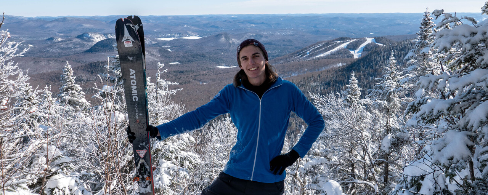

# Val <small>(Valérian Galliat)</small>

<figure class="center">
  
</figure>

## About

I'm from **Grenoble** in the French Alps, and currently based in
**Squamish, Canada**. 🏔️

Building software for over 15 years, specialized in backend and
infrastructure. Currently working on [EveTools], previously [Arcade] and
[Hookdeck]. 🧑‍💻

[EveTools]: https://evetools.app/
[Arcade]: https://www.arcade.software/
[Hookdeck]: https://hookdeck.com/about

Big time mountain guy, trail runner, [skier], rock climber, gravel and
mountain biker. ⛷️

[skier]: https://www.youtube.com/@FonkyVal

Also playing bass and guitar, check out my covers on [YouTube]! 🎸

[YouTube]: https://www.youtube.com/FunkyVal

## Links

<!-- ID for backwards compatibility with old contact section fragment -->

* [⏰ Now](now.md) <small>| what I'm doing now</small>
* ✍️ [Blog](https://www.codejam.info/) <small>| you are here</small>
* 🐦 [X](https://x.com/valeriangalliat) <small>| tech & business</small>
* 📸 [Instagram](https://www.instagram.com/funkyval_/) <small>| mountain pics & skiing</small>
* [🎬 YouTube <small>(main channel)</small>](https://www.youtube.com/@FunkyVal) <small>| music covers, and more</small>
* [⛷️ YouTube <small>(secondary channel)</small>](https://www.youtube.com/@FonkyVal) <small>| mostly just skiing</small>
* 🧑‍💻 [GitHub](https://github.com/valeriangalliat) <small>| my projects</small>
* ☕️ [Ko-fi](https://ko-fi.com/funkyval) <small>| buy me a coffee</small>
* 📩 [Email](mailto:val@codejam.info) <small>| `val@codejam.info`, come say hi!</small>

<!-- * 🦄 [LinkedIn](https://www.linkedin.com/in/valeriangalliat/) <small>| connect with me</small> -->
<!-- * 📸 [Photography](https://photography.codejam.info/) <small>| my photos</small> -->
<!-- * 🎸 [SoundCloud](https://soundcloud.com/funkyval) <small>| my music</small> -->
<!-- * 📝 [Resume](https://valeriangalliat.github.io/cv/cv.en.pdf) <small>| also in [French](https://valeriangalliat.github.io/cv/cv.fr.pdf) and [LaTeX](https://github.com/valeriangalliat/cv)</small> -->

